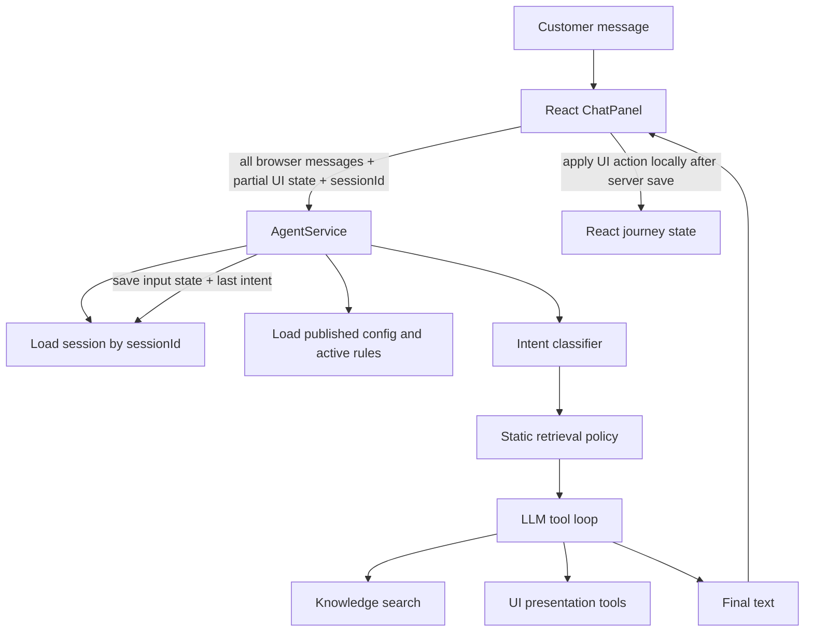
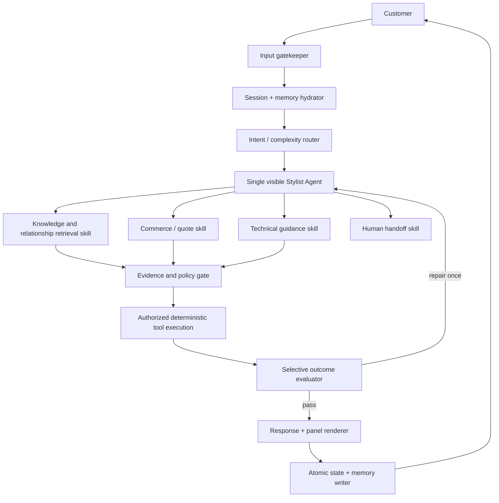

# JourneyAX Agent Context, Memory and Conversation Quality Review

**Date:** 17 July 2026  
**Scope:** Current JourneyAX/Caroma conversation runtime, session persistence, working memory, knowledge retrieval, product-document relationships, accessories, warranties, agent orchestration and human conversational quality.  
**Reference material:** *Building Effective AI Agents: Architecture Patterns and Implementation Frameworks* (30-page supplied PDF), *AI Agents Design Patterns Explained*, and Google Cloud's *Multimodal GraphRAG Resource Orchestration* architecture.

---

## 1. Executive conclusion

The observations from testing are correct:

- the agent can loop around accessories and other steps because it does not retain an authoritative record of what has been presented, accepted, rejected, completed or skipped;
- the Mongo “session” is not a complete conversation session - it stores only a partial UI snapshot and the last classified intent;
- there is no rolling conversation summary or long-term customer memory;
- product installation documents are present in the current corpus, but the retrieval API removes the `documents` field before the model receives the results;
- technical PDF chunks use a metadata type that the agent cannot request directly;
- product-to-guide, product-to-warranty, required-part and accessory relationships are not modeled as reliable, queryable relationships;
- warranty and document capabilities are enabled, but orchestration does not guarantee that they are retrieved or surfaced at the appropriate time;
- the response style feels robotic because several layers prescribe the same fixed response shape and fixed journey sequence, while the state needed for natural continuity is missing.

The right fix is **not** to add more prompt rules and not to immediately create many autonomous agents. JourneyAX should remain one visible stylist/consultant, supported by a small supervised runtime with specialized skills, typed shared state, evidence retrieval, deterministic gatekeepers and selective quality evaluation.

---

## 2. What the reference architectures mean for JourneyAX

### 2.1 Supplied agent-architecture PDF

The PDF recommends beginning with the simplest architecture that solves the problem. For a well-defined product/customer-service domain, it favors a capable single agent enhanced by modular skills before introducing a complex multi-agent system. Its particularly relevant recommendations are:

- prompts and tools should be modular rather than concentrated in one agent implementation;
- a single agent should operate in a bounded perceive/decide/act/observe loop with a stopping condition;
- specialized skills can add domain expertise without multi-agent coordination overhead;
- a supervisor/router becomes useful when distinct domains or complex independent tasks must be coordinated;
- context should be edited as it grows, stale tool outputs should be removed, and persistent memory should live outside the context window;
- tools should support filtering, pagination and response limits;
- evaluator/optimizer loops are valuable when clear quality criteria exist, but should not be used for every low-latency turn;
- e-commerce should evolve from a single inquiry agent toward routing, shared context, specialized operational domains and selective quality evaluators.

The PDF's context-management discussion on page 15 is directly applicable: an orchestrator becomes unreliable when it must carry an ever-growing, unstructured context. JourneyAX currently has the opposite extremes - full browser conversation history during an uninterrupted tab session, but almost no durable conversational context after reload/channel transition.

### 2.2 Medium design-pattern article

The article describes ReAct, routing/supervisor patterns, plan-and-execute, parallel DAG execution, reflection and evaluator patterns. The important lesson for JourneyAX is not that more agents automatically produce better behavior. The article explicitly emphasizes choosing the pattern to match the task and notes that simpler designs can be more efficient.

For JourneyAX:

- ordinary discovery/recommendation should use a single stylist agent with skills;
- retrieval calls for independent fixture categories can run in parallel;
- quote/order/appointment actions should use deterministic workflows;
- a specialist or evaluator should be invoked only for technical guidance, compatibility, warranty/compliance or low-confidence responses;
- the main agent should remain the only conversational voice.

Reference: [AI Agents Design Patterns Explained](https://medium.com/@aydinKerem/ai-agents-design-patterns-explained-b3ac0433c915).

### 2.3 Google GraphRAG architecture

The Google architecture separates:

- immediate session state/history;
- distilled long-term memory;
- shared structured agent state;
- knowledge retrieval;
- coordinator routing;
- specialized ingestion/search agents;
- post-turn memory extraction and persistence.

It recommends passing sufficient typed state so downstream stages do not repeat upstream work, using session storage for immediate history and a memory bank for distilled cross-session facts. It also distinguishes vector/semantic search from graph relationships and hybrid search. This is the most relevant external model for fixing JourneyAX's product-guide/required-part/accessory relationships.

Reference: [Google Cloud Multimodal GraphRAG Resource Orchestration](https://docs.cloud.google.com/architecture/agentic-ai-multimodal-graph-rag-resource-orchestration).

---

## 3. Current JourneyAX flow



The critical timing defect is at the end: the server persists the **state received at the beginning of the turn**, while the state changes produced by the turn are applied later in the browser. Therefore the server does not authoritatively know what it just showed or completed.

---

## 4. Where context and memory should live

“Context” is not one database field. JourneyAX needs five deliberately separate layers.

### Layer 1 - Current turn context

**Purpose:** What the customer just said and the fresh evidence/tools needed to answer it.

**Lifetime:** One model turn/tool loop.

**Store:** In-process request state; optionally trace storage after the turn.

**Contents:**

- current user message;
- active intent and confidence;
- only the retrieved evidence needed for this turn;
- current allowed capabilities and action budget;
- current risk/gatekeeper decisions.

Do not persist the entire raw retrieved chunks into the conversational session. Persist evidence IDs and compact facts instead.

### Layer 2 - Short-term conversation history

**Purpose:** Natural continuity within the active conversation.

**Lifetime:** Session/channel conversation.

**Store:** A `conversation_messages` store keyed by tenant + conversation + subject/channel; Redis can cache, Mongo/Postgres can persist.

**Contents:**

- recent user and assistant messages;
- presentation/action references;
- tool result summaries, not full raw results;
- timestamps, sequence and message IDs.

The model normally receives the latest 6-10 conversational turns, not every historical tool payload.

### Layer 3 - Structured working memory

**Purpose:** Prevent repetition and let every component know the current job.

**Lifetime:** Until the journey is complete/abandoned/expired.

**Store:** Server-owned `journey_state` document with optimistic versioning and event history.

Suggested shape:

```json
{
  "goal": "Renovate ensuite in a warm contemporary style",
  "constraints": {
    "space": "Ensuite",
    "projectType": "renovation",
    "finish": "Brushed Nickel",
    "budget": { "max": 8000, "currency": "AUD" },
    "installationPath": "licensed-professional"
  },
  "selections": {
    "products": [{ "sku": "...", "status": "accepted" }],
    "requiredParts": [{ "sku": "...", "status": "accepted" }],
    "accessories": [{ "sku": "...", "status": "accepted|rejected|pending" }]
  },
  "capabilityLedger": {
    "discovery": "completed",
    "recommendation": "completed",
    "accessories": "completed",
    "installationGuide": "completed",
    "warranty": "completed",
    "quote": "pending"
  },
  "pendingDecision": null,
  "presentedActionIds": ["act_..."],
  "evidenceRefs": ["doc_...", "product_..."],
  "quoteId": null,
  "version": 12
}
```

This state is the most important missing piece. It should be updated by each successful tool/action **before** the response is considered complete.

### Layer 4 - Rolling episodic summary

**Purpose:** Preserve older conversational meaning without retaining unlimited tokens.

**Lifetime:** Active session; optionally retained with the conversation according to policy.

**Store:** `conversation_summary`, versioned and linked to the last summarized message.

**Contents:**

- customer goal and motivation;
- decisions and reasons;
- unresolved questions;
- commitments made by the agent;
- rejected options and why;
- safety/escalation context;
- compact references to authoritative facts.

Generate/update only when the token threshold is reached or a meaningful milestone completes. Never summarize active tool-call/result pairs midway.

### Layer 5 - Long-term customer memory

**Purpose:** Personalization across sessions/channels.

**Lifetime:** Consent and retention policy dependent.

**Store:** Separate customer/profile memory collection or CRM, never the transient session document.

**Examples:**

- preferred style/finish;
- owned products;
- accessibility requirements;
- preferred store/installer/channel;
- stable project address/market where consent permits.

Do not automatically turn every conversational fact into long-term memory. A memory writer should extract candidate facts, apply consent/PII policy, deduplicate and let customers view/correct/delete them.

---

## 5. Minimal context to assemble for every model turn

The context window should be assembled in this order:

1. small platform safety/tool contract;
2. tenant persona and conversational style profile;
3. active business policies relevant to this intent only;
4. compact structured working state;
5. relevant long-term memory facts, if authorized;
6. rolling session summary;
7. latest 6-10 natural conversation turns;
8. current user message;
9. fresh retrieved evidence for the current reasoning step;
10. only the capabilities/tools permitted for this turn.

This is both smaller and more complete than the current approach. “Minimal” means excluding irrelevant raw history, not omitting decisions.

### Context budget proposal

| Context component | Typical budget |
|---|---:|
| Platform + safety contract | 800-1,200 tokens |
| Tenant persona/style/relevant policy | 600-1,000 |
| Structured working state | 400-800 |
| Long-term relevant memories | 0-300 |
| Rolling summary | 300-600 |
| Recent conversation | 1,000-2,000 |
| Retrieved evidence | 1,500-3,000 |
| Response reserve | Model-specific, minimum 1,000 |

Budgets should be configuration by model/context size, with telemetry for truncation and summary use.

---

## 6. Confirmed causes of the accessories loop

### Cause 1 - Accessories are not part of the server session schema

`ChatRequest.state` carries only phase, BOM, recommended products, finish and quantity. It does not carry selected/rejected accessories, selected choice, guide state, warranty state, completed capability states or pending decisions.

**Evidence:** `apps/agent-commerce-service/src/agent.service.ts:344-356`.

### Cause 2 - The server saves pre-action state

At the end of a turn, `AgentService` persists the `state` that arrived from the client. UI actions generated during that turn are not reduced into server state before saving.

**Evidence:** `apps/agent-commerce-service/src/agent.service.ts:493-504`, `721-730`, and equivalent streaming path.

### Cause 3 - Accessory panel does not capture exact selections

The panel displays grouped accessories, but provides only “add these” or “skip optional.” There are no per-item selections. It sends a natural-language message through a global window callback, with no structured accessory IDs/statuses.

**Evidence:** `apps/journeyax-web/src/components/panels/AccessoriesPanel.tsx:12-63`.

### Cause 4 - No completed-capability ledger

The prompt tells the agent not to repeat completed work, but “completed” is not represented in durable state. The model must infer it from prose, which fails after truncation, reload, WhatsApp turns or ambiguous messages.

### Cause 5 - Journey guidance encourages the accessory step repeatedly

The published Caroma guidance includes a fixed sequence: core fixtures, accessories, installation, warranty, quote. Because there is no ledger, the agent sees accessories as a still-unfulfilled goal each time.

### Cause 6 - Tool calls lack journey-level idempotency

There is no fingerprint such as `(conversationId, capability, selectionVersion, evidenceVersion)`. The same `showAddons` operation can be produced repeatedly without a guard.

### Required fix

- add structured accessory selection UI;
- post a typed `AccessoryDecision` action, not a sentence;
- update authoritative journey state atomically;
- mark capability `completed` or `skipped`;
- reject the same presentation fingerprint unless product selection changed;
- include the ledger in every turn context;
- define a loop gate: same capability + same arguments twice without new customer information => do not execute; answer or ask one focused recovery question.

---

## 7. Why installation and warranty guides do not appear

The current database was checked read-only. It contains substantial technical and product-document data:

- more than 1,000 chunks marked `technical`;
- product records with linked installation/specification/CAD documents;
- technical installation and warranty PDF chunks.

The issue is predominantly retrieval and relationship modeling, not simply missing documents.

### Defect 1 - Product search strips linked documents

Product metadata contains `metadata.documents`, but `ProductService.search()` constructs its result without copying `documents`. Therefore `searchKnowledge` cannot give `showDocuments` the URLs even when the selected product record contains them.

**Evidence:** `apps/product-service/src/product.service.ts:320-375`.

### Defect 2 - Search type mismatch

The agent tool permits `installation`, but many ingested PDF chunks are `metadata.type = technical` with `metadata.category = installation|guide|warranty`. Product search filters `metadata.type` by exact equality. The agent cannot request `technical`, so the correct chunks are missed. The relaxed retry may return other types but loses the intended precision.

**Evidence:**

- `apps/agent-commerce-service/src/agent.service.ts:27-40`;
- `apps/product-service/src/product.service.ts:142-155`, `196-205`;
- `apps/journeyax-web/src/services/knowledge/types.ts:47-56`.

### Defect 3 - No reliable SKU/document relationship

Technical PDF chunks often have a title containing a product name and a PDF URL but no normalized SKU/product ID. Product rows have document arrays, but standalone technical chunks do not consistently point back to product identity. Semantic similarity is being asked to perform a relational join.

### Defect 4 - Warranty retrieval is routed as FAQ

Warranty is represented inconsistently: product specs, general/superseded warranty PDFs, `technical/category=warranty`, policy records and FAQ. The intent router maps warranty to `faq`, which cannot reliably retrieve all of these.

### Defect 5 - Orchestration does not require document/warranty evidence

`requiredUiTool()` only forces item cards or generic guide steps. It does not require `showDocuments` after a product selection or `showInfo` before a quote. Enabling a capability merely makes its tool available; it does not create an outcome policy.

**Evidence:** `apps/agent-commerce-service/src/agent.service.ts:406-460`.

### Defect 6 - Generic ingestion is shallow

The new multi-project ingestion runner explicitly describes itself as v1 and states that rich PDF/spec extraction will be added later. It reads page text and classifies by URL; it does not perform the older product/PDF relationship enrichment.

**Evidence:** `apps/journeyax-web/src/scripts/ingest-project.ts:16-18`, `109-143`.

### Target product knowledge model

Use a relationship model, implemented initially as normalized Mongo collections and later as GraphRAG if relationship depth/scale justifies it:

```text
Product(SKU)
  - VARIANT_OF -> ProductFamily
  - IN_COLLECTION -> Collection
  - REQUIRES -> Part(SKU)
  - COMPATIBLE_WITH -> Product(SKU)
  - ACCESSORY -> Product(SKU) [required/recommended/optional]
  - HAS_DOCUMENT -> Document(documentId)
  - COVERED_BY -> WarrantyPolicy(policyId, market, effective dates)
  - HAS_INSTALL_METHOD -> InstallationProfile

Document
  documentId, kind, sourceUrl, title, productSkus[]
  market, locale, revision, effectiveFrom, effectiveTo
  extractedTextChunks[], checksum, trustStatus
```

Then use deterministic queries such as `getProductEvidence(sku)` rather than hoping vector search rediscovers exact relations.

### Retrieval plan after product selection

Run in parallel:

1. product details by exact SKU;
2. required/compatible parts by relationship;
3. matching accessories by relationship and style/finish;
4. installation documents by SKU + market + current revision;
5. warranty policy by SKU/category + market + purchase/install context.

Vector search should support explanatory content and troubleshooting, while exact identifiers/relationships supply product truth.

---

## 8. Why the conversation feels robotic

The live Caroma project already uses `gpt-5.5`; using a stronger model alone will not fix the experience. The current configuration and pipeline constrain that model into repetitive behavior.

### Root causes

1. **Multiple prompt layers prescribe a fixed formula.** The base prompt requires a follow-up question every time. Stage prompts prescribe paragraph counts, panel behavior and exact next objectives. Retrieval policy mandates 3-5 panel questions. Project guidance adds another journey sequence.
2. **Instructions conflict.** The base/stage policy requests 3-5 questions while a Caroma rule limits clarification to three. “Few questions” and “always end with a question” create a recurring interview rhythm.
3. **The persona is a title, not a behavioral style model.** “Caroma Stylist & Plumber” plus a short grounding sentence does not demonstrate how a great showroom consultant listens, reflects taste, varies sentence length, acknowledges uncertainty or transitions naturally.
4. **State loss forces verbal repetition.** A human sounds human partly because they remember. Missing decisions cause the model to restate context and ask confirmation again.
5. **The UI advances through fixed exclusive phases.** Every capability replaces the panel, encouraging a staged wizard feeling rather than one continuous consultation.
6. **The model temperature setting is loaded but not used in main generation calls.** The back-office value is currently cosmetic.
7. **The assistant is forced to speak after UI-only tool rounds.** This can generate unnecessary transition text after every panel action.
8. **No style/quality evaluator exists.** The grounding check only flags a narrow technical pattern and does not correct repetition, unnatural tone, excessive questions or unmet evidence requirements.

### Target stylist behavior

Configure a style profile with principles and examples, not a scripted journey:

```text
Identity: experienced Caroma showroom stylist with practical plumbing knowledge.
Conversation: listen first; reflect the customer's goal in their language; make one
useful observation before asking for missing information.
Questions: ask only the smallest next question; group choices in the panel when useful.
Recommendation: explain the design story and trade-offs, not a catalogue description.
Continuity: refer naturally to accepted choices; never reconfirm an unchanged decision.
Variation: not every response needs a question, summary, or sales close.
Honesty: distinguish product facts, stylist opinion and information still to verify.
```

Add 6-10 high-quality conversation examples covering renovation discovery, replacement, troubleshooting, indecision, budget tension, changing one's mind, returning after a break and moving to a quote. Examples provide tone far better than additional procedural rules.

---

## 9. Recommended JourneyAX agent architecture



### Gatekeepers and their exact responsibilities

#### Input gatekeeper

- authenticate/resolve tenant, channel and subject;
- validate payload size/schema;
- rate/cost/safety limits;
- identify prompt-injection attempts without adding business flow.

#### Context gatekeeper

- load tenant-scoped conversation and working state;
- validate state version;
- assemble the minimal context budget;
- exclude stale/irrelevant tool results;
- prevent cross-tenant/session context.

#### Tool policy gatekeeper

- verify the capability is enabled and authorized;
- validate tool arguments;
- enforce idempotency and loop policy;
- require approval for high-impact actions;
- enforce exact SKU/market/relationship queries where appropriate.

#### Evidence gatekeeper

- ensure product, installation, warranty and compliance statements point to current trusted sources;
- prevent superseded documents from being used;
- require exact SKU/market matching for product-level guidance;
- block or qualify unsupported claims.

#### Outcome evaluator

Use only for higher-risk or milestone turns:

- recommendation package completeness;
- technical/warranty guidance;
- quote readiness;
- repeated action/loop detection;
- tone/repetition checks when confidence or customer frustration signals warrant it.

Maximum one repair iteration for interactive chat. Offline evaluation can be deeper.

#### Memory writer

- atomically append assistant message, tool/action events and updated working state;
- update rolling summary when needed;
- extract consented long-term memory candidates;
- record evidence/action lineage.

---

## 10. Concrete implementation requirements

### CTX-01 - Conversation repository

- Persist ordered messages server-side.
- Key by tenant + conversation + subject/channel.
- Store role, message ID, content, action references, timestamp and token count.
- Do not trust the browser to supply authoritative history.

### CTX-02 - Authoritative journey state reducer

- Define typed domain events: `GoalCaptured`, `QuestionAnswered`, `ProductPresented`, `ProductAccepted`, `AccessoryRejected`, `GuideViewed`, `WarrantyPresented`, `QuoteCreated`.
- Reduce events into a versioned state document.
- Apply UI actions on the server before saving and returning.

### CTX-03 - Rolling summary

- Trigger by token threshold or milestone.
- Summarize only messages older than the recent-turn window.
- Preserve decisions, rejections, open questions, promises and evidence refs.
- Keep the original event/message history for audit according to retention policy.

### MEM-01 - Long-term memory

- Separate from session and knowledge data.
- Store only stable, useful, consented facts.
- Support view/edit/delete/expire.
- Retrieve memories semantically and filter by tenant/customer/project.

### LOOP-01 - Capability ledger and idempotency

- Every capability has state: unavailable, pending, active, completed, skipped, failed.
- Every presentation has an action ID and input fingerprint.
- Do not repeat completed capability unless relevant selection/state changed.
- Detect identical tool calls and repeated assistant questions.
- Emit a trace reason when execution is suppressed.

### KNOW-01 - Product evidence envelope

Return a typed envelope containing:

- product identity and authoritative commercial fields;
- relationship results;
- current installation/spec/warranty documents;
- extracted evidence snippets with document IDs/revisions;
- source URLs for the panel;
- confidence/validation warnings.

### KNOW-02 - Normalize document taxonomy

Replace ambiguous type/category combinations with explicit fields:

- entity type: product, document, policy, article, collection;
- document kind: installation, spec, warranty, troubleshooting, care, CAD;
- product SKUs/family IDs;
- market/locale/revision/effective dates/status.

### KNOW-03 - Retrieval strategy

- exact lookup for SKU, price, relationships and current documents;
- hybrid keyword/vector retrieval for customer language and troubleshooting;
- optional graph traversal for multi-hop relationships;
- rerank and deduplicate by entity/document, not by chunk alone.

### TONE-01 - Human conversation profile

- Replace rigid response recipes with a compact style profile and examples.
- Remove universal “always end with a question.”
- Let the agent acknowledge, advise or pause when no question is needed.
- Apply the configured generation parameters where supported.
- Track repetition, question count, customer sentiment and conversation repair.

### EVAL-01 - Quality suite

Include deterministic and model-evaluated scenarios:

- accessory accepted, rejected, skipped and revisited after product change;
- reload in the middle of a journey;
- same conversation continued through WhatsApp;
- product with one/multiple/no installation guides;
- current versus superseded warranty documents;
- product name ambiguity and SKU exact match;
- customer changes finish/budget/room;
- conversational naturalness, repetition and question burden;
- no hallucinated URL, warranty, SKU, price or installation step.

---

## 11. Prioritized implementation sequence

### Phase 1 - Fix continuity and loops (highest priority)

1. tenant-bound conversation/message persistence;
2. full typed working state and capability ledger;
3. server-side action reducer and post-action persistence;
4. structured accessory selection and action acknowledgements;
5. idempotency/loop gate;
6. rolling summary and context assembler.

**Exit test:** reload, reconnect or switch channel without losing decisions; accessories cannot repeat unless selections change.

### Phase 2 - Fix guides and warranty evidence

1. return `metadata.documents` in product search results;
2. normalize technical/document taxonomy;
3. backfill SKU/product-family relationships for PDFs;
4. add exact `getProductEvidence(sku, market)` retrieval;
5. introduce installation/warranty outcome policy before technical advice/quote where applicable;
6. block superseded or unmatched documents.

**Exit test:** a selected product consistently shows its current relevant installation/spec/warranty sources, while unrelated PDFs never appear.

### Phase 3 - Improve human quality

1. simplify platform/stage/retrieval prompt overlaps;
2. remove conflicting fixed question counts and mandatory closings;
3. enrich the Caroma style profile and add conversation examples;
4. apply provider/model generation configuration correctly;
5. add selective tone/completeness evaluator;
6. run and tune against recorded test conversations.

**Exit test:** reviewers rate conversations as natural and context-aware, with no unnecessary repeated question or capability step.

### Phase 4 - Add specialized skills only where justified

- product/design skill;
- technical-installation skill;
- warranty/policy skill;
- deterministic quote/order skill;
- human handoff skill.

Keep the stylist agent as supervisor and sole customer-facing voice. Do not create a peer-to-peer swarm for normal storefront conversations.

---

## 12. Final design principle

JourneyAX does not primarily need more agent autonomy. It needs better continuity and better truth management.

> The model should remember the meaning of the conversation through compact typed state, retrieve product truth through exact relationships plus RAG, speak through one coherent human persona, and pass every action through deterministic gates.

Once that foundation exists, the existing design and panel experience can feel seamless rather than robotic - without turning the solution into a large rule engine or an unnecessarily expensive multi-agent system.
