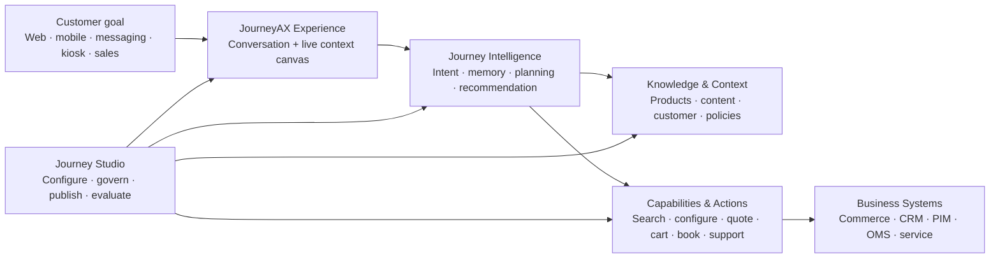

# JourneyAX Website and Documentation Blueprint

**Reference model:** Airbyte marketing site and documentation  
**Review date:** 11 August 2026  
**Purpose:** Translate the strongest parts of Airbyte's visual language and product storytelling into an original, business-led website for JourneyAX.

---

## 1. Executive recommendation

JourneyAX should not present itself as another chatbot, a collection of AI features, or a technical agent framework. It should own a clear business category:

> **JourneyAX is the AI journey platform that turns customer intent into guided, visual, transactable experiences.**

Airbyte's strongest move is not its purple-on-black styling. It is the discipline of its story. The site names one production problem, makes the architecture understandable, demonstrates the difference, proves the outcome, and then gives technical buyers a direct path into documentation.

JourneyAX should use the same storytelling discipline, with a different center of gravity:

- Airbyte leads with infrastructure and developer productivity.
- JourneyAX should lead with conversion, customer experience, speed to decision, brand ownership, and operational control.
- Technical architecture should establish credibility after the buyer understands the business outcome.
- The live conversational experience and its 40/60 context canvas should be the visual hero of the site.
- Every capability claim must be backed by a live product surface, a real customer example, a verified metric, or a clear roadmap label.

The corporate website must be a new surface. It should not replace either of the existing applications:

| Surface | Audience | Purpose |
|---|---|---|
| `journeyax.com` | Executives, commerce leaders, digital leaders, partners | Explain, differentiate, prove, convert |
| `docs.journeyax.com` | Business administrators, solution architects, developers, operators | Onboard, configure, integrate, operate |
| Customer storefront / embed | End customers | Run the actual AI journey |
| JourneyAX console | Tenant administrators and operations teams | Configure and govern the platform |

---

## 2. What Airbyte is doing well

### 2.1 Its story is a sequence, not a feature wall

The current Airbyte homepage follows a compact narrative:

1. **Category statement** — one memorable idea: a context layer for AI agents.
2. **Production problem** — agents can access systems but do not have a map of the data.
3. **Consequences** — token waste, latency, and disconnected context.
4. **Architecture** — one governed layer between source systems and agents.
5. **Simple operating model** — connect, build context, query.
6. **Interfaces** — CLI, SDK, API, and MCP demonstrate that it works with the buyer's stack.
7. **Ownership and trust** — portability, deployment choice, compliance, and no lock-in.
8. **Repeated conversion point** — try it or talk to sales.

The [Airbyte Context Store page](https://airbyte.com/context-store) expands the same structure. It shows a before/after comparison, explains knowing versus doing, gives measurable outcomes, demonstrates use cases, answers category objections, and closes with an action. The [documentation home](https://docs.airbyte.com/) changes from marketing language to task-based paths: get started, concepts, interfaces, connectors, reference, and administration.

### 2.2 It sells an architecture through one human problem

Airbyte does not open with connector counts, deployment topology, or feature matrices. It first shows why the current approach is painful. Its architecture diagram is the answer to that pain.

For JourneyAX, the equivalent problem is:

> Digital commerce gives customers pages, filters, forms, and configurators. It rarely understands the outcome they are trying to achieve or carries them seamlessly from intent to decision and transaction.

JourneyAX's architecture should then appear as the answer: conversation, context, visual canvas, governed capabilities, actions, and enterprise control working as one system.

### 2.3 It progressively discloses complexity

Airbyte uses short headings, generous space, interactive examples, diagrams, tabs, terminal/code samples, and dedicated deep-dive pages. A visitor can understand the basic idea without reading implementation details; a technical buyer can keep descending into the architecture and docs.

JourneyAX needs the same progression:

```text
Business outcome
    → visible customer experience
        → platform capabilities
            → architecture and governance
                → integration and operational documentation
```

### 2.4 Proof has multiple forms

Airbyte uses open-source adoption, benchmarks, named customers, quantified customer outcomes, compliance marks, product demonstrations, public documentation, and reproducible technical examples. JourneyAX should not imitate GitHub-star proof if it is not an open-source product. Its proof system should instead use:

- real journeys completed;
- verified conversion, quote-cycle, AOV, containment, or configuration-time results;
- named customer stories where permitted;
- live or recorded product journeys;
- architecture, security, isolation, and audit evidence;
- implementation partner credibility;
- evaluation scores and release reliability.

No placeholder metric should ever be published as a real number.

### 2.5 Marketing and documentation have different jobs

Airbyte's marketing site persuades. Its docs help a user complete a task. JourneyAX should preserve this separation. The marketing site can be expressive and outcome-led. The docs should be fast, searchable, role-aware, versioned, precise, and operational.

---

## 3. What JourneyAX should emulate—and what it should not copy

### Emulate

- One category-defining sentence above the fold.
- A dark, high-contrast visual environment with a single energetic accent.
- A product diagram that animates as the visitor scrolls.
- Clear problem → consequence → platform → proof storytelling.
- Before/after comparisons grounded in a realistic scenario.
- Interactive tabs for audiences, use cases, and platform surfaces.
- Short, direct section headings.
- Repeated calls to action with the same two choices.
- Dedicated product, solution, customer, architecture, security, and docs pages.
- Task-led documentation with search, Ask AI, left navigation, feedback, and release notes.

### Do not copy

- Airbyte's wording, diagrams, page layouts, iconography, or purple gradients.
- A developer-first homepage; it would understate JourneyAX's commercial value.
- Technical acronyms before the buyer understands the business problem.
- Generic moving dots and glows that do not explain a product interaction.
- Unverified performance or customer metrics.
- A huge connector logo wall as the primary proof of platform value.
- An all-black page. JourneyAX should alternate black, warm-white, and yellow signal moments to create rhythm and maintain readability.

---

## 4. JourneyAX positioning and message system

### 4.1 Recommended category

**AI Journey Platform**

This is broader and more durable than “AI shopping assistant” and more understandable to business buyers than “agentic orchestration framework.” It supports commerce, complex configuration, services, support, guided selling, dealer workflows, and future industry journeys.

### 4.2 Homepage message

**Recommended hero headline**

> **Turn every customer conversation into a completed journey.**

**Supporting copy**

> JourneyAX understands what each customer is trying to achieve, brings the right product and business knowledge into the conversation, creates a visual path to the answer, and takes action across commerce, service, and sales systems.

**Primary CTA:** See JourneyAX in action  
**Secondary CTA:** Explore the platform

For campaigns aimed at brand ownership, test this alternative:

> **Your customer. Your brand. Your AI journey.**

### 4.3 Message hierarchy

| Level | Message |
|---|---|
| Category | The AI journey platform |
| Customer promise | From intent to confident action in one continuous experience |
| Business value | Higher conversion, faster decisions, larger baskets, lower service cost |
| Experience difference | Natural conversation plus a live visual workspace—not chat alone |
| Platform difference | One configurable platform for many brands, journeys, channels, and business models |
| Enterprise credibility | Grounded knowledge, deterministic transactions, tenant isolation, governance, audit, and observability |
| Strategic differentiation | The brand owns the customer, data, experience, and economics; the model remains replaceable |

### 4.4 Language principles

- Say “customer journey,” “guided decision,” “visual experience,” and “complete the outcome.”
- Say “capabilities” before “tools” when speaking to business buyers.
- Say “knowledge and context” before “RAG” on marketing pages.
- Say “controlled business actions” before “function calling.”
- Say “configure and publish” before “prompt engineering.”
- Explain multi-model support as freedom and resilience, not a model list.
- Use vertical examples to make the platform concrete, but never make the platform appear vertical-specific.

---

## 5. Recommended top-level navigation

```text
JourneyAX
├── Platform
│   ├── Platform overview
│   ├── Experience Canvas
│   ├── Journey Intelligence
│   ├── Knowledge & Context
│   ├── Capabilities & Actions
│   ├── Visual Configuration
│   ├── Journey Studio
│   └── Analytics & Optimization
├── Solutions
│   ├── Guided commerce
│   ├── Product configuration
│   ├── Assisted selling & quoting
│   ├── Customer service
│   ├── Dealer & partner experiences
│   └── Industries
│       ├── Retail & apparel
│       ├── Home & building products
│       ├── Teamwear & uniforms
│       ├── Personalised products
│       └── Services
├── Customers
│   ├── Customer stories
│   └── Experience gallery
├── Resources
│   ├── Insights
│   ├── Guides
│   ├── Events
│   ├── Architecture
│   ├── Security & trust
│   └── Partner ecosystem
├── Developers
│   ├── Documentation
│   ├── API reference
│   ├── Integration catalog
│   ├── Embed quickstart
│   └── Release notes
├── Pricing
└── Sign in

Persistent actions: [Watch a live journey] [Talk to us]
```

The navigation should remain business-readable. “Developers” may expose SDK, API, events, webhooks, and runtime details; those terms should not dominate the main platform navigation.

---

## 6. Homepage: detailed story and wireframe

### Section 1 — Category hero

**Goal:** Make the buyer understand the category and desired outcome in ten seconds.

**Layout:** Black background, subtle yellow coordinate grid, floating navigation, large centered headline. Beneath the copy, show the real JourneyAX 40/60 experience rather than an abstract orb.

**Hero product scene:**

- Left 40%: a customer naturally describes a goal.
- Right 60%: the context canvas updates from intent → recommendation → visual/configuration → quote/cart.
- A thin event rail under the scene shows “understood,” “grounded,” “configured,” and “completed.”
- Use one continuous 12–15 second animation; allow replay and pause.

**Recommended demonstration prompt:**

> “I need a complete team kit for 18 players, in our school colours, with names and numbers, ready before the season starts.”

It demonstrates multiple products, logos, roster data, configuration, business constraints, and a quote in one recognizable business journey.

### Section 2 — Trust and outcome strip

**Goal:** Establish legitimacy immediately after the promise.

Use permitted customer/partner logos and at most three verified metrics. Until verified metrics exist, use qualitative proof: “Multi-brand,” “Multi-model,” “Enterprise governed,” and “From conversation to transaction.” Never manufacture numbers.

### Section 3 — Name the broken experience

**Eyebrow:** Why digital journeys break  
**Headline:** **Customers do not think in pages, filters, and forms.**

Show a visual before state: search results, separate product page, configurator, PDF, quote form, and support chat. Explain the consequences in business language:

- Too many choices, too little confidence.
- Context is lost between systems and channels.
- Complex products require expert knowledge customers cannot easily access.
- Every brand journey becomes another custom project.

### Section 4 — The before/after comparison

**Headline:** **From fragmented steps to one continuous journey.**

| Without JourneyAX | With JourneyAX |
|---|---|
| Customer repeats the need across search, chat, configurator, and sales | The goal and decisions persist across the journey |
| Static navigation exposes the catalogue structure | Conversation translates intent into a guided plan |
| Configuration is a separate specialist tool | The visual canvas changes inside the conversation |
| Pricing, compatibility, warranty, and installation appear too late | Knowledge and rules are applied at the right moment |
| Sales manually rebuilds the basket or quote | JourneyAX produces the governed cart, quote, lead, or service action |

This is JourneyAX's equivalent of Airbyte's “five live calls versus one context query” explanation.

### Section 5 — The platform architecture

**Eyebrow:** One platform, every journey  
**Headline:** **One intelligent layer between customer intent and business action.**



Animate the five layers as the visitor scrolls. Each layer should reveal one business sentence, then offer a deep-dive link.

### Section 6 — How it works

Use four steps; keep implementation detail out of the headings:

1. **Understand the goal** — detect intent, constraints, preferences, and missing information.
2. **Build the right context** — retrieve product, project, customer, policy, technical, and prior-journey knowledge.
3. **Create the experience** — respond naturally while the visual canvas presents products, designs, documents, comparisons, and progress.
4. **Complete the outcome** — configure, quote, add to cart, book, create a case, hand off, or continue in another channel.

### Section 7 — The experience canvas

**Headline:** **More than chat. A workspace that moves with the conversation.**

Use a real, interactive 40/60 demo. Tabs should change the right-side surface without navigating away:

- Recommend
- Compare
- Configure in 3D
- Build the complete set
- Review knowledge
- Quote or checkout

The current storefront and embed mode provide the foundation for this demonstration. The marketing site should host a curated demo tenant rather than recreate the interaction as a non-functional animation.

### Section 8 — Capabilities, assembled per business

**Headline:** **One platform. The right capabilities for each journey.**

This section must reinforce the product's SaaS abstraction. Show capabilities as a runtime assembly, not as hardcoded agents:

```text
Understand → Retrieve → Recommend → Visualize → Configure → Transact → Support
```

Then show three configured examples:

- A retail journey loads fit, inventory, complete-the-look, loyalty, cart, and checkout capabilities.
- A building-products journey loads specification, compatibility, installation, warranty, BOM, quote, and appointment capabilities.
- A teamwear journey loads roster, garment design, artwork, personalization, quantity, approval, and quote capabilities.

### Section 9 — Outcome-led solutions

Use tabs by business objective, not technology:

- Increase conversion
- Accelerate complex selling
- Reduce service effort
- Personalize at scale
- Unify assisted and digital channels

Each tab contains one situation, one short journey, the relevant surfaces, and one proof point.

### Section 10 — Customer stories

The first visible element should be a result, not a grid of case-study thumbnails. Recommended structure:

> “JourneyAX reduced the time from customer brief to approved quote from X to Y.”

Then identify the customer, use case, business challenge, enabled capabilities, and measured outcome. Build a searchable gallery by industry, journey type, and result.

### Section 11 — Enterprise control

**Headline:** **Creative for the customer. Controlled for the business.**

Show the Journey Studio and explain:

- tenant and project isolation;
- configurable personas, journeys, capabilities, knowledge, rules, and channels;
- draft, publish, version, and rollback;
- RBAC, authentication, data controls, logging, and audit;
- model choice and resilience;
- evaluations, analytics, alerts, and operational health.

This section answers the executive's “Can I trust and operate it?” question without turning the homepage into a security document.

### Section 12 — Integrate and deploy

**Headline:** **Fits your commerce stack. Keeps the experience yours.**

Show four implementation paths:

- Embed on an existing site.
- Launch as a dedicated experience.
- Add to messaging and assisted-selling channels.
- Integrate through APIs, events, and capability adapters.

Show commerce, PIM, CRM, OMS, payments, knowledge sources, identity, analytics, and rendering systems as categories. Only label an integration “available” when it is production-ready; use “planned” or “custom adapter” honestly.

### Section 13 — Final conversion

**Headline:** **Show us the journey your customers struggle with today.**  
**Copy:** JourneyAX will turn it into a conversational, visual, governed experience.  
**Primary CTA:** Design my journey  
**Secondary CTA:** Explore the documentation

This is more distinctive than a generic “Get started.” The sales process should begin with a journey workshop and a measurable outcome hypothesis.

---

## 7. Core page briefs

### 7.1 Platform overview

Tell the complete intent-to-action story. Include the architecture, operating model, configuration model, channels, and buyer roles. Avoid repeating the homepage word for word.

### 7.2 Experience Canvas

Explain why conversation alone is insufficient. Demonstrate the 40/60 pattern, UI actions, product panels, documents, comparison, visual configuration, project/rack state, cart/quote, and human handoff. Include responsive channel behavior.

### 7.3 Journey Intelligence

Explain intent resolution, context dimensions, session state, memory, planning, recommendation, grounding, response generation, and evaluation in business-readable terms. Provide a deeper architecture link for technical readers.

### 7.4 Knowledge & Context

Explain ingestion, products, specifications, manuals, policies, customer context, session memory, retrieval routing, source visibility, freshness, isolation, and governance. Use a product-level example where the discussion naturally brings in installation and warranty material.

### 7.5 Capabilities & Actions

This is a major differentiation page. Explain the registry model: a project enables approved capabilities at runtime; the agent sees only those schemas and conditions. Cover search, presentation, configuration, quote, cart, checkout, booking, case, CRM, messaging, and handoff. Distinguish read/context operations from consequential write/action operations and show approval controls.

### 7.6 Visual Configuration

Show 3D products, 2D personalization, multi-item projects, artwork/logo upload, roster data, variants, preview, approval, and export. Demonstrate that a visual configurator is a JourneyAX capability, not a hardcoded sportswear application.

### 7.7 Journey Studio

Use the current back-office surfaces as the product proof: onboarding, business profile, journey guidance, capabilities, model configuration, knowledge, rules, integrations, channels, publish/rollback, users, notifications, analytics, and platform health.

### 7.8 Analytics & Optimization

Show journey funnels, intent distribution, completion, handoff, conversion, quote/cart value, abandonment, retrieval quality, agent quality, latency, cost, and evaluation results. Separate currently implemented analytics from planned optimization features.

### 7.9 Architecture

Provide executive and technical views. Cover channels, frontend/BFF, agent runtime, context, capability registry, integration adapters, services, data stores, multi-tenancy, security, observability, deployment, and failure handling. Include downloadable diagrams with version dates.

### 7.10 Security & trust

Cover tenant isolation, RBAC, SSO status, encryption, secrets, service identity, data retention, model-provider data handling, prompt injection controls, action authorization, audit, subprocessor list, vulnerability management, availability, and incident response. Claims must reflect implemented and contractually available controls.

### 7.11 Pricing

Do not price only by tokens. Package the customer value and operational units:

- Platform edition and environments.
- Monthly active journeys or completed journeys.
- Knowledge and integration scale.
- Advanced visual/configuration capabilities.
- Enterprise governance, SSO, audit, support, and SLA.
- Implementation or journey-design services.

A buyer should be able to understand the commercial model without speaking to sales, even if enterprise pricing remains custom.

---

## 8. Documentation experience

### 8.1 Design principle

The docs should answer “What am I trying to do?” before “Which service owns this?” They should support four entry roles:

| Role | First task |
|---|---|
| Business administrator | Configure and publish a customer journey |
| Solution architect | Design the tenant, context, capabilities, integrations, and controls |
| Developer | Embed JourneyAX or integrate an external system |
| Operator | Monitor quality, cost, performance, failures, and releases |

### 8.2 Recommended docs information architecture

```text
JourneyAX Docs
├── Get started
│   ├── What is JourneyAX?
│   ├── Choose your implementation path
│   ├── Launch the sample journey
│   ├── Create a project
│   └── Production readiness checklist
├── Core concepts
│   ├── Projects and tenants
│   ├── Conversations, sessions, and memory
│   ├── Journeys and context dimensions
│   ├── Knowledge and grounding
│   ├── Capabilities and tools
│   ├── UI actions and the context canvas
│   ├── Business rules and deterministic services
│   └── Draft, publish, version, and rollback
├── Configure in Journey Studio
│   ├── Business profile and persona
│   ├── Journey guidance
│   ├── Capability catalog
│   ├── Knowledge sources
│   ├── Business rules
│   ├── Models and prompts
│   ├── Channels and embed
│   ├── Users and roles
│   └── Analytics and alerts
├── Build experiences
│   ├── Web storefront
│   ├── Embed quickstart
│   ├── 40/60 context canvas
│   ├── Messaging channels
│   ├── Assisted sales console
│   ├── Visual configuration
│   └── Accessibility and localization
├── Integrate
│   ├── Authentication
│   ├── Commerce adapters
│   ├── PIM and product data
│   ├── CRM and service
│   ├── Orders and payments
│   ├── Knowledge ingestion
│   ├── Webhooks and events
│   └── Build a custom capability adapter
├── Operate
│   ├── Environments and deployment
│   ├── Observability
│   ├── Evaluations and quality gates
│   ├── Rate limits and quotas
│   ├── Data retention
│   ├── Backup and recovery
│   ├── Troubleshooting
│   └── Incident runbooks
├── Security and governance
├── Tutorials and solution guides
├── API, schema, event, and UI-action reference
├── Integration and capability catalog
├── Release notes
└── Support and status
```

### 8.3 Required docs behavior

- Full-text search with keyboard shortcut.
- “Ask JourneyAX Docs” grounded only in the selected documentation version, with citations.
- Version selector and explicit “latest / supported” labels.
- Role and deployment filters.
- Copy-page, copy-code, edit-page, and page-feedback actions.
- Previous/next navigation and a useful page outline.
- Runnable examples and sample tenant configuration.
- OpenAPI-generated REST reference and generated event/schema reference.
- Integration pages with status, authentication, supported operations, limitations, and last verification date.
- Capability pages with input/output schema, side effects, approvals, error behavior, and UI action contract.
- Release notes that link changes to migration instructions.
- Status and support links always visible.

### 8.4 Business documentation is not optional

The docs must include operational content for non-developers:

- how to write journey guidance;
- when to use rules versus model guidance;
- how to prepare catalogue and knowledge content;
- how to validate product, warranty, and installation grounding;
- how to publish safely;
- how to read the journey funnel;
- how to build and run an evaluation set;
- how to respond when the agent loops, skips a capability, or gives a weak answer.

This will make the platform feel manageable rather than magical.

---

## 9. Visual design system: black with yellow

### 9.1 Design idea

Call the visual concept **The Journey Signal**. Yellow represents intent, progress, and action moving through a controlled black platform. Unlike Airbyte's soft purple cloud aesthetic, JourneyAX should feel more physical, directional, and outcome-oriented.

### 9.2 Existing foundation to retain

The repository already defines a strong initial brand system in `packages/design-system/styles.css`:

- signature yellow `#FFD600`;
- near-black `#0A0A0A`;
- Space Grotesk for display and DM Sans for body copy;
- warm visual hierarchy, semantic tokens, focus treatment, and reusable spacing;
- sharper product/control surfaces with softer conversational surfaces.

The new site should extend these tokens rather than create a third visual language.

### 9.3 Recommended palette behavior

| Token | Value | Use |
|---|---:|---|
| Signal yellow | `#FFD600` | Primary action, active route, journey progress, selected data |
| Near black | `#0A0A0A` | Hero, navigation, architecture, enterprise control |
| Raised black | `#141414` | Cards and diagrams on dark surfaces |
| Warm white | `#FFFDF5` | Long-form content and business outcome sections |
| Soft grey | `#F3F2ED` | Alternate sections, tables, docs backgrounds |
| Muted text on dark | `rgba(255,255,255,.66)` | Supporting copy |
| Signal glow | `rgba(255,214,0,.18)` | Controlled emphasis, never body text |

Yellow must normally carry black text. White text on bright yellow will not provide reliable contrast. The design should reserve yellow for signal and action rather than flooding entire long sections.

### 9.4 Graphic language

- Fine dot or coordinate grids suggest an adaptive journey space.
- A single yellow path connects interface, intelligence, context, capability, and action layers.
- Cards use thin neutral borders; active cards receive a yellow edge or coordinate marker.
- Product imagery, 3D renders, canvas states, and console captures should be the main visuals.
- Icons should be geometric and consistent, not mixed emoji or stock illustration sets.
- Diagrams should be legible static images first and animations second.
- Motion should reveal cause and effect: a prompt changes context, which changes the canvas, which creates an action.

### 9.5 Page rhythm

Recommended alternation:

```text
Black hero
→ warm-white business problem
→ black before/after experience
→ warm-white platform explanation
→ black live demo
→ yellow proof signal
→ warm-white solutions
→ black enterprise control
→ warm-white customers/resources
→ black final CTA
```

This preserves Airbyte's premium technical tone while making JourneyAX more approachable to business audiences.

### 9.6 Accessibility and performance

- Meet WCAG 2.2 AA for text, controls, focus, motion, and keyboard navigation.
- Respect reduced-motion settings; every animated explanation must remain understandable when static.
- Use real HTML text rather than text baked into images.
- Lazy-load 3D and video; provide poster frames and low-power fallback.
- Keep the homepage hero interactive without sacrificing Core Web Vitals.
- Avoid continuous WebGL rendering when the scene is outside the viewport.

---

## 10. Translation from the current codebase

### 10.1 Assets JourneyAX already has

The current repository already contains much of the product evidence needed for the new site:

- a working multi-tenant 40/60 storefront;
- SSE streaming and dynamic UI actions;
- an embeddable journey surface;
- configurable personas, guidance, context dimensions, capabilities, business rules, and channels;
- a live back-office console with publish, version, rollback, analytics, platform health, knowledge operations, and RBAC surfaces;
- product, document, troubleshooting, installation, warranty, cart, quote, configuration, research, and roster experiences;
- multiple vertical demonstrations using the same platform;
- a shared JourneyAX design-system package;
- extensive architecture, configuration, memory, audit, and solution documents.

These should become live proof, not merely claims in marketing copy.

### 10.2 Missing public-facing layer

The repository currently has the customer experience and administration application, but no dedicated corporate marketing application or published documentation portal. Product truth is distributed across README files and many internal documents. That creates several risks:

- positioning can drift between pages;
- implemented, partial, and planned capabilities can be mixed together;
- model and architecture descriptions can become stale;
- there is no obvious path from business value to technical adoption;
- search engines cannot discover the product's complete category and solution story.

### 10.3 Required content truth model

Create a small structured catalog used by the website and docs:

```text
Capability
  id, name, business outcome, description, status,
  applicable journey types, supported channels,
  required services/integrations, docs URL,
  demo URL, last verified date

Integration
  id, system, category, status, operations,
  authentication, limitations, docs URL, last verified date

Customer proof
  customer, approved logo, problem, journey,
  measured baseline, measured result, approval status
```

This should prevent the website from hardcoding claims that later diverge from runtime reality. A content editor may change wording, but product status and technical facts should come from reviewed structured content.

### 10.4 Naming consistency to fix before launch

Use **JourneyAX** consistently. Reserve **JourneyX** only if it is intentionally a separate legal or product name. Avoid “JohnnyX,” “Journey X,” and mixed internal names in public copy. Standardize these product terms:

- JourneyAX Platform
- JourneyAX Experience Canvas
- JourneyAX Journey Intelligence
- JourneyAX Knowledge & Context
- JourneyAX Capability Registry
- JourneyAX Journey Studio

All names should pass legal/trademark review before production branding.

---

## 11. Technical implementation recommendation

### 11.1 Applications

Add two independently deployable applications to the monorepo:

```text
apps/
├── journeyax-site/      Corporate site, product stories, solutions, customers
└── journeyax-docs/      Documentation, API/reference, release notes
```

- Build the marketing site in the current web stack so it can share the JourneyAX design system and embed the real product demo.
- Use a documentation framework with mature versioning, search, code blocks, side navigation, and generated references. Docusaurus is a strong fit for the Airbyte-like documentation model; a Next-compatible docs framework is acceptable if it meets the same requirements.
- Deploy the two sites separately so documentation releases do not block marketing releases.
- Share brand tokens, icons, navigation metadata, capability status, and integration status through versioned packages or content data.

Before implementation, the team must follow the repository rule to read the installed Next.js version's own guides because the project uses a version with breaking conventions.

### 11.2 Content management

Use a hybrid model:

- CMS for marketing pages, customer stories, resources, campaign landing pages, and approved metrics.
- Git/MDX for technical documentation, configuration examples, runbooks, reference prose, and release notes.
- Generated content for OpenAPI, schemas, events, and integration capability tables.
- Review workflow with owner, reviewer, approval state, publish date, and last-verified date.

### 11.3 Live product demo

Create a dedicated public demo project with synthetic data and a restricted capability allow-list. Reuse the existing embed route. Add:

- a resettable session;
- scripted starter journeys;
- capped token/tool usage and abuse controls;
- no access to customer production data;
- safe sample checkout/quote behavior;
- analytics separated from production customer analytics;
- graceful static video fallback.

### 11.4 Search, analytics, and experimentation

- Privacy-respecting product analytics with explicit events for CTA, section engagement, demo start, demo completion, docs search, no-result search, signup, and meeting request.
- Server-side CRM attribution with consent controls.
- A/B testing limited to messaging and presentation; never claim success based only on clicks.
- Search telemetry should feed the content roadmap.
- Connect site journeys to CRM campaigns without exposing private conversation text by default.

### 11.5 SEO and discoverability

Build topic clusters around customer outcomes, not only the JourneyAX name:

- conversational commerce platform;
- guided selling software;
- AI product configurator;
- agentic commerce platform;
- AI-assisted quoting;
- conversational product discovery;
- digital sales assistant for complex products;
- visual commerce and 3D configuration;
- enterprise AI journey orchestration.

Each solution and industry page needs distinct evidence, FAQs, structured data, internal links, and a real product example. Avoid creating dozens of near-duplicate programmatic pages.

---

## 12. Delivery plan

### Phase 0 — Product truth and story foundation (1–2 weeks)

- Confirm the product name, category, vocabulary, and target buyer roles.
- Audit every public claim against code, deployment status, contracts, and roadmap.
- Establish the capability/integration/customer-proof catalogs.
- Select three flagship journeys and collect approved assets.
- Define baseline business metrics and measurement method.
- Approve sitemap, navigation, and homepage narrative.

**Exit:** One approved messaging brief and evidence register.

### Phase 1 — Visual system and homepage prototype (2–3 weeks)

- Extend the existing black/yellow design tokens for marketing and docs.
- Design desktop and mobile navigation, section rhythm, cards, diagrams, and CTA system.
- Prototype the category hero and live 40/60 demo.
- Prototype the platform architecture animation with reduced-motion fallback.
- Usability-test the story with business and technical buyers.

**Exit:** Tested high-fidelity homepage and reusable page system.

### Phase 2 — Marketing minimum viable site (3–4 weeks)

- Build homepage, platform overview, Experience Canvas, Journey Studio, solutions overview, architecture, security, customers, pricing, and contact flow.
- Integrate CMS, analytics, consent, SEO, forms, and CRM routing.
- Deploy the safe demo tenant.
- Add verified customer proof or clearly marked scenario demonstrations.

**Exit:** Production corporate site with no unsupported claims.

### Phase 3 — Documentation portal (3–4 weeks, can overlap Phase 2)

- Implement role-based docs home and navigation.
- Migrate and rewrite the highest-value internal documents into task-led guides.
- Generate API and schema references.
- Publish embed, project, knowledge, capability, integration, security, and operations quickstarts.
- Add search, Ask Docs, feedback, versioning, release notes, status, and support routes.

**Exit:** A new customer can understand, configure, embed, and operate a sample journey from the docs.

### Phase 4 — Solution depth and proof (ongoing)

- Add industry and outcome pages based on actual pipeline demand.
- Publish customer case studies with measured baselines and results.
- Build an experience gallery using the Caroma, teamwear, personalised candy, fashion, and future service demonstrations.
- Publish architecture and evaluation thought leadership.
- Tune the journey workshop conversion funnel.

---

## 13. Launch acceptance criteria

### Story and brand

- Five target buyers can explain JourneyAX accurately after viewing only the homepage.
- The site communicates business outcome before architecture detail.
- The visual identity is recognizably JourneyAX, not a yellow recolor of Airbyte.
- Product names and terminology are consistent across site, docs, app, and sales material.

### Product truth

- Every capability and integration has an owner, status, and last verification date.
- Every number has a documented source and measurement period.
- Planned features are visibly distinguished from available features.
- Demo data is synthetic and isolated.

### Experience

- The interactive demo shows a complete intent-to-action journey.
- Mobile visitors receive a coherent version of the 40/60 experience.
- Accessibility meets WCAG 2.2 AA.
- Performance budgets are met with 3D/video fallbacks.

### Documentation

- Each role can find a relevant quickstart within two clicks.
- Docs search returns useful results for the top 50 expected tasks.
- API, events, configuration, capability, and integration contracts are versioned.
- Every guide has an owner, review date, feedback control, and release compatibility.

### Business conversion

- Calls to action are instrumented from first visit through qualified journey workshop.
- The visitor can choose between seeing a journey, understanding the platform, reading docs, and contacting sales without dead ends.
- Sales receives the visitor's desired journey/outcome, not merely a generic contact request.

---

## 14. Immediate next actions

1. Approve the category and homepage message.
2. Select the three flagship journeys for the website.
3. Decide which customer names, logos, and results may be published.
4. Create the capability and integration status catalog from current implementation truth.
5. Design the homepage hero around the real JourneyAX embed and 40/60 canvas.
6. Build the content inventory and assign business, product, architecture, security, and docs owners.
7. Start Phase 0 before writing production website code.

The first deliverable should be the homepage story prototype, not a full site implementation. If the category, product demonstration, and narrative sequence work, the rest of the site can scale from that foundation without becoming a disconnected collection of pages.

