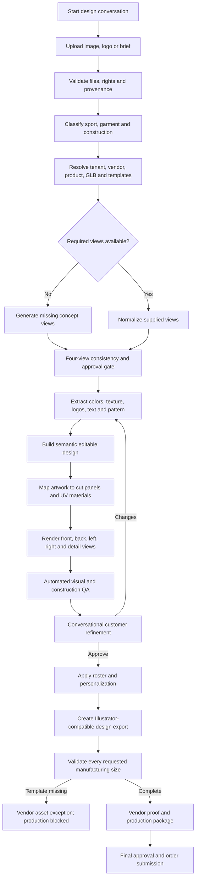

# JourneyAX configurable garment design flow — product requirements

Status: proposed enterprise product baseline  
Audience: product owners, customer experience, vendor operations, art teams, platform engineering, security and QA  
Scope: reference image to conversational design, approved 3D preview, Adobe Illustrator handoff, roster and production package

## 1. Product outcome

JourneyAX shall provide a conversational, tenant-configurable journey in which a customer can upload a garment idea, refine it naturally, view it on the correct 3D product, personalize a team roster, approve the result and produce a vendor-ready handoff.

The experience shall feel like one design conversation rather than a sequence of technical forms. The platform shall remain generic enough to support uniforms, workwear, retail products and services without product-specific branches in the agent, API or user interface.

JourneyAX shall keep these artifacts distinct:

1. **Customer reference** — the supplied image, brief, logo, colors and supporting assets.
2. **Inferred concept views** — generated front, back, left and right views used for design reasoning; not manufacturing truth.
3. **Semantic design** — editable base colors, patterns, logos, text, names and numbers.
4. **Display texture and 3D placement** — artwork mapped to an approved GLB/UV set for visualization.
5. **Illustrator artwork** — an Adobe-compatible design document with defined compatibility rules.
6. **Manufacturing templates** — authoritative, graded vendor cut files for every ordered size.
7. **Production package** — proof, roster, manifests, approvals and vendor-specific output.

No inferred concept image, display UV or scaled preview template shall be represented as an authoritative manufacturing pattern.

## 2. Governing design principles

| Principle | Requirement |
|---|---|
| Configuration over code | Products, vendors, sizes, assets, tools, prompts, approvals and export rules shall be selected from tenant/project configuration at runtime. |
| Evidence before inference | Official vendor metadata and approved files shall take precedence over filenames, visual similarity or generated content. |
| Conversation with visible work | The chat shall explain and confirm decisions while the 3D/design canvas shows the current result in the same response cycle. |
| Human approval at ambiguity | Generated views, uncertain model matches, reconstructed logos and production-critical transformations shall require explicit approval. |
| Source fidelity | Visible artwork, texture and color shall be extracted from the supplied source wherever legally and technically possible; the system shall not silently substitute a different logo or generic pattern. |
| Separate display from production | A 3D preview can be approved for appearance while production remains blocked until authoritative graded templates exist. |
| Deterministic handoff | Approved source assets and configuration shall reproduce the same export, subject to recorded model and renderer versions. |
| Safe failure | Missing fonts, corrupt SVG structures, absent size templates and uncertain mappings shall create actionable exceptions, not blank files or silent fallbacks. |

## 3. End-to-end customer journey



The user-facing progress language should be simple: `Idea → Style → Artwork → Team → Proof`. Internal job states may be more detailed.

## 4. Roles and responsibilities

| Role | Primary responsibility |
|---|---|
| Customer/designer | Supplies the brief and assets, resolves creative ambiguity and approves appearance. |
| Sales/customer service | Assists the customer, manages team/roster needs and exceptions. |
| Tenant administrator | Configures vendors, products, capabilities, prompts, fonts, colors and approval policies. |
| Art reviewer | Approves view reconstruction, logo/vector quality, panel alignment and Illustrator handoff. |
| Vendor/production reviewer | Supplies authoritative templates and approves print/manufacturing proof. |
| JourneyAX platform | Orchestrates retrieval, generation, tools, state, audit, quality gates and notifications. |

## 5. Functional requirements

### 5.1 Tenant, project and capability resolution

**JX-GAR-001 — Runtime project resolution**  
The platform shall resolve tenant, project, brand, locale, channel and user permissions before selecting any agent guidance or tool.

Acceptance criteria:

- A request cannot use assets or configuration belonging to another tenant.
- The selected project version is recorded on the job.
- Missing or disabled capabilities are not exposed to the model or client.

**JX-GAR-002 — Dynamic capability registry**  
The orchestrator shall load capabilities from a registry rather than importing product-specific tools into the conversational service.

Each capability definition shall include:

- stable capability ID, version and description;
- input and output JSON schemas;
- eligibility conditions;
- service/API binding and authentication reference;
- timeout, retry and idempotency policy;
- required permissions and data classification;
- UI renderer or panel type;
- audit and approval requirements;
- tenant/project enablement.

**JX-GAR-003 — Configurable journey guidance**  
Persona, tone, business guidance, required outcomes and prohibited behavior shall be managed as versioned project configuration. Guidance shall influence reasoning but shall not hardcode a fixed phase sequence in source code.

### 5.2 Intake, provenance and safety

**JX-GAR-010 — Multimodal intake**  
The customer shall be able to submit one or more front/back/side images, logos, sketches, color references, text instructions and roster files in one conversation or over multiple turns.

**JX-GAR-011 — File validation**  
Before processing, the platform shall validate file type, size, dimensions, corruption, malware risk, alpha channel and color profile. Unsupported files shall produce a clear recovery instruction.

**JX-GAR-012 — Immutable source retention**  
The original file shall be preserved without modification. SHA-256, MIME type, dimensions, uploader, timestamp, source classification and rights declaration shall be stored in the asset manifest.

**JX-GAR-013 — Rights and privacy confirmation**  
The customer shall confirm authorization to use uploaded trademarks, names, player data and imagery. Retention and deletion shall follow tenant policy and applicable privacy rules.

### 5.3 Construction and official asset resolution

**JX-GAR-020 — Construction-first classification**  
The system shall classify category, sport/use case, sleeve length, neckline/collar, closure, reversibility and panel construction before choosing a vendor style.

**JX-GAR-021 — Evidence-backed style match**  
The style resolver shall rank candidates using configured catalog metadata, approved reference images, GLB metadata and vendor template metadata. Filename similarity alone shall not authorize a match.

**JX-GAR-022 — Confidence gate**  
Low-confidence or conflicting matches shall pause for art/customer review. The interface shall show the proposed style and the observable reasons for the match.

**JX-GAR-023 — Vendor asset adapter**  
Vendor endpoints, authentication, design-line IDs, slot names, URL patterns, mesh/material names and response mappings shall be implemented behind versioned adapters and configured in the back office.

**JX-GAR-024 — Asset manifest**  
For every selected style, the platform shall resolve and hash the approved GLB, normal maps, display textures, cut templates, fonts, swatches, slot definitions and size availability.

### 5.4 Missing-view generation and consistency

**JX-GAR-030 — Missing-view detection**  
The system shall identify whether front, back, left and right evidence is available and distinguish supplied views from generated views.

**JX-GAR-031 — Turnaround generation**  
When views are missing, JourneyAX may generate only the missing concept views using the approved construction and supplied artwork as constraints.

**JX-GAR-032 — Generated-view disclosure**  
Every inferred view shall be visibly labelled as generated, retain the prompt/model/version/seed where available and require approval before vectorization.

**JX-GAR-033 — Four-view consistency gate**  
The system shall check that all views depict one coherent garment, including:

- exactly one correct neckline/collar and closure;
- no duplicate laces, neck openings or collars;
- consistent sleeve length and cuff construction;
- left/right sleeve logo and number placement;
- compatible front-to-side-to-back pattern continuation;
- matching colors and fabric treatment;
- legible and consistent names, numbers and text;
- no invented sponsor marks or logo substitutions.

Any failed check shall return to regeneration or manual review.

### 5.5 Artwork intelligence and source fidelity

**JX-GAR-040 — Semantic artwork decomposition**  
JourneyAX shall separate base fabric, color regions, repeating patterns, distress/texture, logos, text, player names, numbers, trim and shadows into identifiable layers.

**JX-GAR-041 — Source-faithful extraction**  
The system shall sample colors and extract visible design content from the customer source. It shall not replace a logo, font treatment or texture with a generic alternative without explicit disclosure and approval.

**JX-GAR-042 — Color management**  
The pipeline shall preserve source color profiles, calculate representative color values and map them to configured vendor swatches when required. The UI shall distinguish source color, display approximation and production swatch.

**JX-GAR-043 — Logo handling**  
Supplied vector logos shall be preserved. Raster logos may be background-removed and traced, but the original raster shall remain linked in provenance and the trace shall require visual QA.

**JX-GAR-044 — Text handling**  
Detected text shall be recorded as content plus typography metadata. Uncertain OCR or unidentified typography shall trigger customer confirmation; it shall not silently introduce substitute wording.

**JX-GAR-045 — Editability modes**  
Each layer shall declare one of `vector-editable`, `live-text`, `outlined-text`, `embedded-raster`, or `reference-only`. The customer and production team shall be able to see which parts are truly editable.

### 5.6 Panel mapping, UV mapping and 3D rendering

**JX-GAR-050 — Panel taxonomy**  
The selected style shall provide stable panel identifiers such as front body, back body, left sleeve, right sleeve, collar, cuff and trim. Panel names shall come from the product configuration.

**JX-GAR-051 — Independent side mapping**  
Front, back, left and right evidence shall be mapped to their corresponding panels. The platform shall not mirror front artwork onto the back or duplicate one sleeve onto both sides unless the approved design specifies it.

**JX-GAR-052 — Geometry-owned components**  
If the GLB contains separate collar, lace, button, hoop or trim geometry, photographed versions of those components shall be masked from the texture so the 3D render does not display duplicate necks or hardware.

**JX-GAR-053 — Material-aware atlas**  
The texture baker shall honor configured mesh/material bindings such as main, reverse, lace and trim atlases. Bindings shall not be assumed from generic material order.

**JX-GAR-054 — Seam-aware placement**  
Artwork crossing cut pieces shall use seam anchors and configured bleed/safe zones. Continuity shall be evaluated on the assembled 3D garment as well as the flat artwork.

**JX-GAR-055 — Multi-angle preview**  
The system shall provide front, back, left, right and close-detail views and an interactive 3D model when supported.

### 5.7 Conversational refinement and personalization

**JX-GAR-060 — Stateful design conversation**  
The active design, selected style, approved decisions, unresolved questions, roster and prior tool results shall be retained server-side. The customer shall not need to repeat previously supplied information.

**JX-GAR-061 — Minimal working context**  
The model context shall be assembled from a compact conversation summary, current structured design state, relevant recent turns, retrieved product/guide content and eligible capability schemas. Full raw history shall not be the only memory mechanism.

**JX-GAR-062 — One-question recovery**  
When required data is missing, the agent shall ask the smallest useful question, explain why it matters and continue from the saved state after the answer.

**JX-GAR-063 — Synchronized response**  
Text, tool status and canvas/panel updates produced by one reasoning turn shall be delivered as one ordered stream so the customer does not see a stale design while reading the response.

**JX-GAR-064 — Schema-driven roster**  
Roster fields, validation, maximum lengths, number ranges, duplicate rules, pricing impact and placement slots shall come from product/project configuration.

**JX-GAR-065 — Non-destructive personalization**  
Names and numbers shall be rendered as separate variants over an approved base design. Creating a roster entry shall not rebuild or degrade the base artwork.

### 5.8 Adobe Illustrator and SVG export

**JX-GAR-070 — Export profiles**  
JourneyAX shall support versioned export profiles. At minimum:

1. `semantic-working` — editable layers and approved live/outlined text for continued design work;
2. `illustrator-compatible` — self-contained SVG designed for reliable Adobe Illustrator opening;
3. `production` — authoritative vendor format using approved graded templates.

**JX-GAR-071 — Illustrator-safe SVG structure**  
The Illustrator-compatible SVG shall be valid XML and shall not depend on browser-only branch selection. Private Adobe PGF payloads, root-level `switch`/`foreignObject` compatibility branches and stale editor metadata shall be removed unless the selected profile explicitly supports and validates them.

**JX-GAR-072 — Font dependency preflight**  
Before delivery, the exporter shall inventory every live text node and font family, including hidden objects. Hidden placeholder text is still a dependency and shall not be ignored.

**JX-GAR-073 — Font-safe delivery**  
When an approved font is unavailable, the exporter shall follow the project profile: use an approved substitute with disclosure, convert text to outlines, or create a font-free embedded-texture version. It shall never deliver a file that produces an unexplained Illustrator font error.

**JX-GAR-074 — Source-faithful visible design**  
A font-free compatibility export may contain no live text while retaining exact visible typography inside a self-contained embedded texture. It shall clearly declare that those text pixels are not independently editable.

**JX-GAR-075 — Self-contained file**  
The Illustrator-compatible SVG shall contain no external image links, scripts, remote fonts or tenant-unsafe references. Raster content shall be embedded and vector objects shall remain within declared bounds.

**JX-GAR-076 — Export validation**  
Every exported SVG shall pass:

- XML parse and schema sanity checks;
- no prohibited scripts, external links or private compatibility branches;
- font dependency policy;
- expected artboard dimensions and nonempty bounds;
- embedded asset decode checks;
- an independent raster render proving the file is not blank;
- configured Adobe Illustrator smoke test or manual art-team approval for production workflows.

The export shall not be marked complete when the preview is blank, fonts fail resolution or embedded content cannot be decoded.

### 5.9 Size and manufacturing authority

**JX-GAR-080 — Three size concepts**  
The platform shall separately store:

- catalog-orderable sizes;
- sizes supported by a display/editor template;
- sizes with authoritative manufacturing templates.

These sets shall not be assumed to be identical.

**JX-GAR-081 — Authoritative graded templates**  
Each production size shall reference an official vendor SVG/AI/PDF template with version, checksum, unit, panel identifiers, seam allowance, bleed, safe zone, notches and print profile.

**JX-GAR-082 — No synthetic production grading**  
JourneyAX shall not manufacture S, M, XL or other sizes by proportionally scaling a publicly available L display SVG. Preview scaling may be used only when explicitly labelled non-production.

**JX-GAR-083 — Ordered-size gate**  
Before proof or order submission, the platform shall verify that every ordered size has a currently approved manufacturing template. Missing templates shall block production and create a vendor-asset exception.

**JX-GAR-084 — Size-specific artwork QA**  
For every requested size, the platform shall validate panel bounds, safe zones, bleed, seam crossing, minimum text/logo size and personalization fit.

### 5.10 QA, approval and production

**JX-GAR-090 — Automated visual QA**  
The QA service shall check blank or corrupt output, duplicate neckline/hardware, panel overflow, transparent gaps, seam discontinuity, accidental mirroring, logo/text legibility, color drift and source-versus-render similarity.

**JX-GAR-091 — Required approval gates**  
The workflow shall support separately recorded approvals for:

- inferred turnaround views;
- product/style selection;
- extracted/reconstructed artwork and color;
- interactive 3D appearance;
- roster data;
- Illustrator/art-team handoff;
- vendor manufacturing proof.

**JX-GAR-092 — Version-bound approval**  
An approval shall reference exact asset and configuration hashes. A material artwork, template, roster or configuration change shall invalidate affected downstream approvals.

**JX-GAR-093 — Production package**  
The final package shall contain approved per-size art files, roster/personalization data, color/swatches, preview renders, asset manifest, template versions, QA results, approvals and vendor order metadata.

**JX-GAR-094 — Reproducibility manifest**  
The package shall record source hashes, transformation parameters, model/prompt versions, capability versions, fonts, color profiles, GLB/UV/template versions, export profile and timestamps.

## 6. Back-office configuration requirements

All configuration shall be tenant-scoped, versioned, permission-controlled, auditable, publishable and rollback-capable.

| Configuration area | Required controls |
|---|---|
| Journey and persona | Advisor identity, tone, guidance, required outcomes, escalation language and locale. |
| Capabilities/tools | Enablement, schemas, eligibility, endpoint, auth secret reference, timeout, retry, UI renderer and approvals. |
| Vendor adapters | Base URLs, asset paths, auth, rate limits, slot mappings, error mappings and adapter version. |
| Product registry | Category, construction, catalog metadata, design lines, supported capabilities and style evidence. |
| 3D registry | GLB, normal maps, UV atlases, mesh/material bindings, camera presets and geometry-owned components. |
| Template registry | Display and manufacturing templates by size, checksums, units, panels, bleed, safe areas, seams and revision status. |
| View generation | Required views, prompt templates, negative constraints, model choice, quality threshold and approval policy. |
| Artwork processing | Segmentation, tracing, raster-retention, logo handling, resolution, color and texture policies. |
| Typography | Approved fonts, font files/licences, substitution map, outlining rules and prohibited dependencies. |
| Color | Brand palettes, vendor swatches, Delta-E tolerance, profiles and production color naming. |
| Export profiles | Live/outlined/font-free text mode, PGF/metadata policy, embedded asset policy, Illustrator version and validation rules. |
| Roster | Fields, constraints, placement slots, price rules, import/export format and approvals. |
| QA | Thresholds, blocking rules, manual-review triggers and waiver permissions. |
| Workflow | Approval gates, role assignments, SLAs, notifications and exception routing. |
| Governance | Retention, deletion, regional storage, audit, content policy and intellectual-property acknowledgement. |

Published configuration shall be immutable. A new edit creates a draft version and affects new jobs only unless an authorized operator explicitly migrates an active job.

## 7. Core domain records

| Record | Purpose |
|---|---|
| `DesignJob` | Root lifecycle, tenant/project version, owner, state, current approvals and errors. |
| `SourceAsset` | Original uploads, rights, hashes, classifications and metadata. |
| `ConceptView` | Supplied/generated orientation, confidence, provenance and approval. |
| `ProductStyle` | Vendor style, construction, catalog sizes and capability links. |
| `AssetManifest` | GLB, texture, font, swatch and template assets with versions/checksums. |
| `SemanticArtwork` | Layer graph for base, pattern, logo, text, number, roster and trim. |
| `PanelMap` | Relationship among semantic layer, cut panel, UV region, mesh and material. |
| `Roster` | Schema version and validated personalization rows. |
| `ExportArtifact` | File, purpose, size, format, profile, checksum, QA result and authority level. |
| `Approval` | Gate, actor, timestamp, artifact/config hashes, comment and invalidation state. |
| `AuditEvent` | Append-only record of user, model, tool, configuration and administrative actions. |

## 8. Service responsibilities

| Service | Responsibility |
|---|---|
| Conversation/orchestration | Assemble minimal context, choose eligible capabilities, stream responses and maintain job state. |
| Asset intake | Upload, scan, hash, profile, retain and authorize source files. |
| Construction resolver | Classify garment construction and rank official product candidates. |
| Vendor adapter | Retrieve vendor metadata/assets and translate vendor-specific contracts. |
| View synthesis | Generate missing views and attach provenance/confidence. |
| Artwork intelligence | Segment, OCR, extract colors/textures and build semantic layers. |
| Template/UV mapping | Map layers to panels, cut templates, meshes and materials. |
| 3D rendering | Bake atlases, render configured angles and support interactive preview. |
| Export/preflight | Build SVG/AI/vendor artifacts and perform font, structure and blank-file checks. |
| Roster | Validate imports, create variants and price personalization. |
| QA/evaluation | Execute deterministic checks, visual comparisons and regression scenarios. |
| Approval/workflow | Route gates, invalidate stale approvals and manage exceptions/SLAs. |
| Audit/observability | Correlation, metrics, traces, alerting, lineage and compliance evidence. |

## 9. API and event requirements

The implementation may adapt naming to existing JourneyAX conventions, but shall expose equivalent versioned contracts:

| Operation | Purpose |
|---|---|
| `POST /v1/design-jobs` | Create a job using tenant/project/version and customer brief. |
| `POST /v1/design-jobs/{id}/assets` | Upload or register source images, logos and documents. |
| `POST /v1/design-jobs/{id}/resolve-style` | Run construction and product resolution. |
| `POST /v1/design-jobs/{id}/turnaround` | Normalize or generate required concept views. |
| `POST /v1/design-jobs/{id}/artwork` | Extract or update semantic design layers. |
| `POST /v1/design-jobs/{id}/render` | Produce material-aware 3D previews. |
| `PUT /v1/design-jobs/{id}/roster` | Validate and persist personalization data. |
| `POST /v1/design-jobs/{id}/exports` | Request a named export profile and target sizes. |
| `POST /v1/design-jobs/{id}/approvals` | Approve/reject a gate against exact artifact hashes. |
| `GET /v1/design-jobs/{id}` | Return structured state, progress, exceptions and artifacts. |
| `GET /v1/design-jobs/{id}/events` | Stream ordered progress, chat and canvas events. |

All mutating operations shall accept an idempotency key. Long-running work shall be asynchronous, resumable and observable through ordered events.

## 10. Lifecycle and exception states

Recommended internal states:

```text
received
validating
classifying
resolving_assets
generating_views
awaiting_view_approval
decomposing_artwork
mapping_panels
rendering_3d
awaiting_artwork_approval
exporting_illustrator
validating_sizes
awaiting_vendor_templates
proofing
awaiting_final_approval
ready_for_order
submitted
failed
```

A state transition shall be recorded as an audit event. Retried jobs shall resume from the last valid artifact and shall not duplicate charges, approvals or orders.

The platform shall provide explicit recovery states for:

- insufficient or corrupt input;
- uncertain construction/style match;
- inconsistent generated views;
- unrecognized/reconstructed logo or text;
- duplicate collar/neck/hardware in mapped art;
- missing GLB, UV or vendor endpoint access;
- missing authoritative size template;
- unavailable/prohibited font;
- invalid, external-linked or blank SVG;
- color or seam QA failure;
- vendor proof rejection;
- manual review or customer response required.

## 11. Non-functional requirements

### Security and isolation

- Enforce tenant isolation for assets, configuration, jobs, logs and vector indexes.
- Use short-lived signed asset URLs and secret-manager references; never place vendor credentials in client code or prompts.
- Scan uploads and sanitize SVG/XML; prohibit scripts and uncontrolled external resource loading.
- Apply role-based permission to configuration publishing, approval waivers and production export.
- Encrypt data in transit and at rest and redact sensitive customer/roster data from prompts and logs.

### Reliability and performance

- Acknowledge intake immediately and stream meaningful progress during long-running work.
- Set configurable timeout, retry and circuit-breaker policies for generation and vendor adapters.
- Cache immutable vendor assets by checksum and invalidate them by published revision.
- Make render/export operations deterministic and horizontally scalable.
- Define tenant-specific performance targets; the default target is first progress feedback within two seconds, initial style candidates within fifteen seconds and cached preview interaction within two seconds.

### Observability and operations

- Propagate a correlation ID across gateway, agent, capability, vendor and rendering calls.
- Record latency, cost, token use, retries, confidence, QA failures and approval wait time by tenant/project/capability.
- Alert on blank-export rate, Illustrator preflight failures, missing templates, vendor error rate, unusually high generation cost and repeated workflow loops.
- Provide an operations view with current stage, last successful artifact, exception reason and safe retry action.

### Accessibility and experience

- Make chat, upload, progress, approvals and roster functions keyboard accessible.
- Provide text alternatives for 3D views and do not communicate approvals or errors by color alone.
- Preserve the customer's conversation and design state across refresh, device change and authenticated return.

## 12. Evaluation requirements

The release evaluation suite shall include, at minimum:

1. single front image with missing back and side views;
2. complete four-view upload;
3. lace-up versus V-neck construction distinction;
4. GLB with a separate collar/lace mesh to detect duplicate-neck regression;
5. asymmetric sleeve logo and number placement;
6. exact source texture/color comparison;
7. logo and OCR uncertainty;
8. unavailable proprietary fonts, including hidden SVG text objects;
9. SVG containing Adobe PGF, `switch` and `foreignObject` branches;
10. Illustrator-safe, font-free self-contained export;
11. public L display template with S/M/XL production templates missing;
12. complete authoritative templates across all ordered sizes;
13. roster with duplicate, invalid and overlength values;
14. mid-journey refresh/session resume;
15. tenant capability disabled and cross-tenant access attempted;
16. vendor timeout, retry and recovery without duplicate order.

Each scenario shall assert conversation quality, structured state, tool selection, artifact integrity, audit evidence and expected blocking/approval behavior.

## 13. Definition of done

The JourneyAX garment flow is production-ready only when:

- no customer, sport, style, vendor URL, design-line, material, slot, size or font is hardcoded in conversational/UI logic;
- every tool is resolved dynamically from tenant/project capability configuration;
- a single-image job produces reviewable four-view concepts before vectorization;
- logos, texture and colors are source-faithful or substitutions are disclosed and approved;
- front, back and both sides map to correct panels without duplicated neckline/hardware;
- the 3D preview, flat art and conversation update from the same versioned design state;
- Illustrator exports open nonblank and pass structure, embedded-asset and font preflight checks;
- ordered sizes use authoritative vendor templates and missing sizes block production;
- roster variants are schema-driven and non-destructive;
- every approval is version-bound and every artifact has lineage and checksum evidence;
- failures are resumable with an actionable customer or operator message;
- the evaluation suite passes across at least two materially different tenants or product domains.

## 14. Recommended delivery increments

1. **Foundation** — tenant project resolution, capability registry, server-side design state and audit events.
2. **Intake and asset intelligence** — upload, provenance, construction classification and vendor registry.
3. **Turnaround and artwork** — missing-view generation, consistency gate, source-faithful decomposition and semantic layers.
4. **3D experience** — panel/UV mapping, material-aware rendering, synchronized streaming and visual QA.
5. **Illustrator reliability** — export profiles, PGF/foreign-object sanitization, font preflight, self-contained export and blank-render validation.
6. **Size and production authority** — per-size template registry, ordered-size gates and production package.
7. **Roster, approvals and operations** — personalization, workflow, alerts, dashboards and exception handling.
8. **Enterprise hardening** — security testing, performance, disaster recovery, cross-tenant evaluations and vendor certification.

The order is intentional: production size generation must not be built on inferred or display-only templates, and a visually attractive preview must not bypass Illustrator, art-team or vendor authority gates.
