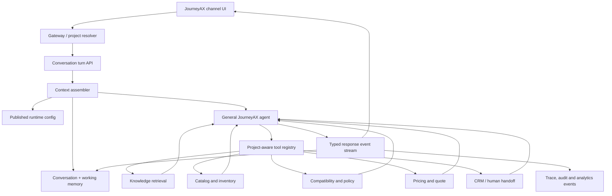

# JourneyAX Conversational Agent Requirements and Implementation Plan

**Document date:** 13 July 2026  
**Status:** Proposed implementation baseline  
**Related audit:** `docs/journeyax-enterprise-architecture-audit.md`  
**Objective:** Transform the current JourneyAX POC into a natural, ChatGPT-style, knowledge-grounded customer experience without using a rigid conversational decision tree.

---

## 1. Executive requirement

JourneyAX shall provide a natural conversational experience in which a customer can describe a goal in their own words, receive relevant answers grounded in approved project knowledge, and complete supported business activities through secure tools.

The language model shall control conversational reasoning and presentation. JourneyAX application services shall control identity, authorization, product facts, compatibility, price, inventory, quotes, orders, compliance, and auditability.

The guiding design rule is:

> Flexible conversation; controlled facts and actions.

This is not a requirement to remove all rules. It is a requirement to move each rule to the correct layer:

| Concern | Owning layer |
|---|---|
| Personality, tone, helpfulness | Agent instructions |
| Customer goal and next conversational response | Model reasoning |
| Relevant documents | Knowledge retrieval |
| Product facts | Catalog service/tool |
| Price, discount, tax | Pricing/quote service |
| Product compatibility and compliance | Configurator/policy service |
| Authorization and project isolation | Gateway and domain services |
| Quote/order lifecycle | Deterministic workflow |
| Quality and regression behavior | Evaluation suite |

---

## 2. Product goals

### 2.1 Primary goals

1. Customers may use natural language without learning commands or following a fixed wizard.
2. JourneyAX remembers the relevant context of the current and resumed conversation.
3. The agent asks only clarifying questions that materially affect the answer.
4. The agent dynamically retrieves approved project knowledge when necessary.
5. The agent dynamically selects approved tools based on customer intent.
6. Product, technical, price, inventory, compatibility, quote, and order claims are grounded in authoritative tool results.
7. Chat text and contextual UI panels update from one synchronized streamed execution.
8. Each tenant/project can configure identity, experience, scope, tools, knowledge, and policies without application code changes.
9. Every important model/tool decision is traceable and testable.
10. The same conversational core can later support web, mobile, messaging, voice, kiosk, partner, and CSR channels.

### 2.2 Non-goals for the first release

- Reproducing the full general-purpose capability of ChatGPT.
- Creating many specialized agents before one general agent is proven insufficient.
- Fine-tuning a model before prompt, retrieval, tools, and evaluations are mature.
- Allowing administrators to edit security or tenant-isolation controls.
- Allowing the model to calculate financial totals or confirm transactions without a service.
- Implementing every channel in the reference architecture during the first increment.

---

## 3. Target customer behavior

### 3.1 Discovery example

Customer:

> I am renovating a small bathroom. I want something modern in matte black.

Expected behavior:

1. Agent identifies the customer goal and known requirements.
2. Agent determines which missing information materially changes the recommendation.
3. Agent asks one concise clarification, if necessary.
4. Agent does not force the customer through a predefined form or visible phase sequence.
5. When sufficient information is available, the agent searches the approved catalog.
6. Agent explains recommendations naturally and provides supporting product UI data.

### 3.2 Technical-support example

Customer:

> My tap is dripping.

Expected behavior:

1. Agent recognizes a troubleshooting goal without relying on phrase matching.
2. Agent asks for identifying information only if required.
3. Agent retrieves an approved troubleshooting guide or product manual.
4. Agent provides only grounded, appropriate guidance.
5. Agent recommends licensed assistance or human handoff when safety policy requires it.
6. Agent does not fabricate repair steps when retrieval is empty or uncertain.

### 3.3 Quote example

Customer:

> Add those products to a quote for two bathrooms.

Expected behavior:

1. Agent calls a quote tool with product identifiers and quantities.
2. Quote service reloads current product, compatibility, price, tax, discount, and inventory facts.
3. Quote service returns a persistent `quoteId`, version, line items, totals, warnings, and provenance.
4. Agent explains the quote in natural language.
5. UI displays the same authoritative quote result.
6. Model- or browser-supplied prices are ignored.

### 3.4 Unsupported-action example

Customer:

> Place the order now.

Expected behavior:

- If real ordering is enabled and authorized, request confirmation and execute the order workflow.
- If real ordering is not enabled, clearly explain that JourneyAX can save or submit a quote/lead.
- Never generate a fake order identifier or claim that fulfillment/email has occurred.

---

## 4. Functional requirements

### 4.1 Conversation and reasoning

#### FR-CONV-001 — Natural-language interaction

The agent shall interpret semantically equivalent customer requests without relying on hard-coded prefixes such as `My answers` or `Build my quote`.

**Acceptance criteria:**

- At least five differently worded versions of each supported intent produce equivalent behavior.
- The agent supports follow-up messages such as “make it black,” “I need two,” or “what about the cheaper one” using conversation context.
- Changing customer-facing button text does not break backend routing.

#### FR-CONV-002 — Dynamic next action

The model shall choose among responding, clarifying, retrieving, using a tool, escalating, or declining based on the current context.

**Acceptance criteria:**

- No mandatory sequential phase progression is required for all requests.
- Exact SKU questions can go directly to product lookup.
- Warranty questions can be answered without product-discovery stages.
- Existing quote requests can resume directly from quote context.

#### FR-CONV-003 — Minimal clarification

The agent shall ask a question only when the missing answer materially affects recommendation, safety, compatibility, pricing, or action completion.

**Acceptance criteria:**

- Agent does not ask for already-known information.
- Agent normally asks one focused question at a time.
- Agent can state assumptions when the missing detail is noncritical.
- A configurable absolute question limit may exist as a safety/UX boundary, not as the primary conversation strategy.

#### FR-CONV-004 — Compact agent identity

The system shall assemble a concise identity and behavior prompt from platform instructions plus published project configuration.

The prompt shall contain:

- Agent identity and role.
- Primary customer objective.
- Communication style.
- Approved knowledge/tool behavior.
- Non-negotiable factual/action boundaries.
- Escalation behavior.

The prompt shall not contain product catalogs, live prices, warehouse status, or a complete conversational decision tree.

#### FR-CONV-005 — Structured output and tool arguments

All model-generated machine-consumed outputs shall conform to strict runtime schemas.

**Acceptance criteria:**

- Unknown properties are rejected.
- Enums, lengths, quantities, identifiers, and nested objects are validated.
- Invalid tool arguments are returned to the model as a structured tool error or terminate safely.
- No raw `JSON.parse` result is trusted without validation.

### 4.2 Context and memory

#### FR-MEM-001 — Server-owned session

The server shall own the canonical session and working state.

**Acceptance criteria:**

- Session records are keyed and queried using `{ projectId, sessionId }`.
- Browser-provided state never overwrites authoritative server state.
- Session is bound to the authenticated user or an anonymous subject/channel token.
- Reset creates a new session or performs an audited server-side reset.

#### FR-MEM-002 — Conversation history

The system shall persist customer messages, assistant messages, tool calls, tool results, and key state transitions.

**Acceptance criteria:**

- A supported page refresh restores the conversation.
- A resumed conversation retains selected products and quote references.
- PII retention follows project privacy configuration.

#### FR-MEM-003 — Structured working memory

The system shall maintain a validated state containing relevant facts such as:

- Customer goal.
- Project/room/category.
- Style and finish preferences.
- Budget and quantity.
- Installation context.
- Selected product identifiers.
- Active quote identifier/version.
- Confirmed assumptions.
- Open questions.
- Handoff or safety state.

Model-generated memory patches shall be validated before persistence.

#### FR-MEM-004 — Context management

The context assembler shall include only information relevant to the current turn and shall support summarization/compaction when conversation history becomes large.

**Acceptance criteria:**

- Tool call/result pairs are never separated.
- Important customer facts survive compaction.
- Token usage and context size are measured.
- The full unbounded transcript is not sent indefinitely.

### 4.3 Knowledge and grounding

#### FR-KNOW-001 — Project-scoped retrieval

Every knowledge query shall use an edge-resolved `projectId` and approved published knowledge scope.

**Acceptance criteria:**

- Caller cannot select another project using body/header parameters.
- Vector and fallback searches preserve project scope.
- Cross-project negative tests return zero unauthorized documents.

#### FR-KNOW-002 — Dynamic retrieval

The model shall be able to request retrieval when the answer depends on project-specific products, technical documents, policies, or design content.

Retrieval shall not be mandatory for greetings, conversational acknowledgments, or other general statements.

#### FR-KNOW-003 — Normalized knowledge documents

Each knowledge chunk shall include:

- `projectId`
- Source identifier and URL
- Content type
- Market and locale
- SKU/category/collection when relevant
- Source version and effective date
- Approval status
- Ingestion timestamp
- Content checksum
- Access classification

#### FR-KNOW-004 — Retrieval quality

The retrieval service shall support semantic and keyword retrieval, metadata filtering, duplicate removal, relevance thresholding, and optional reranking.

#### FR-KNOW-005 — Provenance validation

The agent runtime shall record which sources support each product/technical recommendation.

**Acceptance criteria:**

- A product recommendation references an authoritative product identifier.
- Technical instructions reference an approved guide/manual.
- Empty/failed retrieval cannot be counted as grounded retrieval.
- Unsupported technical instructions are withheld or clearly escalated.

### 4.4 Tools and business actions

#### FR-TOOL-001 — Project-aware tool registry

The active tool set shall be resolved from published project configuration and authenticated customer context.

Tool availability may vary by:

- Project.
- Market.
- Channel.
- User role.
- Journey capability.
- Integration health.
- Feature flag.

#### FR-TOOL-002 — Minimum initial tools

The first production toolset shall provide:

1. `searchKnowledge`
2. `searchProducts`
3. `getProduct`
4. `checkCompatibility`
5. `getPriceAndInventory`
6. `createQuote`
7. `updateQuote`
8. `requestHumanHandoff`

Checkout, order, CRM, appointment, notification, and visual-planning tools shall only be exposed when their backing implementations are real and production-enabled.

#### FR-TOOL-003 — Tool authorization

Every tool call shall be checked for:

- Project scope.
- Actor identity and role.
- Tool capability enabled for the project/channel.
- Valid input schema.
- Allowed resource identifiers.
- Approval/confirmation requirements.
- Idempotency.

#### FR-TOOL-004 — Tool-result truth

The final response and UI shall use tool results rather than the model's original proposed arguments for business facts.

#### FR-TOOL-005 — Idempotent turns and actions

Each customer turn shall have a unique `turnId`. Mutating tools shall accept an idempotency key derived from the project, session, turn, and tool call.

**Acceptance criteria:**

- Retrying an SSE request does not create duplicate quotes, leads, orders, or appointments.
- Completed tool calls can be replayed to the model without repeating the external action.

### 4.5 Catalog, compatibility, pricing, and quotes

#### FR-CAT-001 — Authoritative catalog

Catalog tools shall return structured, current product data from an approved system of record rather than reconstructed LLM text.

#### FR-COMP-001 — Deterministic compatibility

Compatibility, required components, compliance, and blocked combinations shall be evaluated by a deterministic service or policy engine.

The model may explain the result but shall not create the result.

#### FR-PRICE-001 — Server-side money calculation

All money values shall use integer minor units or an approved decimal representation consistently across services.

Pricing shall include:

- Price list/version.
- Customer or segment pricing where authorized.
- Quantity.
- Promotions/discounts.
- Tax jurisdiction and rounding.
- Freight/addons when applicable.
- Currency.

#### FR-QUOTE-001 — Persistent quote aggregate

Quote creation shall return an authoritative record containing:

- `quoteId`
- `quoteVersion`
- `projectId`
- Customer/session identifiers
- Product identifiers and quantities
- Price source/version
- Compatibility result/version
- Tax/discount results
- Warnings and required items
- Status
- Creation/expiry timestamps
- Configuration/rule versions

#### FR-ORDER-001 — Truthful transaction status

UI shall present order confirmation only after an authoritative order service/integration returns success and a persisted order record exists.

Until that capability exists, the supported outcome shall be explicitly named “save estimate,” “submit quote,” or “request contact.”

### 4.6 Streaming and user experience

#### FR-STREAM-001 — Single execution stream

Buffered and streaming responses shall use one orchestration implementation.

The core shall emit typed internal events such as:

- `turn.started`
- `context.ready`
- `tool.started`
- `tool.completed`
- `ui.updated`
- `text.delta`
- `memory.updated`
- `turn.completed`
- `turn.failed`

#### FR-STREAM-002 — Synchronized chat and panels

The storefront shall process validated UI events during the stream rather than waiting only for the final response.

**Acceptance criteria:**

- Loading/progress state appears quickly.
- Product/guide/quote panels update as their authoritative tool result becomes available.
- Chat text and panel state belong to the same `turnId`.
- Duplicate/out-of-order events are safely ignored.

#### FR-STREAM-003 — Safe recovery

Stream interruption shall not automatically repeat a non-idempotent agent turn.

The client shall resume/poll the turn result or retry using the same `turnId`.

### 4.7 Configuration and back office

#### FR-CONFIG-001 — Published runtime configuration

The project service shall publish an immutable `ProjectRuntimeConfig` version consumed by runtime services.

Minimum configuration:

- Project identity and status.
- Brand/persona/tone/greeting.
- Locale, market, currency, and timezone.
- Theme and channel presentation.
- Supported scope/categories/finishes.
- Enabled tools/capabilities.
- Journey guidance: approved goal/outcome statements the agent reasons over to
  shape the flow (never a fixed stage sequence — see §6.3).
- Knowledge scopes and retrieval settings.
- Model profiles and budget boundaries.
- Escalation/handoff settings.
- Privacy/retention settings.
- References to structured pricing/compatibility/compliance policy versions.
- Integration domain-to-platform mappings.

#### FR-CONFIG-002 — Configuration lifecycle

Configuration shall support:

- Draft.
- Schema validation.
- Simulation/evaluation.
- Approval.
- Scheduled or immediate publication.
- Immutable published version.
- Rollback.
- Audit history.

#### FR-CONFIG-003 — Rule separation

Back-office rules shall be separated into:

1. Conversational guidance — approved text included in agent context.
2. Deterministic policy — structured predicates/actions evaluated by code/policy engine.

Pricing, compatibility, compliance, eligibility, authorization, and transaction rules shall not be implemented only as free-text prompt instructions.

### 4.8 Observability and evaluation

#### FR-OBS-001 — Agent trace

Each turn shall record:

- Project/session/turn/correlation identifiers.
- Configuration and model version.
- Context sources and size.
- Model calls and token usage.
- Tool selection, duration, result status, and safe metadata.
- Retrieval source IDs and scores.
- Guardrail/policy decisions.
- Final outcome and latency.

Sensitive reasoning text, credentials, and unnecessary PII shall not be logged.

#### FR-EVAL-001 — Evaluation dataset

JourneyAX shall maintain a versioned evaluation suite with representative conversations and expected outcomes.

Minimum categories:

- Discovery and ambiguity.
- Exact product/SKU lookup.
- Follow-up reference resolution.
- Product comparison.
- Troubleshooting and installation.
- Empty retrieval.
- Conflicting requirements.
- Out-of-scope requests.
- Prompt injection and malicious documents.
- Cross-project access attempts.
- Pricing and quote accuracy.
- Duplicate/retried turns.
- Human escalation.
- Locale variations.

#### FR-EVAL-002 — Release gate

Prompt, model, retrieval, tool, and configuration changes shall run automated evaluations before publication/deployment.

---

## 5. Non-functional requirements

### NFR-SEC-001 — Tenant/project isolation

- `projectId` is resolved at the trusted edge.
- Project identity cannot be overridden by body/query/header from a public client.
- Every repository query includes project scope.
- Sensitive services are not directly exposed to browsers.

### NFR-SEC-002 — Authentication and authorization

- Protected routes fail closed in every deployed environment.
- Administrative registration requires invitation/authorization.
- Tool authorization is enforced server-side.
- Staff and customer permissions are distinct.

### NFR-PERF-001 — Responsiveness

Initial target, to be refined by load testing:

- Stream acknowledgement/progress: under 500 ms when infrastructure is healthy.
- First useful text or tool-progress event: p95 under 2 seconds.
- Normal grounded response: p95 under 8 seconds.
- Long-running tools communicate progress and may continue asynchronously.

### NFR-REL-001 — Reliability

- Normal service calls use timeouts and cancellation.
- Safe reads may retry with bounded backoff.
- Mutating operations require idempotency.
- Required policy/config failures fail closed.
- Optional personalization failures degrade gracefully.

### NFR-PRIV-001 — Privacy

- Session/transcript retention is configurable by approved policy.
- PII is minimized and redacted from logs.
- User/session export and deletion are supported where required.
- Knowledge access respects project/source classifications.

### NFR-MAINT-001 — Maintainability

- One orchestration engine serves streaming and buffered transports.
- Runtime contracts use shared schemas rather than `any`.
- No production fake-success connectors.
- Generated/build output is excluded from normal source commits.

### NFR-TEST-001 — Quality gates

- Build, lint, unit, contract, integration, isolation, evaluation, and critical browser tests run in CI.
- Next.js applications use the supported ESLint CLI/Biome configuration rather than removed `next lint`.

---

## 6. Target architecture



### 6.1 Recommended agent strategy

Start with one general JourneyAX agent. Do not create separate discovery, product, technical, sales, and quote agents initially.

Introduce a specialist only when evaluation data proves that it provides a material improvement in accuracy, safety, cost, or maintainability.

### 6.2 Recommended API strategy

Use a single turn execution abstraction regardless of whether the implementation uses:

- OpenAI Responses API with a custom loop, or
- OpenAI Agents SDK for agent loop, sessions, guardrails, and tracing.

The application architecture shall not depend directly on one transport/provider API. Implement a model-runtime port so provider/model changes do not change business tools.

### 6.3 Journey model: capabilities + configuration, not hardcoded stages

The journey is **emergent**, not scripted. The agent must not contain a fixed
stage machine (`clarify → products → accessories → install → warranty → quote`)
or phrase-matching that forces "at this step ask this". That approach ties the
business's hands and cannot generalize across scenarios or platforms. Instead the
journey is produced by three separated layers:

1. **Capability layer (code, tenant-agnostic).** Journey-agnostic tools that are
   pure building blocks, never a sequence: `askClarifying`, `searchKnowledge`,
   `showProducts`, `showAccessories`, `presentChoice` (e.g. DIY vs plumber),
   `showInstallGuide` (retrieves and attaches official PDFs), `showWarranty`,
   `buildQuote`, `escalate`. Every tenant and vertical uses the same blocks; none
   of them assume Caroma, bathrooms, or an order of operations.
2. **Configuration layer (back office, per project).** What varies per business is
   **data, not code**: persona/goals/tone; the *journey intent* expressed as
   approved conversational guidance (e.g. "guide the customer from their problem
   to a confident quote; when a fixture is selected, consider matching accessories
   and what installing it requires; surface warranty before quoting"); business
   rules as `condition → action` (see FR-CONFIG-003); enabled capabilities;
   knowledge scopes; model profile. A new business is onboarded by editing
   configuration and pointing at its knowledge base — **zero code change**.
3. **Reasoning layer (the model).** Each turn the agent reads the published config
   + conversation + working memory + retrieved knowledge and decides the single
   best next action, calling a capability or speaking. The sequence is whatever
   the situation calls for; a leak starts with safety and diagnosis, a new build
   starts with project/rough-in planning, an install request goes straight to PDF
   retrieval — because the model reasons, not because code branches on a stage.

**Completeness without scripting.** A "complete" journey (accessories, install
path, warranty, quote) is achieved by two non-hardcoded mechanisms:

- **Configurable journey guidance** — the milestones/outcomes a good journey
  should usually reach are expressed as *goals* in the tenant's approved guidance
  text, edited in the back office, not compiled into the agent.
- **Outcome (not flow) enforcement** — deterministic guarantees about integrity,
  never about sequence: e.g. if a capability retrieved products/guides this turn,
  ensure the corresponding panel actually renders; never invent specs/warranty;
  a required deterministic policy (pricing, compliance) fails closed. These are
  UI/grounding guarantees, not "you must be in stage X" rules.

### 6.4 Platform-agnostic genericity (multi-tenant, multi-vertical)

The agent core, tools, and pipeline are **business-agnostic**. Caroma/GWA is the
first configured *project*, not a special case in the code. The same runtime must
serve a different brand, a different water-space vertical (bathroom, kitchen,
laundry), or a different industry entirely, purely through back-office
configuration + that project's knowledge base and integrations.

Requirements:

- No brand names, category lists, finish names, journey stages, warranty rules, or
  question scripts are hardcoded in the agent, tools, prompts, or storefront. All
  such content is project configuration or retrieved knowledge.
- Space/vertical (bathroom/kitchen/laundry/…) and journey type (build/renovate/
  replace/repair/install/warranty) are **classified**, not enumerated in code, and
  drive retrieval scope and guidance — they do not select a hardcoded branch.
- Adding a platform/vertical = create the project, attach its knowledge base +
  integrations, configure persona/rules/capabilities, publish. No deploy.
- The back office is the **control plane**: every business-specific behavior
  (persona, rules, journey guidance, enabled capabilities, connectors, model,
  theme) is authored, validated, simulated, approved, and versioned there.

---

## 7. Current-code change map

### 7.1 Agent commerce service

#### Retain

- Modular prompt directory.
- Retrieval policy concept.
- Integration/knowledge port usage.
- SSE controller contract, after event versioning.
- Session concept, after redesign.

#### Replace or refactor

| Current area | Required change |
|---|---|
| `src/agent.service.ts` | Replace duplicated `processChat`/`processChatStream` logic with one `executeTurn()` async event pipeline |
| `routePostClarify()` | Remove hard-coded English phrase routing |
| `mustForceClarify()` | Replace forced phase behavior with context/model decision plus UX boundaries |
| `tools` constant | Move to strict, typed, project-aware tool registry |
| UI tool arguments | Validate and hydrate from authoritative services before emission |
| `pipeline/intent-resolver.ts` | Remove or reduce to optional optimized router after evaluation |
| `pipeline/session-store.ts` | Replace arbitrary snapshot with project-scoped session, transcript, working memory, version, retention |
| `pipeline/config-loader.ts` | Load published runtime config/version, not only free-text active rules |
| `pipeline/grounding-validator.ts` | Replace trace-only regex with provenance/claim/tool-result validation and safe fallback |
| `prompts/base.ts` | Reduce Caroma-specific procedural rules; assemble compact identity/boundaries from project config |

#### Proposed internal modules

```text
apps/agent-commerce-service/src/
  runtime/
    turn-orchestrator.ts
    context-assembler.ts
    event-stream.ts
    model-runtime.port.ts
  memory/
    conversation.repository.ts
    working-memory.schema.ts
    memory-service.ts
  tools/
    tool-registry.ts
    tool-executor.ts
    tool-policy.ts
    schemas/
  grounding/
    provenance-validator.ts
    response-policy.ts
  prompts/
    platform.ts
    identity.ts
    boundaries.ts
    context-renderer.ts
```

These names are implementation guidance, not a mandatory directory contract.

### 7.2 Journey storefront

| Current area | Required change |
|---|---|
| `components/ChatPanel.tsx` | Replace `any` messages, global window handlers, and whole-turn retry with typed turn/event client |
| SSE parser | Consume `uiAction`/tool progress/trace-safe events as well as text/done |
| `context/JourneyContext.tsx` | Treat UI state as a projection of server events, not quote/order authority |
| Local session storage | Store only an opaque allowed session reference; server owns state |
| `handleApprove()` | Call authoritative quote/order action; remove random order creation |
| Hard-coded product/price/stock copy | Render project configuration and tool results |
| `AuthContext.tsx` | Integrate secure authenticated/anonymous session strategy with chat requests |

### 7.3 Project service and back office

| Current area | Required change |
|---|---|
| Project config | Add schema/version/draft/publish/rollback lifecycle |
| Rules | Separate conversational guidance from structured deterministic policy |
| Rule updates | Replace mass assignment with strict allow-listed DTO/schema mapping |
| Back-office rules page | Route through protected gateway/BFF, add project selector, auth, edit, simulation, approval, audit |
| Back-office main page | Decompose static demo into real project/config/operations modules |
| Agent config | Add persona, enabled tools, knowledge scope, model profile, handoff and privacy configuration |

### 7.4 Product/data services

| Current area | Required change |
|---|---|
| Product controller brand body | Use trusted project context |
| Knowledge schema | Normalize `projectId`, metadata, version, approval, locale, source classification |
| Retrieval | Add threshold, hybrid/dedupe/rerank options, provenance, metrics and evaluation |
| Ingestion scripts in web app | Move to durable data-service jobs |
| Data service simulation | Implement source connector, checkpointing, mapping, validation, upsert, errors and lineage |
| Catalog versus knowledge | Separate authoritative structured product APIs from unstructured RAG results |

### 7.5 New configurator/quote capability

The current repository has calculation utilities and configurator interfaces but no authoritative quote aggregate. Implement either:

- A new `apps/configurator-service`, or
- A clearly bounded configurator/quote domain service within an existing service during the first increment.

It shall own:

- Compatibility evaluation.
- Required/blocked product relationships.
- Authoritative quantity and line-item hydration.
- Price/tax/discount calculation.
- Quote persistence and versioning.
- Quote adjustment and expiry.
- Validation evidence returned to agent/UI.

Do not place this responsibility in the LLM prompt or React context.

### 7.6 Gateway/auth/shared packages

- Resolve and bind `projectId` at the edge.
- Remove deployed fail-open authentication.
- Enforce method-aware authorization.
- Forward signed verified actor/project context to services.
- Standardize error envelopes, correlation IDs, timeouts, and trace propagation.
- Replace conflicting tenant/project, role, and money types with shared runtime schemas.
- Cache database clients/handles safely by URI/database.

---

## 8. Delivery plan

The plan is organized so each phase produces a demonstrable improvement and does not require a big-bang rewrite.

### Phase 0 — Baseline and safety controls

**Goal:** Establish reproducibility and close immediate trust gaps before changing agent behavior.

#### Work items

- `P0-01` Create a clean source baseline; exclude build output and Turbo logs.
- `P0-02` Replace removed `next lint` commands with supported lint configuration.
- `P0-03` Add test runner and initial unit/contract suites.
- `P0-04` Close public self-assigned admin registration.
- `P0-05` Remove deployed auth fail-open behavior.
- `P0-06` Protect project/rule APIs and stop direct browser-to-service access.
- `P0-07` Bind trusted `projectId` at gateway and scope sessions/product queries.
- `P0-08` Remove or relabel fake order, fulfillment, live-price and stock claims.

#### Exit criteria

- Build, lint, and baseline tests pass.
- A hostile client cannot self-register as an administrator or choose another project.
- UI does not claim a transaction that did not happen.

### Phase 1 — Contracts, server memory, and runtime configuration

**Goal:** Create the foundation the conversational agent will consume.

#### Work items

- `P1-01` Define runtime schemas for messages, turn events, working memory, tool calls/results, project config, products, money, and quote.
- `P1-02` Implement `{projectId, sessionId}` conversation repository.
- `P1-03` Persist transcript/tool results and structured working memory.
- `P1-04` Add `turnId`, optimistic session version, and idempotency ledger.
- `P1-05` Implement published `ProjectRuntimeConfig` read model.
- `P1-06` Make agent load runtime config/version per session/turn.
- `P1-07` Add explicit server reset/new-session endpoint.
- `P1-08` Add retention and redaction configuration.

#### Exit criteria

- Refresh/resume restores a conversation and server state.
- Client state cannot override server state.
- Every turn is associated with project/config/session/turn identifiers.

### Phase 2 — Unified natural agent runtime

**Goal:** Replace the mechanical pipeline with one context-and-tool-driven agent.

#### Work items

- `P2-01` Create one async `executeTurn()` event pipeline.
- `P2-02` Implement context assembler: identity, runtime config, memory, tools, relevant knowledge/tool results.
- `P2-03` Reduce base prompt to identity, objective, tool behavior, truth boundaries, communication and escalation.
- `P2-04` Implement strict tool schemas and validated execution.
- `P2-05` Remove `routePostClarify()` phrase routing.
- `P2-06` Remove mandatory phase progression and forced clarify tool call.
- `P2-07` Allow model-driven response/clarify/retrieve/tool selection.
- `P2-08` Remove separate intent resolver from critical path, retaining it only if evaluation proves value.
- `P2-09` Implement context compaction/summary with invariant memory.
- `P2-10` Add model runtime abstraction and configurable evaluated model profiles.

#### Exit criteria

- Representative requests work without hard-coded trigger phrases.
- One pipeline produces both buffered and streaming output.
- Agent asks contextually relevant questions and can skip irrelevant stages.
- All machine-consumed model output is schema validated.

### Phase 3 — Grounded knowledge and authoritative tools

**Goal:** Prevent hallucinated business facts while keeping natural reasoning.

#### Work items

- `P3-01` Normalize project-scoped knowledge schema and ingestion.
- `P3-02` Implement hybrid retrieval, relevance threshold, dedupe, optional reranking and source provenance.
- `P3-03` Add authoritative structured catalog tools.
- `P3-04` Implement compatibility/policy evaluator.
- `P3-05` Implement price/inventory tool.
- `P3-06` Implement persistent quote create/update/read APIs.
- `P3-07` Validate model-proposed product IDs against tool results.
- `P3-08` Block or escalate unsupported technical claims.
- `P3-09` Replace prompt-only critical business rules with structured policy.

#### Exit criteria

- Model cannot display an unverified SKU/price/inventory/compatibility result.
- Quote totals are reproducible and server calculated.
- Technical responses have approved source provenance or safe escalation.

### Phase 4 — Unified streaming experience

**Goal:** Make chat and contextual panels feel like one live experience.

#### Work items

- `P4-01` Version typed SSE event protocol.
- `P4-02` Stream progress, tool and UI result events from the unified pipeline.
- `P4-03` Replace ChatPanel event parser with typed reducer/client.
- `P4-04` Update panels from validated tool results during the same turn.
- `P4-05` Add turn resume/polling and remove duplicate whole-turn fallback.
- `P4-06` Add cancel behavior and stale-turn handling.
- `P4-07` Measure time-to-first-event/text and end-to-end latency.

#### Exit criteria

- Customer receives immediate progress/stream feedback.
- Right panel updates in the same turn without waiting for a second message.
- Network interruption cannot duplicate a quote or future transaction.

### Phase 5 — Back-office control plane

**Goal:** Make tenant onboarding and behavior changes configuration-driven.

#### Work items

- `P5-01` Project and market selector.
- `P5-02` Brand/persona/tone/locale configuration.
- `P5-03` Enabled tools and channel capabilities.
- `P5-04` Knowledge sources, ingestion schedules, approval and retrieval tests.
- `P5-05` Structured compatibility/compliance/policy designer.
- `P5-06` Pricing/tax/discount/addon configuration.
- `P5-07` Integration platform/capability/secret-reference configuration.
- `P5-08` Draft/validate/simulate/approve/publish/rollback workflow.
- `P5-09` Immutable audit history.
- `P5-10` Remove or visibly label remaining demo-only dashboards.

#### Exit criteria

- A second project can be configured and published without code changes.
- Published config version is observable in every conversation/quote trace.
- Critical policies require validation and approval.

### Phase 6 — Evaluation, observability, and production readiness

**Goal:** Make model behavior measurable and safely releasable.

#### Work items

- `P6-01` Build 100–300 scenario evaluation dataset.
- `P6-02` Add graders for intent/action, retrieval relevance, factual support, tool selection, quote accuracy and safety.
- `P6-03` Add prompt/model/retrieval/config regression runs.
- `P6-04` Implement OpenTelemetry traces and structured redacted logs.
- `P6-05` Replace analytics mocks with canonical events and real metrics.
- `P6-06` Define latency, accuracy, grounding, cost and availability SLOs.
- `P6-07` Add integration failure queues, retry controls and operator dashboards.
- `P6-08` Complete security, load, resilience and disaster-recovery testing.

#### Exit criteria

- Agent/config/model changes cannot publish when critical eval thresholds regress.
- Back office reports real session, retrieval, quote and outcome data.
- Operators can trace a customer turn across gateway, agent, retrieval and tools.

---

## 9. Prioritized product backlog

| Priority | ID | Deliverable | Dependency |
|---|---|---|---|
| P0 | SEC-01 | Invitation-only staff/admin onboarding | None |
| P0 | SEC-02 | Trusted project resolution and service authorization | None |
| P0 | UX-01 | Remove false order/live-stock/live-price claims | None |
| P0 | QA-01 | Working lint and initial test gate | None |
| P1 | CONTRACT-01 | Shared runtime schemas | QA-01 |
| P1 | MEM-01 | Project-scoped session/transcript/working memory | CONTRACT-01, SEC-02 |
| P1 | CONFIG-01 | Published runtime configuration | CONTRACT-01, SEC-02 |
| P1 | AGENT-01 | Unified turn orchestrator | CONTRACT-01, MEM-01, CONFIG-01 |
| P1 | AGENT-02 | Compact dynamic prompt/context assembler | AGENT-01 |
| P1 | TOOL-01 | Strict project-aware tool registry | AGENT-01, CONFIG-01 |
| P1 | STREAM-01 | Typed unified event stream | AGENT-01 |
| P1 | WEB-01 | Typed streaming UI reducer | STREAM-01 |
| P1 | KNOW-01 | Normalized project-scoped knowledge | SEC-02, CONTRACT-01 |
| P1 | CAT-01 | Authoritative product lookup | TOOL-01, KNOW-01 |
| P1 | QUOTE-01 | Compatibility/pricing/quote service | TOOL-01, CAT-01 |
| P2 | POLICY-01 | Structured policy engine/rule separation | CONFIG-01, QUOTE-01 |
| P2 | BO-01 | Project/agent/knowledge/policy publish screens | CONFIG-01, POLICY-01 |
| P2 | EVAL-01 | Agent evaluation suite and release gate | AGENT-02, TOOL-01, KNOW-01 |
| P2 | OBS-01 | Trace/audit/canonical analytics events | AGENT-01, STREAM-01 |
| P3 | ORDER-01 | Real checkout/order workflow | QUOTE-01, SEC-02, OBS-01 |
| P3 | CHANNEL-01 | Additional channels | Stable agent/runtime/config/evals |

---

## 10. Definition of done

A requirement or backlog item is complete only when:

1. Runtime schemas and error behavior are defined.
2. Authorization and project isolation are enforced.
3. Unit and contract tests pass.
4. Relevant integration and cross-project negative tests pass.
5. Agent evaluation scenarios are added or updated.
6. Telemetry and safe diagnostics exist.
7. Documentation and back-office capability descriptions match reality.
8. No fake success behavior is introduced.
9. Build and lint pass.
10. Acceptance criteria are demonstrated in a controlled environment.

---

## 11. Initial evaluation acceptance targets

Targets shall be refined using a reviewed baseline, but the first production candidate should aim for:

| Measure | Initial target |
|---|---:|
| Cross-project data leakage | 0 occurrences |
| Invented SKU/price/order ID in critical evals | 0 occurrences |
| Quote calculation match against golden cases | 100% |
| Required tool argument schema validity | 100% |
| Correct supported/unsupported transaction messaging | 100% |
| Grounded technical-answer rate | ≥ 98% |
| Appropriate tool selection | ≥ 95% |
| Relevant clarification behavior | ≥ 90% |
| Retrieval top-result relevance | ≥ 90% on curated set |
| p95 first progress/text event | < 2 seconds |

Security, tenant isolation, quote arithmetic, and truthful transaction status are hard gates and cannot be traded for average conversational scores.

---

## 12. Recommended first implementation increment

The first increment should not attempt the entire plan. Implement this vertical slice:

1. Trusted `projectId`, secure session and `turnId`.
2. Published project identity/persona/tool configuration.
3. One unified agent `executeTurn()` pipeline.
4. Compact prompt and removal of phrase/forced-phase routing.
5. Strict `searchKnowledge` and `searchProducts` tools.
6. Typed streaming events consumed live by ChatPanel.
7. Server working memory and transcript persistence.
8. A 40–60 scenario evaluation baseline.

Demonstrate these four journeys:

- Natural design discovery.
- Exact product question.
- Grounded troubleshooting.
- Product recommendation with synchronized right-panel update.

Do not include production quote/order claims in this increment unless the authoritative quote service is also implemented.

### First-increment success statement

> A customer can speak naturally, JourneyAX remembers the conversation, dynamically retrieves approved knowledge/products, responds in a project-specific voice, and updates the chat and contextual panel from one safe streamed turn—without hard-coded conversational trigger phrases.

---

## 13. Final implementation recommendation

JourneyAX should evolve through controlled refactoring rather than a rewrite:

- Preserve the current UI, service boundaries, prompt modules, knowledge port, and streaming transport where useful.
- Replace the duplicated mechanical orchestration with one model-driven turn runtime.
- Make context rich but bounded.
- Make tools few, clear, strict, authorized, and authoritative.
- Keep business truth outside the model.
- Make every configuration and behavior change versioned, evaluated, observable, and reversible.

This produces the desired ChatGPT-style experience while remaining safe enough for enterprise product, technical, quote, and eventually transactional use.

---

## 14. File-level implementation specifics

> **Purpose of this section:** The requirements and delivery phases above define *what* to build and *why*. This section defines *exactly where* in the current codebase each change must be made — file paths, function names, line references, and code samples. It is written for the developer picking up the first increment described in Section 12.
>
> **Codebase reviewed:** 13 July 2026. All line references are approximate and should be verified against the current HEAD before making changes.

---

### 14.1 Ticket map

Each item below corresponds to a work item from Section 8.

| Ticket | Section 8 ref | Effort | Risk | Depends on |
|---|---|---|---|---|
| JRNY-01 | P2-05, P2-06, P2-07 | 2 h | Low | None |
| JRNY-02 | P2-03, FR-CONV-004 | 3 h | Low | None |
| JRNY-03 | P1-02, P1-03, FR-MEM-001, FR-MEM-002 | 1 day | Medium | JRNY-01 |
| JRNY-04 | P2-01, FR-STREAM-001, FR-STREAM-002 | 1 day | Medium | JRNY-01 |
| JRNY-05 | P3 (next sprint), FR-CAT-001 | 2 days | High | JRNY-03, JRNY-04 |

---

### 14.2 JRNY-01 — Remove phrase-matching and forced phase logic

**Requirement refs:** FR-CONV-001, FR-CONV-002, P2-05, P2-06, P2-07

**File:** `apps/agent-commerce-service/src/agent.service.ts`

#### Changes

**1. Delete `routePostClarify()` (approx. lines 240–268)**

This method intercepts the model's reasoning by checking whether the last user message starts with the literal string `"my answers"` or `"build my"`. These are client-generated button labels, not semantic signals. The model already understands these phrases from conversation context. Deleting this method satisfies FR-CONV-001.

**2. Delete `mustForceClarify()` (approx. lines 277–284)**

This method forces `setPhase('clarify')` on every first turn, overriding the model's judgment. Deleting it satisfies FR-CONV-002 — the model decides whether to clarify, ask a direct question, or go straight to retrieval.

**3. Remove the two calls to `routePostClarify()`**

In `processChat()` (approx. line 337) and in `processChatStream()` (approx. line 585):
```typescript
// DELETE both occurrences of:
this.routePostClarify(intent, messages);
```

**4. Simplify `tool_choice` in `processChat()` (approx. lines 425–430)**

```typescript
// BEFORE:
tool_choice: forceText
  ? 'none'
  : loops === 1 && this.mustForceClarify(intent, state, messages)
    ? { type: 'function', function: { name: 'setPhase' } }
    : 'auto',

// AFTER:
tool_choice: forceText ? 'none' : 'auto',
```

**5. Simplify `tool_choice` in `processChatStream()` (approx. lines 645–648)**

```typescript
// BEFORE:
tool_choice:
  loops === 1 && this.mustForceClarify(intent, state, messages)
    ? { type: 'function', function: { name: 'setPhase' } }
    : 'auto',

// AFTER:
tool_choice: 'auto',
```

#### Acceptance criteria

- A customer saying "I want a new shower" receives a direct response or a single focused question — not always the clarify panel.
- A customer saying "show me your best matte black basin mixer" goes directly to product retrieval without forced clarification.
- "My answers: matte black, wall-mounted" still routes correctly because the model understands this from conversation context, not a keyword check.
- Changing the label on the "My answers" button in the UI does not change agent behavior.

---

### 14.3 JRNY-02 — Rewrite system prompt to 5-section structure

**Requirement refs:** FR-CONV-004, P2-03

#### File: `apps/agent-commerce-service/src/prompts/base.ts`

Replace the entire `BASE_PROMPT` export. The critical addition is the **business-truth boundary** as an explicit hard constraint — currently absent from the prompt.

```typescript
export const BASE_PROMPT = `
## Identity
You are the customer experience adviser for this JourneyAX project.
You communicate like an experienced, curious human adviser — warm, direct, and genuinely helpful.
You are not following a script. You are a real expert having a real conversation.

## Objective
Understand what the customer is trying to accomplish and help them reach a useful outcome with as little unnecessary questioning as possible.
If the answer is clear from context, give it.
If you need one piece of information to give a good answer, ask for that one thing.

## Knowledge behaviour
Use the available knowledge and product tools whenever the answer depends on project-specific products, technical documents, policies, or specifications.
Do not search for information you already have in the customer context.
Do not search during early discovery when you should be asking questions first.

## Business-truth boundary
**Never invent or estimate a SKU, price, inventory result, compatibility decision, quote total, appointment, or order.**
These facts must come from the corresponding tool.
If a tool has not been called, you do not know the answer — say so and offer to look it up.
A convincing, confident-sounding answer that is factually wrong is worse than saying "let me check that."

## Communication
Respond naturally. Ask a clarification only when the missing information would materially change the answer.
Explain technical information at the customer's level.
Offer the next helpful action without forcing a fixed journey.
Use the right panel tools (showProducts, showGuide, updateQuote, setPhase) to present structured information — keep the chat text conversational, not a product list.
`.trim();
```

#### File: `apps/agent-commerce-service/src/prompts/business.ts`

Replace `BUSINESS_OVERLAY` with a short tone reinforcement (remove procedural rules):

```typescript
export const BUSINESS_OVERLAY = `
## Mode: Discovery and design
You are helping a customer plan or choose products.
Be a curious, consultative adviser. Ask questions that help you understand their space, style, and constraints — but only the questions that matter.
When you have enough context, use the product tools to show real options.
`.trim();
```

#### File: `apps/agent-commerce-service/src/pipeline/retrieval-router.ts`

Shorten the `guidance` strings in `buildRetrievalPolicy()`:

```typescript
// Discovery turn:
guidance: 'Discovery turn — ask questions first. Do not call searchKnowledge yet. Use setPhase("clarify") if you need structured answers from the customer.',

// Retrieval allowed:
guidance: `Retrieval allowed for: [${allowedTypes.join(', ')}]. Use short, specific queries. Do not retrieve content outside these types.`,
```

#### Acceptance criteria

- Agent responses read like a knowledgeable human, not a scripted assistant.
- Agent never states a price or SKU that was not returned by a tool call in the current turn.
- Agent does not list products in chat text when `showProducts` is available.
- Agent asks at most one clarifying question per turn when context is genuinely missing.

---

### 14.4 JRNY-03 — Add structured working memory to SessionStore

**Requirement refs:** FR-MEM-001, FR-MEM-002, FR-MEM-003, P1-02, P1-03

#### File: `apps/agent-commerce-service/src/pipeline/types.ts`

Add the `WorkingMemory` interface:

```typescript
export interface WorkingMemory {
  goal: string | null;
  room: string | null;
  market: string;
  style: string | null;
  finish: string | null;
  installationType: 'new' | 'retrofit' | 'replacement' | null;
  budget: number | null;
  selectedProducts: Array<{ sku: string; name: string; price: number }>;
  quoteId: string | null;
  openQuestions: string[];
  lastUpdatedAt: string;
}

export const EMPTY_WORKING_MEMORY: WorkingMemory = {
  goal: null, room: null, market: 'AU', style: null, finish: null,
  installationType: null, budget: null, selectedProducts: [],
  quoteId: null, openQuestions: [], lastUpdatedAt: new Date().toISOString(),
};
```

#### File: `apps/agent-commerce-service/src/pipeline/session-store.ts`

Add `workingMemory?: WorkingMemory` to `SessionDoc`. Extend `save()` to persist it. Add `updateWorkingMemory()` for partial patch updates:

```typescript
async updateWorkingMemory(sessionId: string, patch: Partial<WorkingMemory>): Promise<void> {
  const col = await this.getCol();
  if (!col) return;
  const update: Record<string, unknown> = { updatedAt: new Date() };
  for (const [k, v] of   for (const [k, v] o) {
    update[`workingMemor    update[`workingMemor    update[`workingMemor    update[`new Date().toISOString();
  await col.updateOne({ sessionId }, { $set: update });
}
```

#### File: `apps/agent-commerce-service/src/agent.service.ts`

**1. Add `updateMemory` tool** (after `showGuide` in the tools array):

```typescript
{
  type: 'function',
  function: {
    name: 'updateMemory',
    description: 'Update the server-side working memory with facts learned from the customer this turn. Call this whenever you learn something new: their goal, room, style, finish, budget, or installation type. This persists across page reloads.',
    parameters: {
      type: 'object',
      properties: {
        goal:             { type: 'string' },
        room:             { type: 'string' },
        style:            { type: 'string' },
        finish:           { type: 'string' },
        installationType: { type: 'string', enum: ['new', 'retrofit', 'replacement'] },
        budget:           { type: 'number' },
        openQuestions:    { type: 'array', items: { type: 'string' } }
      }
    }
  }
}
```

**2. Add `'updateMemory'` to `UI_TOOL_NAMES`.**

**3. Load working memory from session and inject into context** (replace `stateContext` block):

```typescript
const workingMemory: WorkingMemory = stored?.workingMemory ?? { ...EMPTY_WORKING_MEMORY };

const workingMemoryContext = [
  '[CUSTOMER CONTEXT — server-maintained, authoritative]',
  `Goal: ${workingMemory.goal ?? 'not yet established'}`,
  `Room: ${workingMemory.room ?? 'unknown'}`,
  `Style: ${workingMemory.style ?? 'not stated'}`,
  `Finish: ${workingMemory.finish ?? 'not stated'}`,
  `Installation type: ${workingMemory.installationType ?? 'not stated'}`,
  `Budget: ${workingMemory.budget != null ? `$${workingMemory.budget}` : 'not stated'}`,
  `Products selected: ${workingMemory.selectedProducts.length > 0
    ? workingMemory.selectedProducts.map(p => `${p.name} (${p.sku})`).join(', ')
    : 'none yet'}`,
  `Open questions: ${workingMemory.openQuestions.join(', ') || 'none'}`,
].join('\n');
```

**4. Handle `updateMemory` in the tool dispatch loop:**

```typescript
} else if (call.function.name === 'updateMemory') {
  const patch = JSON.parse(call.function.arguments) as Partial<WorkingMemory>;
  await this.sessionStore.updateWorkingMemory(sessionId, patch);
  Object.assign(workingMemory, patch);
  conversation.push({ role: 'tool', tool_call_id: call.id, content: JSON.stringify({ success: true }) });
}
```

**5. Pass `workingMemory` to `sessionStore.save()`** (replace `state` parameter).

#### File: `apps/journeyax-web/src/components/ChatPanel.tsx`

Remove the client-sent `state` object from the request body:

```typescript
// AFTER — server owns state, client only sends messages and sessionId:
const requestBody = JSON.stringify({
  messages: apiMessages,
  sessionId: existingSessionId,
});
```

#### Acceptance criteria

- On page reload, the agent remembers the customer's finish preference, goal, and selected products.
- When the customer says "actually I prefer chrome," the agent calls `updateMemory` and subsequent recommendations reflect chrome.
- The server's `workingMemory` is the source of truth — the client cannot override it.

---

### 14.5 JRNY-04 — Unify the agent pipeline and fix live UI action processing

**Requirement refs:** FR-STREAM-001, FR-STREAM-002, P2-01

#### Part A — Remove the buffered pipeline

- **Delete `processChat()`** (approx. lines 316–554) from `agent.service.ts`. Keep only `processChatStream()`.
- **Remove the `POST /chat` endpoint** from `agent.controller.ts`. Keep only `POST /chat/stream`.
- **Remove `apps/journeyax-web/src/app/api/chat/route.ts`** entirely. The BFF exposes only the streaming proxy.

#### Part B — Process uiActions live during streaming

The server already emits `uiAction` SSE events *during* the stream (line 696 in `processChatStream()`). The client currently ignores these and only processes `uiActions` from the final `done` payload.

**File: `apps/journeyax-web/src/components/ChatPanel.tsx`**

Update `streamChat()` to accept an `onUiAction` callback and call it on each live `uiAction` event:

```typescript
async function streamChat(
  body: string,
  newMessages: any[],
  setMessages: (m: any[]) => void,
  onUiAction: (action: { name: string; arguments: any }) => void,
): Promise<any> {
  // ... existing fetch/reader setup unchanged ...
  // In the SSE event loop:
  if (ev === 'token') {
    streamText += payload.delta || '';
    setMessages([...newMessages, { role: 'assistant', content: streamText }]);
  } else if (ev === 'uiAction') {
    onUiAction(payload);   // ← LIVE — process immediately
  } else if (ev === 'done') {
    doneData = payload;
  } else if (ev === 'error') {
    throw new Error(payload.message || 'stream error');
  }
}
```

Add `processUiActions()` function that maps tool names to `dispatch` calls:

```typescript
const processUiActions = useCallback((actions: Array<{ name: string; arguments: any }>) => {
  for (const action of actions) {
    switch (action.name) {
      case 'setPhase':
        dispatch({ type: 'SET_PHASE', phase: action.arguments.phase });
        if (Array.isArray(action.arguments.questions) && action.arguments.questions.length > 0) {
          dispatch({ type: 'SET_DYNAMIC_QUESTIONS', questions: action.arguments.questions });
        }
        break;
      case 'showProducts':
        dispatch({ type: 'SET_RECOMMENDED_PRODUCTS', products: action.arguments.products });
        dispatch({ type: 'SET_PHASE', phase: 'products' });
        break;
      case 'updateQuote':
        dispatch({ type: 'SET_CUSTOM_BOM', items: action.arguments.items, title: action.arguments.title });
        dispatch({ type: 'SET_PHASE', phase: 'quote' });
        break;
      case 'showGuide':
        dispatch({ type: 'SET_GUIDE_STEPS', steps: action.arguments.steps });
        break;
    }
  }
}, [dispatch]);
```

Remove the buffered fallback from `sendToAI()` and pass `processUiActions` as the live callback.

#### Acceptance criteria

- The right panel (products, guide, quote) updates while the agent is still streaming the chat response.
- A single code change to the agent pipeline only needs to be made in one place.
- Duplicate `uiAction` events from the `done` payload are handled idempotently.
- If the stream fails, the user sees a clear error message and can retry.

---

### 14.6 JRNY-05 — Product output validation (next sprint)

**Requirement refs:** FR-CAT-001, FR-COMP-001, P3

**New file:** `apps/agent-commerce-service/src/pipeline/product-validator.ts`

Called inside the tool dispatch loop when `showProducts` or `updateQuote` fires, before the `uiAction` event is emitted. Verifies each SKU against the authoritative catalogue and corrects prices.

```typescript
import { adapterRegistry } from '@journeyax/integration';

export async function validateProductOutput(tenantId: string, proposedProducts: any[]) {
  const warnings: string[] = [];
  const correctedProducts: any[] = [];
  for (const product of proposedProducts) {
    if (!product.sku) { warnings.push(`No SKU for "${product.name}" — omitted`); continue; }
    try {
      const auth = await adapterRegistry.getCommerce(tenantId).getProduct({ tenantId }, product.sku);
      if (!auth) { warnings.push(`SKU ${product.sku} not in catalogue — omitted`); continue; }
      if (Math.abs(auth.price - product.price) / auth.price > 0.05) {
        warnings.push(`Price corrected for ${product.sku}: $${product.price} → $${auth.price}`);
      }
      correctedProducts.push({ ...product, price: auth.price });
    } catch {
      warnings.push(`Could not validate ${product.sku} — included unverified`);
      correctedProducts.push(product);
    }
  }
  return { valid: warnings.length === 0, correctedProducts, warnings };
}
```

**Prerequisite:** `standalone.commerce.adapter.ts` `getProduct()` stub must be wired to the product service before this validator can function.

---

### 14.7 What to keep unchanged

| Component | Location | Reason |
|---|---|---|
| `IntentResolver` | `pipeline/intent-resolver.ts` | Correctly gates retrieval. Remove only if evaluation proves no value. |
| `AdapterRegistry` and port interfaces | `packages/integration/src/` | Architecture is correct. Only adapter implementations need filling in. |
| `SessionStore` MongoDB connection | `pipeline/session-store.ts` | Solid. JRNY-03 extends it, does not replace it. |
| `auth-service` JWT implementation | `apps/auth-service/` | Production-quality. Wire to API gateway in a separate security ticket. |
| Knowledge ingestion pipeline | `apps/journeyax-web/src/services/knowledge/` | Well-built. Continue running ingestion jobs to expand coverage. |
| Tool definitions: `showProducts`, `showGuide`, `updateQuote`, `setPhase` | `agent.service.ts` tools array | Correct. JRNY-03 adds `updateMemory` alongside them. |
| `buildRetrievalPolicy()` logic | `pipeline/retrieval-router.ts` | Routing logic is correct. Only guidance strings are shortened in JRNY-02. |
| `validateGrounding()` | `pipeline/grounding-validator.ts` | Appropriate heuristic for current scale. Upgrade to LLM-based validator later. |

---

### 14.8 First-increment success statement (with file context)

After completing JRNY-01 through JRNY-04, the following four journeys must work end-to-end:

**Journey 1 — Natural design discovery**
Customer: "I'm renovating my main bathroom, modern style."
Expected: Agent asks one focused question (e.g., finish preference), calls `updateMemory` with `{goal, room, style}`, then retrieves products. No forced clarify panel on the first turn.

**Journey 2 — Exact product question**
Customer: "Do you have the Liano II basin mixer in matte black?"
Expected: Agent calls `searchKnowledge` directly, returns product via `showProducts`, states price from tool result only.

**Journey 3 — Grounded troubleshooting**
Customer: "My tap is dripping."
Expected: Agent calls `searchKnowledge` with type `troubleshooting`, shows guide via `showGuide`, does not fabricate repair steps. Right panel updates while agent is still typing the chat response.

**Journey 4 — Product recommendation with synchronized right panel**
Customer: "Show me shower options for a small ensuite."
Expected: Agent retrieves products, calls `showProducts` during the tool round, right panel shows product cards before the agent finishes the chat text. `updateMemory` called with `{room: 'ensuite'}`.
