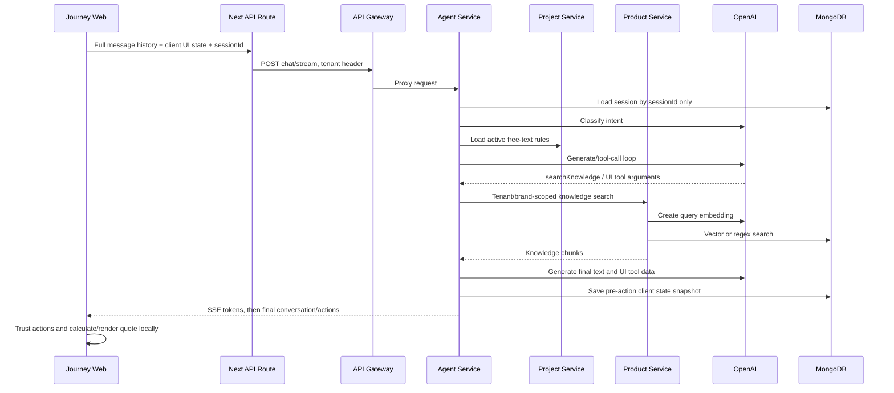
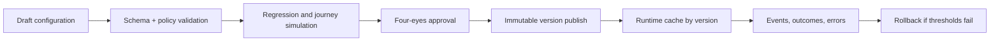
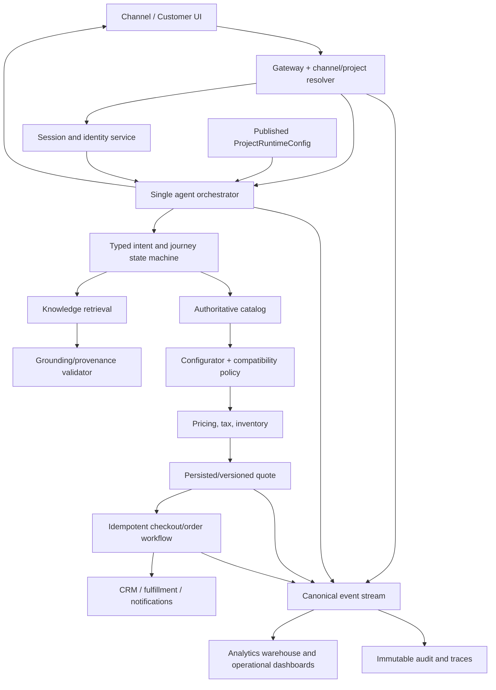

# JourneyAX Enterprise Architecture and Code Audit

**Audit date:** 13 July 2026  
**Repository:** `journeyAX` monorepo  
**Reference architecture:** JourneyAX Architecture screenshot supplied with the review  
**Audit type:** Static code, configuration, flow, security, operability, and architecture-alignment review  
**Document status:** Final audit report (implementation changes are not included)

---

## 1. Executive decision

JourneyAX is a credible proof of concept with a useful target architecture and several sound foundations: a gateway, domain-oriented services, a project configuration service, modular prompts, retrieval routing, Mongo-backed session snapshots, SSE transport, integration ports, and a compilable monorepo.

It is **not ready for enterprise production or a real transactional launch** in its current form.

The main issue is not whether boxes exist in the repository. Most boxes in the supplied architecture have a corresponding application, package, screen, or interface. The issue is that several are simulations or are not connected to the customer journey. The live storefront still treats LLM-generated product, price, inventory, compatibility, quote, and order data as trusted. The back office is mostly static demo data, and the project configuration it stores is not consistently consumed by the agent, storefront, product service, or gateway.

### Overall assessment

| Dimension | Rating | Assessment |
|---|---:|---|
| Target architecture | 3.5 / 5 | Good direction and sensible layer boundaries |
| Functional completeness | 2.0 / 5 | Chat and recommendation demo work; transaction lifecycle is not real |
| Configuration maturity | 1.5 / 5 | Configuration schemas exist, but runtime consumption is limited |
| Multi-tenant isolation | 1.5 / 5 | Tenant identifiers exist, but trust boundaries and schemas are inconsistent |
| Security and authorization | 1.0 / 5 | Several critical authorization and service-bypass risks |
| Data and integration maturity | 1.5 / 5 | Knowledge search is real; most commerce/CRM/data integrations are mocks |
| Reliability and operability | 1.5 / 5 | Build passes; no working lint gate, automated tests, SLOs, or production telemetry |
| Maintainability | 2.5 / 5 | Modular direction is good, but duplicate pipelines and oversized UI modules remain |

**Enterprise release recommendation: NO-GO until all P0 controls in section 14 are complete.**

---

## 2. Scope and method

The review covered the current working tree, including tracked and untracked implementation work. It included:

- 103 TypeScript, TSX, JavaScript, and CSS source files under `apps/` and `packages/`.
- Approximately 14,398 source lines, excluding generated `dist`, `.next`, and `node_modules` content.
- All application routes and service boundaries.
- Storefront, agent, gateway, authentication, project, organization, product, data, lead, analytics, back-office, shared types, database, configurator, and integration modules.
- Customer discovery, retrieval, recommendation, quote, session, rule, authentication, and order flows.
- Hard-coded brand, business, platform, security, operational, and demo values.
- The supplied layered architecture, used as the target-state comparison.
- Production builds and the available repository quality commands.

This was a static and build-level audit. It did not execute live OpenAI, MongoDB Atlas, Shopify, Salesforce, HubSpot, payment, email, or fulfillment transactions because no controlled integration test environment or test credentials were part of the audit scope.

### Repository state caveat

The working tree contains a large amount of uncommitted and untracked application code, generated output, Turbo logs, and TypeScript build metadata. The audit therefore represents the filesystem as reviewed, not a reproducible tagged release. A clean, committed baseline is required before formal remediation and regression measurement.

---

## 3. What is already strong

The following work should be retained and strengthened:

1. **Layered intent is visible in code.** The gateway, agent, project, organization, product, auth, data, lead, and analytics boundaries broadly correspond to the reference architecture.
2. **The agent prompt has been physically modularized.** `prompts/base.ts`, `business.ts`, `technical.ts`, and `stage.ts` are a better maintenance structure than one monolithic constant.
3. **Retrieval is policy-controlled.** The agent removes the knowledge-search tool when retrieval is disallowed instead of relying only on prompt guidance.
4. **The product fallback preserves the brand filter.** Relaxing type/category without dropping the tenant/brand predicate avoids a previously dangerous cross-brand fallback.
5. **Integration ports establish a useful hexagonal boundary.** Commerce, CRM, fulfillment, configurator, and knowledge interfaces are named by business capability rather than vendor.
6. **Prices in the integration port use integer minor units.** This is the correct direction, although it conflicts with float-based types elsewhere.
7. **Server-side session persistence, SSE, and back-office rules now exist as prototypes.** These close important structural gaps, even though the current implementations need redesign before production.
8. **The current monorepo builds.** `npm run build` completed successfully for all 14 workspaces with build scripts.

These strengths make the recommended remediation an evolution of the current platform, not a rewrite.

---

## 4. Current system inventory

### 4.1 Applications and services

| Component | Port | Current responsibility | Actual maturity |
|---|---:|---|---|
| `journeyax-web` | 3008 | Customer chat/configurator, Next.js API proxy | Functional POC; Caroma-specific and client-authoritative |
| `backoffice-admin` | 3009 | Admin console and business-rules screen | Mostly static demo; rules are the only meaningful live integration |
| `api-gateway` | 3010 | Route proxy, tenant header, auth middleware, SSE proxy, health aggregation | Functional basic proxy; not an enterprise API-management layer |
| `auth-service` | 8080 | Registration, login, JWT verification, refresh, logout | Functional baseline with critical registration/RBAC/session risks |
| `project-service` | 8082 | Project config, membership, isolation context, business rules | Useful config prototype; weak validation/authorization and limited consumers |
| `product-service` | 8083 | Mongo/Atlas knowledge retrieval and regex fallback | Real retrieval path; not a complete catalog/PIM/pricing service |
| `data-service` | 8084 | Catalog connection and synchronization endpoint | Simulation only; no data synchronization occurs |
| `organization-service` | 8085 | Organization CRUD and project references | Partial persistence; not integrated transactionally with auth/project |
| `analytics-service` | 8086 | Dashboard metrics | Mock/random response only |
| `lead-service` | 8087 | Push commerce lead to CRM | Mock/random response only |
| `agent-commerce-service` | 3004 | Intent, orchestration, tool calls, rules, sessions, SSE | Functional LLM POC; unsafe as transactional authority |

### 4.2 Shared packages

| Package | Intended role | Finding |
|---|---|---|
| `shared-types` | Cross-service contracts | Useful start, but roles, project/tenant terminology, money, rules, sessions, and events are inconsistent or missing |
| `database` | Shared Mongo connection | Globally caches one client/database regardless of subsequent URI/database name |
| `configurator-core` | Pricing calculations and connectors | Totals logic exists; connectors fabricate orders, stock, CRM IDs, and payment sessions |
| `integration` | Business ports and adapters | Strong interface direction; only knowledge is materially wired into the agent |
| `design-system` | Shared UI styling | Useful foundation; applications still contain extensive one-off UI and hard-coded branding |

---

## 5. Alignment to the supplied architecture

Legend: **Implemented** means a real path exists; **Partial** means a prototype/interface exists; **Missing** means there is no operational capability.

| Reference-architecture capability | Status | Audit assessment |
|---|---|---|
| Web/Desktop channel | Implemented | Customer storefront exists |
| Mobile, WhatsApp/SMS, email, voice, kiosk, partner, CSR channels | Missing | Labels/config concepts appear, but no channel adapters or channel-specific state/policy |
| NLU and intent detection | Partial | LLM classifier exists; no schema validation, evaluation set, confidence policy, or localization |
| Context and memory | Partial | Snapshot persistence exists; transcript/event/customer memory does not |
| Dialog management | Partial | Prompt and UI phases; state machine is not centrally enforced |
| Recommendation engine | Partial | Recommendations are model-generated from RAG, not deterministically ranked/validated |
| Visual planner/image generation | Missing | UI claims and target box only; no working planner or image-generation flow |
| Tool/action selection | Partial | OpenAI tools exist; arguments and business effects are not strongly validated |
| Human handoff and guardrails | Missing/partial | Prompt guidance only; no case/handoff workflow or enforced policy service |
| Agent orchestrator | Partial | A controlled loop exists, but buffered and SSE implementations are duplicated |
| MCP/tool router | Partial | Integration registry exists; tenant platform resolver is hard-coded to defaults |
| Workflow orchestration | Missing | No durable multi-step workflow/saga for quote, cart, payment, appointment, or order |
| Personalization and session state | Partial | Session snapshot exists; no customer profile/segment integration |
| API gateway | Partial | Basic proxy; lacks production authorization, schema validation, throttling, resilience, and telemetry |
| Commerce/product systems | Partial | Knowledge retrieval exists; authoritative pricing, inventory, cart, checkout, and order do not |
| Project/configuration | Partial | Project and rule APIs exist; configurator, BOM validation, and visualization do not |
| Order/fulfillment/service | Missing | Interfaces exist; real adapters and persistence do not |
| Customer/CRM/support | Missing/partial | Auth user store and mock lead; no customer 360, cases, loyalty, or history |
| Shared context | Missing | State is split among client React state, session snapshot, project config, and knowledge documents |
| Auth/SSO | Partial | Local JWT auth only; no SSO, invitation model, or enforced RBAC |
| Secrets management | Missing | Environment variables and credential-reference concepts; no vault integration |
| Audit logging | Missing | Console output only; critical config mutations are not audited |
| Observability | Missing | No real metrics, traces, centralized logs, SLOs, or alerting |
| Messaging/event bus | Missing | No Kafka/RabbitMQ implementation despite documentation/UI references |
| Feature flags | Missing | No runtime flag service or evaluated flag context |
| Data encryption | Partial/unknown | Transport/database provider may provide defaults; no application policy or field-level strategy |
| CI/CD and deployment | Partial | Build orchestration exists; quality gates and release evidence do not |
| Operational/vector/object/analytics stores | Partial | Mongo operational/vector usage exists; no warehouse/object-store pipeline |
| Business outcomes | Not measurable | Analytics is fabricated and events are absent |

The diagram is therefore a valid **target architecture**, not an accurate as-built diagram. An as-built view should visually mark mocks, interfaces, and disconnected services.

---

## 6. End-to-end flow audit

### 6.1 Actual customer conversation flow

This supports a compelling demonstration, but it has four architectural breaks:

1. The browser sends the entire conversation and operational state on every turn.
2. The server lets non-empty client state override stored state.
3. The LLM supplies product/quote action data that the browser trusts.
4. The quote/order flow does not pass through an authoritative pricing, compatibility, inventory, quote, checkout, or order transaction.

### 6.2 Discovery and clarification

- The agent forces a clarification phase for early turns and requires 3–5 questions in a `setPhase` tool call.
- Transition logic depends on hard-coded English prefixes such as `My answers` and `Build my quote`, plus an English repair regex.
- The client exposes global `window` callbacks to connect panels to chat behavior.
- This is brittle across localization, copy changes, multiple channels, concurrent UI interactions, and replayed requests.

**Recommendation:** Use explicit typed commands (`ClarificationSubmitted`, `QuoteRequested`) and a server-owned journey state machine. Do not infer UI events from conversational text.

### 6.3 Retrieval and recommendation

- The intent resolver selects a stage/mode/retrieval type.
- A policy can physically remove the knowledge tool, which is good.
- When retrieval is allowed, the model can still request a content type outside `allowedTypes`; server code does not validate it.
- `hadRetrieval` becomes true when a search is attempted, even if search fails or returns zero results.
- Product recommendations and quote lines are model tool arguments. There is no server check that each SKU, price, finish, URL, or image came from the retrieved result set.
- Retrieved documents are content inside the model context and are not protected by a structured anti-prompt-injection boundary.

**Conclusion:** RAG is present, but grounding is advisory. It does not establish transaction-grade product truth.

### 6.4 Quote and pricing

- The UI computes a 12% discount and 10% GST locally.
- The agent checkout-validation endpoint also hard-codes rates based on tenant and accepts client-provided discount rate/BOM.
- The project service stores pricing configuration, but the storefront and checkout path do not consume it as the single source of truth.
- Money is represented as floating-point dollars in shared/UI types and integer cents in integration ports.
- Changing quantity in the UI does not reliably recompute existing BOM line totals; displayed quantity and stored line totals can diverge.
- A finish change does not trigger SKU, price, availability, or compatibility revalidation.
- Pricing rules can be entered as free-form prompt text, which is inappropriate for financial calculations.

**Conclusion:** Quotes are visual estimates generated in the browser, not authoritative, auditable quotations.

### 6.5 Approval, checkout, and order

- Approving a quote generates a random `CAR-######` identifier in the browser.
- The UI claims fulfillment scheduling, email confirmation, downloadable specifications, compatibility validation, live price, and stock without completing corresponding backend calls.
- “Download BOM” currently adds a message rather than producing a document.
- Removing a required item creates a note but does not enforce compatibility or approval.
- There is no persistent quote/order aggregate, idempotency key, payment event, reservation, saga, or fulfillment handoff.

**Conclusion:** The current order confirmation is a simulated UI state and must not be presented as a completed order in production.

### 6.6 Session and analytics

- Mongo session snapshots are keyed only by `sessionId`; load/save does not include tenant/project in the query filter.
- The session record contains arbitrary state, last intent, turn count, and timestamps only.
- Client state takes precedence when non-empty.
- State is saved before UI actions are applied, so the persisted phase/BOM can lag by one turn. If a user approves without another AI turn, the server never records the final state.
- The conversation transcript is not restored after refresh; the client stores only the session ID.
- Resetting the visible journey does not clearly create a new server session.
- There is no TTL, retention policy, consent flag, user/channel identity, optimistic version, event history, or replay protection.
- The analytics service reads none of this data and returns random/static metrics.

**Conclusion:** Session persistence is a continuity prototype, not a system of record or analytics event source.

### 6.7 Streaming

- SSE exists end-to-end and final text is streamed.
- The agent has two nearly duplicated orchestration implementations, creating drift risk.
- The client ignores streamed `uiAction` and `trace` events and applies actions only from the final `done` event.
- If streaming fails after the model/tool loop has caused side effects, the client automatically retries the full turn through the buffered endpoint. This can duplicate model calls and future business operations.
- Stream errors are SSE events after HTTP 200; the gateway does not first validate the upstream content/status before declaring an SSE response.

**Recommendation:** One orchestration engine should emit an internal async event stream used by both SSE and buffered adapters. Retries require a turn id/idempotency key and resumable event semantics.

---

## 7. Critical and high-priority findings

### P0-01 — Public registration permits self-assigned administrator role

The public register endpoint accepts `tenantId` and optional `admin` role from the caller. A new user can attempt to register directly into an arbitrary tenant as an administrator.

**Impact:** Tenant takeover and unauthorized back-office access.  
**Required fix:** Public registration may create only a constrained customer role for an allowed storefront/project. Administrative and staff membership must require an expiring invitation, verified organization/project relationship, and authorized inviter. Enforce this in the auth domain, not the UI.

### P0-02 — Domain services can bypass gateway authentication and RBAC

Project/rule/member APIs have no local authorization guard. The rules screen calls project service directly using a public browser environment URL and a hard-coded tenant. Service CORS is broadly enabled. The gateway validates authentication but does not enforce a route/role authorization matrix.

**Impact:** Unauthorized modification of prompts, pricing/compliance rules, project configuration, and membership.  
**Required fix:** Make domain services private; use workload identity/mTLS or signed internal tokens; enforce project-scoped authorization in each sensitive service; route back office through a protected BFF/gateway; deny direct browser access.

### P0-03 — Development auth fails open

When `NODE_ENV` is not exactly `production`, missing/bad tokens and auth-service outages pass through protected routes.

**Impact:** A deployment configuration error exposes protected APIs.  
**Required fix:** Fail closed by default in all environments. If a local bypass is essential, require an explicit, separately named local-only switch that cannot be enabled in deployed environments.

### P0-04 — Tenant identity is client-selectable on anonymous paths

Anonymous requests may provide `X-Tenant-ID`; gateway and services default to or trust that value. Product search also accepts brand from the body. Session lookup is not tenant-scoped.

**Impact:** Cross-project access, session reassignment, brand-data probing, and broken audit attribution.  
**Required fix:** Resolve project from an allow-listed host/channel/API client mapping; bind it to the request at the edge; ignore caller-supplied tenant for public storefronts; include `projectId` in every data key and query; add negative isolation tests.

### P0-05 — LLM output is treated as product and financial truth

Model-provided UI tool arguments become products and quote lines without validating against retrieved/authoritative catalog, price, inventory, compatibility, or allowed finish data.

**Impact:** Hallucinated SKUs, wrong price, unavailable product, unsafe/incompatible BOM, misleading customer promise.  
**Required fix:** The LLM may propose intent and candidate identifiers only. A deterministic quote/configurator service must hydrate product facts, run compatibility/compliance rules, fetch price/inventory, calculate totals, and sign/version the quote before display or approval.

### P0-06 — False transactional confirmation

The browser creates a random order reference and presents fulfillment/email/order confirmation without a backend order.

**Impact:** Customer deception, support incidents, financial/reputational exposure.  
**Required fix:** Rename the current action to “save estimate” until real order integration exists, or implement quote → cart → payment/terms → order → fulfillment with idempotency and persisted status. UI confirmation must render only from a successful authoritative command result.

### P0-07 — Free-text rules are unsafe for pricing, compliance, and safety

Back-office rules are rendered directly into a system prompt. There is no structured predicate/action schema, deterministic evaluator, conflict resolution, approval, version, effective date, rollback, or audit trail.

**Impact:** Prompt injection by an admin account, conflicting rules, non-deterministic regulatory/financial behavior, no proof of which policy executed.  
**Required fix:** Separate conversational guidance from executable policy. Use validated decision tables/JSON logic or a policy engine for pricing, compatibility, compliance, eligibility, and escalation. Publish immutable versions and record evaluated rule IDs/results.

### P0-08 — No reliable release quality gate

The monorepo has no automated unit/integration tests wired into workspace scripts. `npm run lint` fails because both Next apps call `next lint`, removed in Next.js 16.

**Impact:** Regressions and security defects can ship while the build remains green.  
**Required fix:** Adopt ESLint CLI flat configuration or Biome per the bundled Next.js 16 guidance; add unit, contract, integration, isolation, agent-evaluation, and browser tests; make build, lint, tests, dependency/security scan, and artifact provenance mandatory in CI.

### P1-09 — Project configuration is stored but not consumed

Project scope, pricing, persona, greeting, theme, and channels exist, but the agent primarily loads only active rules. The storefront, prompts, model choice, product search, and pricing retain Caroma-specific values.

**Impact:** New tenant onboarding still requires code changes; configuration and behavior drift.  
**Required fix:** Resolve one immutable `ProjectRuntimeConfig` snapshot per session/turn and pass its version through agent, product, configurator, UI, analytics, and audit events.

### P1-10 — Session storage is not tenant-safe or event-complete

Session queries omit project/tenant scope; client state wins; persisted state lags UI effects; no transcript/events/retention/version.

**Impact:** Incorrect continuity, weak analytics, cross-tenant risk, lost journey outcomes.  
**Required fix:** Key by `{projectId, sessionId}`, bind user/channel, use optimistic versioning, persist normalized domain events and server state after accepted actions, configure TTL/privacy controls, and provide an explicit new-session/reset command.

### P1-11 — Business pipelines are duplicated and non-idempotent

Buffered and streaming agent methods duplicate orchestration. Automatic fallback can repeat a turn.

**Impact:** Behavioral drift, duplicate spend, and future duplicate commerce actions.  
**Required fix:** One orchestrator, one state transition per `turnId`, idempotent tool execution, persistent tool-result ledger, and transport adapters around the same result stream.

### P1-12 — DTO validation and update allow-lists are missing

Most Nest controllers rely on erased TypeScript types instead of runtime validation. Rule updates spread the request body into Mongo `$set`, permitting fields outside the intended DTO at runtime.

**Impact:** Invalid state, mass assignment, identifier/scope mutation, and unbounded input.  
**Required fix:** Global validation pipe with strict DTOs or shared runtime schemas; reject unknown fields; validate enums/ranges/lengths/URLs; explicitly map updates; add body/array limits per route.

### P1-13 — Gateway is a proxy, not yet an enterprise integration layer

It lacks true rate limiting, per-route authorization, schema validation, timeouts for normal proxy calls, circuit breakers, retries, header/claim propagation, structured logs, trace context, and non-JSON/file support. Public-route matching uses prefix tests.

**Impact:** Abuse, hanging requests, route-policy mistakes, poor diagnosis, and inability for downstream services to authorize the user.  
**Required fix:** Method-aware exact route policies; forward verified subject/role/project through signed internal identity; timeouts/bulkheads/circuit breakers; response/header policy; OpenTelemetry; standardized errors; configurable limits.

### P1-14 — Documentation and implementation contradict each other

Documentation describes `/config/tenants/*.yaml`, one Mongo database, tenantId isolation, quotes, analytics, messaging, and capabilities that are absent or implemented differently. Current code uses both `journeyx` and `journeyax`, and both `tenantId` and `projectId` as the primary key.

**Impact:** Incorrect implementation decisions and false stakeholder confidence.  
**Required fix:** Mark docs as target/as-built, generate route/schema inventories where possible, establish architecture decision records, and make documentation changes part of release acceptance.

---

## 8. Service-by-service review

### 8.1 Journey storefront

**Working:** Responsive conversational UI, phase panels, SSE text rendering, recommendation/quote presentation.

**Gaps:**

- Caroma name, copy, logo, catalog count, URL, currency formatting, finishes, addons, questions, products, stock location, discount, tax, and greeting are embedded in code.
- Authentication context exists but is not mounted/used in the chat flow; chat requests do not normally send the access token.
- Tokens are stored in local storage, increasing XSS exposure.
- Messages use `any`, state/action payloads have no runtime validation, and global `window` handlers couple components.
- The UI claims live inventory, live price, compatibility, BOM download, order, fulfillment, and email that do not exist.
- Browser state is treated as operational truth.

**Direction:** Tenant-aware server-rendered runtime config, typed UI command bus, HttpOnly secure session/token strategy, authoritative quote API, and honest capability-driven UI labels.

### 8.2 Agent commerce service

**Working:** Intent step, retrieval policy, tool loop, modular prompt files, knowledge port, rules loading, session snapshots, buffered and SSE outputs.

**Gaps:**

- Core prompt and tool schemas remain Caroma/bathroom/AUD specific.
- Project persona, greeting, scope, pricing, channels, and model config are not applied.
- Intent response and tool arguments are JSON-parsed but not validated against runtime schemas.
- Full unbounded conversation history is sent to the model; there is no token/cost compaction strategy.
- Search count, loop count, result count, model, and policy choices are code constants.
- Allowed retrieval types are guidance rather than validated input.
- Grounding is a regex flag and does not block unsafe output.
- Rules/data/user text share model context without a complete injection-defense model.
- Exceptions from buffered controller paths can be returned as ordinary response objects instead of correct failure status.

**Direction:** Server-owned orchestrator with typed steps, versioned runtime config, schema-validated model outputs, deterministic tool authorization/validation, bounded context manager, evaluation telemetry, and a single streaming core.

### 8.3 Product service and knowledge pipeline

**Working:** Atlas vector search, tenant-preserving filter relaxation, regex degradation, token budgeting, metadata response.

**Gaps:**

- It is named product service but primarily serves unstructured knowledge; catalog, price, inventory, and lifecycle are not separated.
- Body-provided brand is accepted instead of an edge-resolved project context.
- Knowledge documents inconsistently use top-level `brand`, `metadata.brand`, and documented `tenantId`; projectId is not the enforced contract.
- Embedding model, index, database, collection, and token budget are hard-coded.
- Regex fallback quality is weak; no relevance threshold, hybrid scoring, reranking, SKU deduplication, freshness, ACL, source version, or locale/channel availability.
- Product specs are heuristically parsed from content during queries.
- Ingestion scripts live inside the storefront and contain overlapping Caroma-specific crawl pipelines.

**Direction:** Split authoritative catalog/pricing/inventory APIs from knowledge retrieval; move ingestion to managed jobs; normalize source documents; enforce projectId/source ACL/version; add retrieval evaluation and data-quality dashboards.

### 8.4 Project service

**Working:** Project configuration CRUD, member records, isolation context, rules CRUD, seed fallback, cache.

**Gaps:**

- Sensitive routes have no role checks.
- Seed tenants and seed rules are hard-coded application data.
- TypeScript DTOs are not runtime validators.
- Rule updates use an unsafe spread update.
- Rules lack version/publish/approval/audit/conflict semantics.
- Config fallback can make a health response look healthy while persistence is unavailable.
- The service declares projectId as universal isolation, but downstream services do not consistently follow it.

**Direction:** Make this a versioned configuration control plane, not a runtime policy evaluator. Publish immutable config bundles, add schemas/approval/audit, and expose signed/cached read models to runtime services.

### 8.5 Back-office admin

**Working:** Strong visual prototype and a basic live rules screen.

**Gaps:**

- The main page is a roughly 1,888-line client component dominated by Workwear/Hard Yakka/KingGee/NNT demo data unrelated to the current Caroma journey.
- Sign-in is session-storage UI state rather than auth-service enforcement.
- Dashboard metrics, orders, catalogs, users, integrations, health, audit, channel settings, and assistant responses are hard-coded or local state.
- Rules bypass gateway/auth, use a fixed tenant, have no project selector, confirmation, editor, test/simulation, approval, version, or rollback.
- Optimistic toggle/delete paths do not correctly recover on HTTP non-success responses.

**Direction:** Protected back-office BFF, real project context, role-based navigation, decomposed feature modules, versioned configuration publishing, health/analytics from real services, and audit history.

### 8.6 API gateway

**Working:** Route registry, tenant middleware, auth verification, JSON proxy, SSE piping, aggregate health.

**Gaps:**

- Client tenant header is trusted for anonymous requests.
- Protected requests fail open outside production.
- Route classification is prefix-based and not HTTP-method aware.
- Verified user identity headers are not propagated to downstream services by the proxy.
- No enforced RBAC, rate limit, request schema, normal-request timeout, circuit breaker, or retry policy.
- Health checks are sequential and expose internal service URLs.
- SSE proxy sets success stream headers without validating upstream status/content type.

**Direction:** Treat the gateway as the edge policy enforcement point but retain defense-in-depth in services. External tenant resolution, exact route policy, signed internal identity, resilience, and telemetry are required.

### 8.7 Auth service

**Working:** bcrypt passwords, short access token, refresh rotation, issuer/audience checks, active-user check on login/refresh.

**Gaps:**

- Public caller chooses tenant and admin role.
- Email is globally unique while the rest of architecture discusses project membership; role models differ across packages.
- Refresh tokens are stored in plaintext; no token family, device/session, reuse detection, or hashed lookup.
- Refresh secret falls back to a derivation of the access secret.
- Access-token verification does not re-check current user active/revocation state.
- No invite, email verification, password reset, lockout, MFA, SSO/OIDC, or login rate limiting.

**Direction:** Central identity plus organization/project membership and policy; invite-based staff onboarding; asymmetric or managed signing keys; secure refresh-session model; OIDC/SSO support.

### 8.8 Organization service

**Working:** Basic Mongo organization records, status/settings updates, project references.

**Gaps:**

- Organization creation does not create the owner user or membership it accepts.
- Organization/project linkage is not transactional with project service.
- No auth/RBAC; settings updates are too open-ended.
- Health can report OK without proving database readiness.
- Random IDs and inconsistent error/degradation behavior remain.

**Direction:** Orchestrated onboarding workflow with idempotency/compensation; strict settings schema; ownership/membership domain; readiness checks.

### 8.9 Analytics service

Returns random active sessions and fixed metrics. It does not read session, quote, order, gateway, model, or customer events and does not scope data to a project.

**Direction:** Define canonical events first, instrument producers, stream/store events, then calculate funnels and business outcomes from immutable facts.

### 8.10 Data service

Accepts a complete integration connection—including credentials—from the request, performs a connector “test,” and reports simulated item counts without storing data.

**Direction:** Back office stores secret references only; data service resolves secrets server-side, creates durable sync jobs, checkpoints/paginates, validates/maps/upserts data, quarantines errors, and records lineage/metrics.

### 8.11 Lead service

Logs customer PII and quote value, creates a random CRM ID, guesses HubSpot versus Salesforce from tenant name, and returns a fabricated URL.

**Direction:** Use the CRM port selected by versioned project integration config; persist idempotent lead-outbox jobs; redact logs; retry with dead-letter handling; record external correlation and consent.

### 8.12 Integration and configurator packages

The port definitions are appropriate, but the registry always resolves default standalone platforms, only knowledge is materially used, and multiple connector frameworks overlap. Standalone/vendor connectors fabricate values or throw “not implemented.”

**Direction:** Keep one port/adapter system. Configure platform selection by project, provide connection health/capabilities, remove fake success behavior, and make unsupported operations explicit to the UI.

### 8.13 Shared database and types

- One process-global cached Mongo `db` is returned even if later callers provide another URI/database name.
- Code uses both `journeyx` and `journeyax` databases.
- Isolation terminology alternates among tenant, brand, and project.
- Money uses floats in `BomItem`/`Quote` and cents in integration ports.
- Role enums differ across auth, shared types, project, and UI.

**Direction:** Cache Mongo clients by URI and database handles by name; define one project-scoped contract vocabulary; use integer minor units or Decimal128 end-to-end; publish runtime-validated contracts and compatibility tests.

---

## 9. Hard-coded value audit and disposition

“No hard-coding” should not mean every constant becomes an editable text box. Values belong in four different control planes.

### 9.1 Move to back-office project configuration

| Category | Current examples | Required configuration |
|---|---|---|
| Identity and brand | Caroma names, logos, domain, product URL, hero copy | Project identity, domains, assets, brand vocabulary, legal footer |
| Theme | Colors, fonts, UI copy | Theme tokens, component variants, accessibility-approved palette |
| Locale | AUD formatter, GST wording, English-only triggers | Locale, currency, timezone, tax labels, languages, translated content |
| Journey | Phase order, question count, clarify questions, suggestions | Versioned journey graph, typed transitions, questions, required fields, copy |
| Scope | Bathroom/kitchen/laundry categories and finishes | Allowed rooms/categories/collections/finishes and market availability |
| Persona | Caroma expert roles and tone | Persona overlay, voice/tone, approved claims, escalation language |
| Agent policy | Model, search/loop/result limits, enabled tools | Approved model route, budgets, temperatures, tool allow-list, latency/cost caps |
| Retrieval | Allowed content types, source scopes | Sources, types, locale/market filters, relevance thresholds, reranker policy |
| Pricing | Currency, tax, discounts, addons | Structured price lists, customer groups, promotion rules, tax jurisdiction, freight |
| Compatibility | Required hidden parts, compliance/WELS rules | Versioned deterministic compatibility and compliance rule sets |
| Inventory | “In stock · NSW DC” | Warehouse selection, availability policy, backorder/lead-time presentation |
| Channels | Web-only behavior | Channel enablement, capabilities, message templates, session/handoff policy |
| Handoff | Support email/plumber recommendation | Queue, operating hours, SLA, reason codes, contact/appointment rules |
| Integrations | Default standalone, tenant-name CRM choice | Domain-to-platform mapping, capability flags, secret references, sync schedules |
| Privacy | No session policy | Consent text, retention duration, transcript policy, redaction/export/delete rules |
| Analytics | Static funnel numbers | Event definitions, funnel stages, outcome targets, attribution window |

### 9.2 Move to environment/platform configuration

- Ports, internal service URLs, public origins, database names, collection/index names where environment-specific.
- Request timeouts, connection-pool sizes, rate-limit storage, log level, telemetry endpoints.
- Model provider endpoints and secret references.
- Object storage, event bus, warehouse, and feature-flag provider endpoints.

These values should use validated startup configuration. Missing critical values should fail startup or readiness, not silently fall back to localhost/default tenant in production.

### 9.3 Keep in code as controlled platform policy

- Protocol formats and stable domain invariants.
- Security deny rules and tenant-isolation enforcement.
- Maximum absolute safety limits that a tenant cannot raise.
- Money arithmetic implementation and rounding algorithm.
- Quote/order state-machine invariants.
- Validation schemas and supported adapter capability contracts.

Back office may select within approved bounds, but must not be able to disable tenant isolation, authentication, immutable audit, or regulatory hard stops.

### 9.4 Keep only as explicit development fixtures

- Random metrics, order IDs, CRM IDs, inventory, checkout sessions, catalog counts, service health, and “connected” states.
- Seed tenants/rules and sample products.
- Workwear and Caroma demonstration records.

Fixtures must live under clearly named demo/test modules, be impossible to enable in production, and display a visible “demo data” marker.

---

## 10. Recommended back-office information architecture

The next back-office increment should be a **versioned Project/Journey control plane**, not additional static dashboard pages.

1. **Organizations and projects** — ownership, markets, domains, status, members, roles.
2. **Brand and experience** — logo, theme, locale, copy, legal text, accessibility preview.
3. **Journey designer** — stages, typed transitions, questions, required data, channel variants.
4. **Agent configuration** — persona overlays, model routes, budgets, tools, safe-response policy.
5. **Rules and policy** — structured decision tables for eligibility, compatibility, price, compliance, and escalation.
6. **Catalog and knowledge** — sources, sync jobs, mappings, freshness, errors, content approval, retrieval tests.
7. **Pricing and promotions** — price books, customer groups, tax, discount, addons, freight, effective dates.
8. **Integrations** — platform per domain, secret reference, capabilities, health, last sync, failure queue.
9. **Channels and handoff** — channel enablement, templates, hours, queues, notification providers.
10. **Sessions and privacy** — retention, consent, redaction, search/export/delete, transcript access policy.
11. **Analytics** — live funnels, conversions, quote/order values, abandonment, model/retrieval quality and cost.
12. **Publish center** — diff, validate, simulate, approve, schedule, publish, rollback, immutable audit.

Every configuration change should follow:

Suggested precedence:

`platform defaults → organization defaults → project version → channel/market overlay → controlled experiment override`

The resolved snapshot and version must be recorded on every session, retrieval, quote, decision, and order.

---

## 11. Recommended target runtime flow

### Key design principle

The model is a **planner and language interface**, not a database, price engine, policy engine, or transaction coordinator. All externally meaningful claims must be backed by a tool result with provenance and validated before presentation.

---

## 12. Data and event model required

### 12.1 Canonical identifiers

- `organizationId` — commercial/legal owner.
- `projectId` — primary runtime isolation and configuration unit.
- `userId` or `anonymousSubjectId` — actor identity.
- `sessionId` — channel conversation.
- `turnId` — idempotent conversational command.
- `quoteId` and `quoteVersion` — immutable priced proposal.
- `orderId` — authoritative transaction.
- `correlationId` and `causationId` — distributed trace/event linkage.
- `configVersion`, `ruleSetVersion`, `catalogVersion`, `priceVersion` — reproducibility.

Do not use tenant, project, and brand interchangeably.

### 12.2 Minimum canonical events

- `SessionStarted`, `MessageReceived`, `IntentResolved`, `StageChanged`.
- `KnowledgeSearched`, `RecommendationPresented`, `ProductSelected`.
- `CompatibilityEvaluated`, `QuoteCalculated`, `QuotePresented`, `QuoteAdjusted`.
- `QuoteApproved`, `CheckoutStarted`, `PaymentAuthorized`, `OrderCreated`.
- `HandoffRequested`, `AppointmentBooked`, `LeadExported`.
- `SessionAbandoned`, `ErrorOccurred`, `PolicyDenied`, `HumanOverrideApplied`.

Events must contain project/session/correlation/config versions, actor, timestamp, channel, outcome, latency, and safe diagnostic metadata. They must not contain unrestricted prompts, credentials, or unnecessary PII.

### 12.3 Storage responsibilities

| Store | Responsibility |
|---|---|
| Operational Mongo | Projects, published config, users/memberships, sessions, quotes, orders, jobs |
| Vector/knowledge store | Versioned project-scoped approved content chunks and embeddings |
| Object storage | Source PDFs, images, generated BOM/specification documents |
| Event stream | Durable domain and telemetry events |
| Analytics warehouse | Funnels, outcomes, cost/latency, historical reporting |
| Secret manager | Integration and model credentials; only references in application data |

---

## 13. Security, reliability, and observability baseline

### Security

- Deny-by-default auth and method-aware RBAC/ABAC.
- Staff invitation and project membership verification.
- Private service networking plus workload identity.
- Strict runtime input/output schemas and allow-listed update fields.
- Project isolation enforced in repository APIs and covered by negative tests.
- HttpOnly/Secure/SameSite session strategy for browser auth where applicable.
- Hashed/rotating refresh sessions with reuse detection.
- Secret-manager integration and credential redaction.
- Prompt-injection controls, tool allow-lists, content provenance, and safe rendering.
- Immutable audit trail for login, membership, config, rule, quote, override, and order actions.

### Reliability

- One orchestration implementation, idempotent turns/tools, and durable workflow state.
- Timeouts, retries only where safe, exponential backoff, circuit breakers, bulkheads.
- Transactional outbox for events/integration work.
- Readiness checks that verify required dependencies; liveness checks that do not.
- Dead-letter queues and operator retry/cancel controls.
- Graceful shutdown, connection cleanup, deployment health gates, backup/restore tests.

### Observability

- OpenTelemetry trace context from edge through model, retrieval, DB, and adapters.
- Structured logs with project/correlation IDs and PII redaction.
- Metrics for request/model/retrieval/tool latency, errors, token/cost, fallback rate, empty retrieval, quote validation, and integration failures.
- SLOs for availability, p95 latency, correct tenant scoping, quote accuracy, event delivery, and order completion.
- Alerts based on customer impact, not hard-coded green status badges.

---

## 14. Prioritized remediation roadmap

### P0 — Trust, security, and truthful transactions (must precede launch)

1. Close public admin/tenant registration and implement invitation/membership authorization.
2. Remove dev fail-open behavior; private-network domain services; enforce role/project authorization.
3. Make edge-resolved `projectId` immutable through the request; fix session/product query scoping.
4. Stop treating model/browser values as product, price, compatibility, inventory, or order truth.
5. Implement server quote calculation/validation and persistent quote versions.
6. Remove/rename fake order and live-stock/price/fulfillment claims until integrations are real.
7. Replace free-text financial/compliance/safety rules with structured, versioned, audited evaluation.
8. Add strict runtime schemas, update allow-lists, request limits, and standardized error status.
9. Restore a working lint command and establish automated security/isolation/quote-flow tests.

**P0 exit criteria:** A hostile client cannot choose another project, grant itself a staff role, change a price/discount/SKU, or receive an order confirmation without an authoritative persisted transaction.

### P1 — Configuration control plane and shared context

1. Define and publish `ProjectRuntimeConfig` with schema/version/effective date.
2. Make storefront, agent, product, configurator, gateway, and analytics consume the same resolved version.
3. Build project selector, journey designer, brand/theme, pricing, catalog, integration, and publish/rollback screens.
4. Replace session snapshot with project-scoped versioned state plus canonical events.
5. Normalize identifiers, roles, money, database names, and shared runtime contracts.
6. Consolidate agent pipelines and connector frameworks.

**P1 exit criteria:** A second project can be onboarded, branded, scoped, priced, and published without application code changes, and every outcome is reproducible from versioned configuration.

### P2 — Production data, integrations, and operational maturity

1. Separate authoritative catalog/pricing/inventory from knowledge RAG.
2. Move ingestion into durable data jobs with lineage, validation, freshness, and retry.
3. Implement selected commerce, CRM, fulfillment, notification, and appointment adapters.
4. Add event bus/outbox, warehouse pipeline, real analytics, audit, traces, metrics, SLOs, and alerts.
5. Add transcript/context compaction, model routing, evaluation sets, and cost controls.

**P2 exit criteria:** Back-office health and analytics are computed from real events, integrations are idempotent/observable, and operators can diagnose/recover failures.

### P3 — Channel and intelligence expansion

1. Add channel adapters for mobile, SMS/WhatsApp, email, voice, kiosk, partner, and CSR.
2. Implement human handoff/case workflow and shared customer context.
3. Add visual planning/image generation only after product/geometry provenance is reliable.
4. Introduce controlled experimentation, personalization, recommendations, and advanced planning.

**P3 exit criteria:** Channel behavior uses the same project policy and shared state while respecting channel capabilities, consent, and handoff requirements.

---

## 15. Verification and test strategy

### Current verification result

| Check | Result | Detail |
|---|---|---|
| `npm run build` | Pass | 14 successful build tasks; Next.js 16.2.9 apps compile and prerender |
| `npm run lint` | Fail | Both Next apps run removed `next lint`; Next.js 16 requires ESLint CLI/Biome setup |
| Automated unit tests | Not available | No workspace test script or discovered unit/spec suite |
| Integration/contract tests | Not available | Standalone scripts exist but are not a repeatable CI gate |
| Live dependency test | Not run | Requires controlled Mongo/OpenAI/vendor test environment |

### Required test layers

1. **Unit:** money/rounding, journey transitions, policy predicates, DTO schemas, tenant repositories.
2. **Contract:** gateway-to-service and port-to-adapter schemas, including error/status behavior.
3. **Isolation:** malicious header/body/session/project combinations and negative data-access tests.
4. **Agent evaluation:** fixed intent, retrieval, grounding, hallucination, refusal, locale, and prompt-injection dataset.
5. **Quote golden tests:** exact SKU/finish/quantity/discount/tax/rounding/compatibility outcomes.
6. **Integration:** Mongo, vector search, config publish/cache, auth rotation, outbox, adapter sandbox.
7. **End-to-end:** discover → clarify → products → authoritative quote → adjust → approve → order/handoff.
8. **Resilience:** OpenAI/product/project/auth/CRM timeouts, partial stream, duplicate request, retry, stale config.
9. **Performance:** p95 turn latency, concurrent SSE sessions, retrieval latency, connection pools, token/cost budgets.
10. **Security:** dependency/SAST/secret/container scans, authorization matrix, XSS/CSRF/SSRF, prompt/tool abuse.

---

## 16. Architectural decisions to make explicitly

1. Is `projectId` definitively the isolation key? If yes, remove tenant/brand ambiguity from all contracts and data.
2. Is back-office identity internal JWT, enterprise OIDC/SSO, or both?
3. Is the system allowed to place orders, or only generate qualified quotes/leads in the first production release?
4. Which service owns the quote aggregate and server-side pricing?
5. Which engine owns structured business/compliance rules?
6. Is Mongo Atlas the operational and vector platform by decision, and what is the analytics/event platform?
7. Which integrations are required for the first real tenant and which UI capabilities must remain hidden until supported?
8. What customer data is retained, for how long, in which regions, and with what deletion/export process?
9. What accuracy, latency, availability, cost, and conversion SLOs define production acceptance?

These decisions should be recorded as Architecture Decision Records before P1 implementation.

---

## 17. Evidence index

Representative evidence used for the findings:

- Public caller-controlled admin role: `apps/auth-service/src/auth.controller.ts:15` and `apps/auth-service/src/auth.service.ts:106`.
- Gateway fail-open and prefix policies: `apps/api-gateway/src/auth.guard.ts:22`, `:45`, `:104`, `:124`, `:134`.
- Gateway drops verified user context: `apps/api-gateway/src/gateway.service.ts:34`.
- Unvalidated SSE upstream: `apps/api-gateway/src/gateway.service.ts:83`.
- Session lookup/update not project scoped: `apps/agent-commerce-service/src/pipeline/session-store.ts:54` and `:64`.
- Client state precedence and pre-action persistence: `apps/agent-commerce-service/src/agent.service.ts:305` and `:518`.
- Raw back-office rules injected into prompt: `apps/agent-commerce-service/src/pipeline/config-loader.ts:29` and `:44`.
- Hard-coded intent text routing: `apps/agent-commerce-service/src/agent.service.ts:240`.
- Model-generated UI/quote actions accepted: `apps/agent-commerce-service/src/agent.service.ts:467` and `apps/journeyax-web/src/components/ChatPanel.tsx:151`.
- Stream-to-buffer duplicate retry risk: `apps/journeyax-web/src/components/ChatPanel.tsx:116`.
- Hard-coded UI inventory claim: `apps/journeyax-web/src/components/ChatPanel.tsx:168` and `apps/journeyax-web/src/components/panels/ProductsPanel.tsx:45`.
- Product body controls brand: `apps/product-service/src/product.controller.ts:12`.
- Retrieval constants/schema inconsistency: `apps/product-service/src/product.service.ts:6`.
- Rules have no runtime validation and spread updates: `apps/project-service/src/project.controller.ts:228` and `apps/project-service/src/project.service.ts:251`.
- Back office bypasses gateway and fixes tenant: `apps/backoffice-admin/src/app/rules/page.tsx:17`.
- Fake analytics: `apps/analytics-service/src/analytics.controller.ts:5`.
- Simulated data sync: `apps/data-service/src/data.controller.ts:9`.
- Fabricated CRM result: `apps/lead-service/src/lead.controller.ts:6`.
- Default-only adapter resolution: `packages/integration/src/registry.ts`.
- One global Mongo database cache: `packages/database/src/index.ts`.
- Conflicting money types: `packages/shared-types/src/index.ts` and `packages/integration/src/ports.ts`.
- Documentation-only YAML configuration: `docs/configuration.md`; no corresponding `config/tenants` implementation exists.
- Removed Next.js lint command remains in both Next app `package.json` files; bundled Next.js guidance is in `node_modules/next/dist/docs/01-app/03-api-reference/05-config/03-eslint.md`.

---

## 18. Final recommendation

Do not extend the static back-office dashboard first, and do not add more channels yet. The highest-value next increment is a combined **trust and configuration foundation**:

1. Secure identity, project resolution, service access, and session isolation.
2. Create an authoritative server-side configurator/quote path that validates all model proposals.
3. Publish a versioned `ProjectRuntimeConfig` and make the current storefront/agent consume it.
4. Replace prompt-only critical rules with structured policy.
5. Emit canonical events and build analytics from those facts.

That sequence turns the current POC into a safe platform foundation while preserving the existing storefront experience and the useful architecture work already completed.
