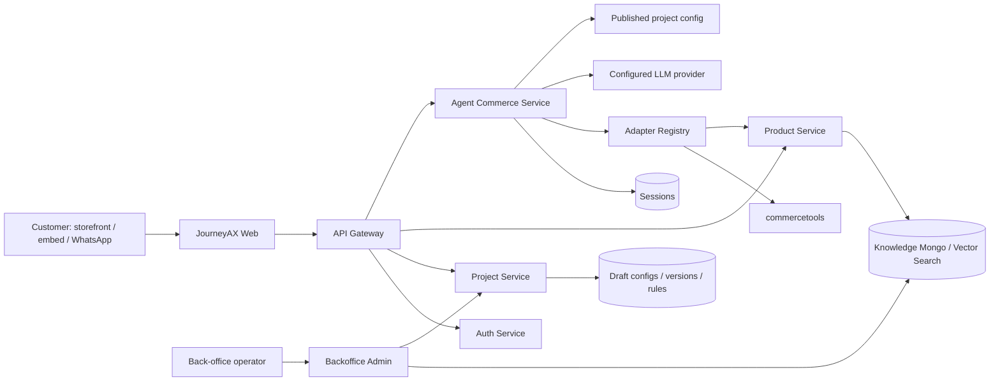

# JourneyAX Enterprise Product-Readiness Audit

**Audit date:** 17 July 2026  
**Repository:** JourneyAX / Caroma POC monorepo  
**Perspective:** Enterprise architect, SaaS product owner, commerce owner, security and operations reviewer  
**Scope:** Current source implementation across storefront, back office, gateway, agent, project/config, product/knowledge, authentication, organization, analytics, lead/data services, shared packages, integrations, build and release controls.

---

## 1. Executive decision

JourneyAX is now a **credible multi-tenant product prototype**, not merely a Caroma chatbot. Important architectural foundations are present: tenant-scoped routes, published configuration, modular prompts, configurable context dimensions, runtime capability switches, SSE streaming, session persistence, provider selection, integration ports, multi-tenant knowledge ingestion, embed and WhatsApp channels, and a materially expanded back office.

It is **not ready for enterprise production or real order-taking**. The production recommendation is **NO-GO until the P0 release gates in this report are closed**.

The principal issue is no longer simply “too many rules.” It is that configuration, secrets, deterministic commerce decisions, LLM-generated content, and UI presentation are not yet separated into the correct trust boundaries. Several screens look live while their downstream behavior is simulated or incomplete. The platform compiles, but security, transaction integrity, operability, and automated quality controls remain below an enterprise baseline.

### Readiness scorecard

| Area | Score | Assessment |
|---|---:|---|
| Product concept and UX direction | 7/10 | Strong conversational-plus-workspace concept; useful panels and streaming |
| Multi-tenant configuration | 6/10 | Real project config/versioning exists; isolation and secret boundaries remain incomplete |
| Agent architecture | 6/10 | Good pipeline decomposition; capability and intent catalogs remain code-owned |
| Knowledge/RAG | 5/10 | Ingestion, vector/regex search and adapters exist; governance/evaluation are insufficient |
| Commerce transaction integrity | 2/10 | Quote, tax, stock, order and checkout paths are partly model/client generated or mocked |
| Security and privacy | 2/10 | Multiple production blockers: credential exposure paths, missing route authorization, webhook verification, rate limiting |
| Reliability and performance | 4/10 | SSE and parallel search help; no consistent timeouts, retries, circuit breakers, budgets or SLOs |
| Observability and operations | 3/10 | Health screens and traces exist; logs, metrics, alerts and audit records are not production-grade |
| Automated quality | 2/10 | Build passes; lint gate is broken and no workspace test gate exists |
| Enterprise production readiness | **3.5/10** | **NO-GO** |

### What is genuinely implemented

- Project/tenant identifiers are present in customer-facing commerce and product paths.
- Draft → publish → immutable version snapshot → rollback is implemented for project configuration.
- The agent prompt has been split into base, business, technical and stage modules.
- Journey guidance, persona, scope, model/provider, capability switches and context dimensions are loaded per project.
- Retrieval is routed by a structured intent pass and can be suppressed during discovery.
- Agent responses support both buffered and SSE streaming paths.
- Session state is persisted in MongoDB and exposed to back-office insights.
- Knowledge and commerce ports, a standalone knowledge adapter and a commercetools knowledge adapter exist.
- The storefront resolves a project by query/header/domain and exposes an embeddable launcher.
- WhatsApp inbound routing resolves a project from its phone-number ID.
- The back office includes project switching, publishing, orchestration, rules, knowledge, channels, integrations, embed, catalogue, analytics, users, notifications and platform health surfaces.

### What “done” currently means

The repository is feature-rich enough for controlled demonstrations and architectural validation. “Done” must **not** yet mean:

- production-safe SaaS tenancy;
- real quote/order/payment/fulfilment;
- certified price, availability, tax or compliance;
- secure connector credential custody;
- complete configurable capability marketplace;
- production observability or support readiness;
- regression-safe agent behavior.

---

## 2. Audit method and evidence

The current repository contains approximately **18,700 source lines** across application and package source, excluding generated build folders and dependencies. The review used:

1. complete source inventory by application/package;
2. route/controller/service/class/function tracing;
3. end-to-end tracing of storefront → gateway → agent → retrieval → UI action;
4. end-to-end tracing of back office → project config/versioning → published runtime config;
5. static searches for hard-coded tenant/domain/model/currency values, broad `any`, console logging, random IDs, TODOs and silent catches;
6. focused security review of authentication, tenant isolation, secrets, webhooks and direct database access;
7. production build and lint execution;
8. comparison of implemented behavior with the architecture and product promise.

This is a static code and local build audit. It does not substitute for penetration testing, load testing, recovery testing, accessibility testing, live connector certification or business UAT.

### Validation results

| Check | Result | Evidence/meaning |
|---|---|---|
| `npm run build` | **Pass** | 14 build tasks completed; Nest/TypeScript and both Next 16 apps compiled |
| `npm run lint` | **Fail** | Both Next apps still call removed `next lint`; the command treats `lint` as a directory |
| Workspace unit tests | **Absent** | No Jest/Vitest unit-test scripts in application/package workspaces |
| Workspace integration tests | **Absent** | Standalone scripts exist, but they are not a repeatable CI quality gate |
| Agent evaluation | **Present but not a release gate** | `eval/run-evals.ts` exists; no script/CI threshold or stored baseline is wired |
| Static debt indicators | **Material** | 18 TODO/FIXME markers, about 268 `any` occurrences, about 333 console log/warn/error calls |
| Repository hygiene | **Fail** | Most services are untracked; generated `.turbo`, `dist`, `.next`, `tsbuildinfo` artifacts are mixed into the working tree |

---

## 3. As-built architecture



The logical direction is sound. The principal architectural breach is that the back office and internal channel routes can bypass the gateway and access services or MongoDB directly, while those downstream surfaces do not independently enforce identity, role and tenant scope.

### Architecture-diagram coverage

| JourneyAX target layer | Current implementation | Assessment |
|---|---|---|
| Experience channels | Web storefront, iframe embed and WhatsApp are implemented; other channel flags exist | Partial: email, voice/IVR, kiosk, partner and CSR are not complete channel adapters |
| NLU / intent | One LLM classification call with configured context dimensions | Partial: compiled intent/stage taxonomy, no confidence policy or evaluation gate |
| Context and memory | Full client history plus Mongo session snapshot | Partial: no tenant-bound subject identity, long-context strategy or semantic memory |
| Dialog management | Model reasoning plus prompt/retrieval guidance and UI phases | Partial: useful but code-owned phase/panel contract remains |
| Recommendation engine | Knowledge retrieval + LLM selection + item renderer | Partial: no deterministic eligibility/ranking/price/inventory layer |
| Tool/action selection | OpenAI-style tool loop and capability switch | Partial: existing tools can be toggled; new tools are not metadata/plugin driven |
| Response generation | Modular prompts and tenant persona/guidance | Implemented foundation; needs output policy, citations and regression controls |
| Human handoff/guardrails | Prompt suggests professionals; lightweight grounding flag | Missing as an operational capability and queue/SLA |
| Visual planner/image generation | Theme/panels exist | Missing as a governed planner/generation capability |
| Agent orchestration | Intent → policy → tools → grounding → session | Implemented prototype; duplicated buffered/stream path and no durable workflow |
| MCP/tool router | Internal capability/tool map and adapter registry | Partial; not an MCP-compatible governed tool catalog/runtime |
| Workflow orchestration | Conversation loop only | Missing for quote/order/appointment/fulfilment transactions |
| Personalization/session state | Tenant config and session state | Partial; no customer profile/consent/segmentation integration |
| API gateway | Nest gateway with auth middleware and proxy | Partial; rate limit, service identity, policy and resilience are missing |
| Commerce/product | Product/knowledge search and adapter skeletons | Partial; no authoritative cart/order/inventory/pricing completion |
| Project/config/visualization | Project service and back-office configuration | Good prototype; secrets, validation, approvals and environment promotion missing |
| Order/fulfilment/service | UI quote/ordered states and connector interfaces | Not implemented as authoritative business services |
| Customer/CRM/support | Auth users, lead mock and Salesforce skeleton | Not implemented end to end |
| Shared context | Project config, knowledge documents and sessions | Partial; no unified customer/product/quote/order event model |
| Shared platform services | Auth, configs, health and basic caching | Partial; messaging, feature flags, audit, encryption, observability and CI/CD controls incomplete |
| Data stores | Mongo config, knowledge and sessions | Partial; operational orders, analytics warehouse, vector governance and object-store lifecycle missing |

---

## 4. Critical findings — release blockers

> **REMEDIATION (2026-07-17, interim):** connector secrets are now REDACTED from
> browser/operator reads — `GET /projects/:id`, `/published` return masked hints
> (`clientSecretHint: ••••1234` + `configured: true`) instead of values; the WhatsApp
> token resolver requires an internal key (returns 400 otherwise). Internal runtime
> services (agent, WhatsApp sender) pass `X-Internal-Key` (env `INTERNAL_API_KEY`) to
> receive full values; fail-closed when the key is unset. Verified. **Still required
> for full closure:** move values to a KMS/secret-ref vault, exclude secrets from
> published version snapshots, service-side authz on the resolver, and credential rotation.

### P0-01 — Connector secrets are handled as ordinary project configuration

**Evidence**

- `ProjectConfig.integrations` includes WhatsApp access tokens, commercetools client secrets, Shopify tokens and WooCommerce secrets.
- `ProjectService.getProject()`, `listProjects()` and published config return cleaned Mongo documents but do not redact integration secrets.
- Published config snapshots copy the entire project document, including credentials, into version history.
- `resolveByWhatsapp()` returns `accessToken` and `verifyToken` in its response.
- The back-office browser API reads/writes the project service directly through `NEXT_PUBLIC_PROJECT_API`.

**Risk**

Any improperly authorized project read, direct-service exposure, browser compromise, log capture, backup access or version-history read can reveal long-lived external-system credentials. Secret rotation and access auditing are not controlled.

**Required remediation**

- Store only secret references in project config: `credentialRef`, status, last-rotated timestamp and masked hint.
- Put values in a managed secret store/KMS; encrypt per tenant and environment.
- Split public, operator and runtime config DTOs. Never return runtime secrets to the browser.
- Give the WhatsApp sender a narrowly scoped internal credential-resolution endpoint protected by workload identity/mTLS.
- Exclude secrets from published snapshots and logs; record credential version references instead.
- Rotate any credentials already stored in MongoDB after migration.

**Acceptance criteria**

- A project GET/list/published/version response never contains a secret value.
- Browser network inspection cannot recover connector credentials after initial entry.
- Runtime secret access is attributable to a service identity and tenant.

### P0-02 — Back-office and project authorization is not enforceable end to end

> **REMEDIATION (R1–R3 shipped; R4 follow-on).**
> - **Permission model** (`packages/shared-types/src/rbac.ts`): a permission
>   catalog (`config.edit`, `config.publish`, `knowledge.ingest`, `secret.rotate`,
>   `user.manage`, …) + role→permissions map + a gateway route→permission policy.
>   Single source of truth for "may this subject do this action?".
> - **Gateway** (`api-gateway/src/auth.guard.ts`): now enforces the required
>   permission per domain+method (not just "valid token"), stamps
>   `x-user-permissions` downstream, and the **fail-open dev passthrough is
>   removed** — bad/missing tokens 401 unless `AUTH_DEV_BYPASS=true` is explicitly
>   set (never in deploys).
> - **Back-office routes** (`backoffice-admin/src/lib/require-auth.ts`): every
>   previously-unguarded Next API route (insights, users, catalogue, knowledge/*,
>   dedup, health, integrations-test) now calls `requireAuth(req, permission)` and
>   **derives the tenant from the identity via `scopeTenant`** — the caller-supplied
>   `projectId`/`brand`/`tenantId` can no longer widen scope (the cross-tenant
>   enumeration fix). Client calls carry the JWT via `authedFetch`.
> - **Per-service** (`project-service/src/permission.guard.ts`): mutating project
>   endpoints (`update`/`publish`/`rollback`/`archive`/`members`/`create`)
>   independently enforce permission — internal key, gateway header, OR verify the
>   caller's JWT directly against auth-service — so the service is not a soft target
>   even reached directly.
> - **Negative tests** (`backoffice-admin/src/lib/__tests__/rbac-isolation.test.ts`):
>   20 assertions — cross-tenant scope pinning, privilege-escalation denials, route
>   policy — all green.
> - **R4 (HttpOnly-cookie BFF) — shipped.** Back-office access + refresh tokens
>   moved OUT of `sessionStorage` into **HttpOnly Secure SameSite cookies** (an XSS
>   payload can no longer read them). Login/logout/session go through same-origin
>   BFF routes (`app/api/auth/*`); `project`/`org` calls go through a same-origin
>   BFF proxy (`app/api/bff/[...path]`) that attaches the cookie token as a Bearer.
>   Edge `middleware.ts` transparently rotates a near-expiry access cookie using
>   the refresh cookie (15m access / 7d refresh), so sessions survive without any
>   JS-readable token. Verified live: login sets HttpOnly cookies + returns no
>   tokens in the body; `/api/auth/session` and the BFF proxy 401 without the
>   cookie; no `jax_access_token` anywhere in client JS.
> - **Still open:** network-isolate services so only the gateway/BFF can reach
>   them; wire the negative tests into CI.

**Evidence**

- The back office calls service URLs directly from the browser rather than using one protected same-origin backend-for-frontend/gateway contract.
- Back-office Next API routes for catalogue, insights, users, ingestion, deduplication and health have no session/JWT/role/tenant guard.
- Those routes open MongoDB directly and trust caller-supplied `projectId`/`brand`/`tenantId`.
- Project-service controllers do not independently authenticate callers.
- Gateway validation protects a tenant-specific URL when a `projectId` is parsed, but platform routes such as project listing need explicit role/organization policy, not only “valid token.”
- Development mode fails open for missing/bad tokens on protected routes.

**Risk**

An attacker or ordinary tenant user may enumerate projects, read cross-tenant analytics/users/catalogue, launch ingestion, delete duplicate documents or update another tenant if network routing permits direct access.

**Required remediation**

- Make the back office use a server-side BFF with HttpOnly, Secure, SameSite cookies.
- Enforce authorization in every service, not only at the gateway: subject, organization, project membership, role and action.
- Add a policy layer with permissions such as `project.read`, `config.edit`, `config.publish`, `knowledge.ingest`, `secret.rotate`, `user.manage`.
- Remove fail-open development authorization; use explicit local identities/test tokens.
- Network-isolate services so only gateway/BFF and approved workloads can reach them.
- Add negative tenant-isolation tests to CI.

### P0-03 — Session state is not scoped by tenant during lookup/update

> **REMEDIATION (tail, shipped).** Sessions are tenant-scoped at load/save
> (`SessionStore.load(sessionId, tenantId)`), and the client-minimal contract now
> flows end-to-end (`{ message, sessionId }` only — server owns transcript +
> journey state). The predictable `wa:<tenant>:<phone>` WhatsApp key is replaced
> by an opaque high-entropy id mapped per (tenant, sha256(phone)) in `wa_sessions`
> — the phone never appears in the key and the id can't be guessed to replay
> another user's conversation (`wa-store.ts:resolveSessionId`). **Still open (see
> P0-02/P0-04):** compound-unique index on {tenantId, sessionId}, signed
> anonymous browser identity binding, and full separation of client UI state from
> server-owned commercial state.

**Evidence**

- `SessionStore.load()` queries only `{ sessionId }`.
- `SessionStore.save()` updates/upserts only `{ sessionId }` and can overwrite `tenantId`.
- Chat accepts a caller-provided session ID. WhatsApp session IDs are predictable (`wa:<tenant>:<phone>`).
- Client-supplied state is treated as authoritative when it contains data.

**Risk**

A known or leaked session ID can be replayed against another tenant, and the record can be reassigned. Client state can inject BOM, phase, prices or recommendations. This breaks the isolation contract and transaction integrity.

**Required remediation**

- Key sessions by `{ tenantId, sessionId }` with a compound unique index.
- Bind sessions to channel/subject/anonymous signed browser identifier.
- Use opaque, high-entropy channel session IDs; never encode phone/customer data in the key.
- Separate conversational UI state from server-owned quote/order state.
- Validate all state schemas and ignore client-provided commercial facts.

### P0-04 — Quote and order behavior is simulated or LLM/client authoritative

> **REMEDIATION (shipped).** Quote + order are now server-authoritative.
> - **Quote engine** (`agent-commerce-service/src/commerce/quote.service.ts`):
>   `updateQuote` now accepts only `{ sku, quantity, reason }` from the LLM — no
>   prices. The engine rehydrates the real price/name/stock from the catalogue
>   (`product-service` internal `pricebook` endpoint), applies the tenant's
>   configured `project.pricing` tax + discount (no hardcoded `0.12`/`0.10`), runs
>   validation, and persists a versioned, expiring quote (source-of-price per line)
>   to Mongo `quotes`. Verified against live catalogue data: authoritative prices
>   845/560 → subtotal 2250 → discount 270 → tax 198 → total 2178.
> - **Order + payment** (`order.service.ts`): `handleApprove` no longer mints a
>   `CAR-<random>` id in React. It commits an idempotent order (Mongo `orders`),
>   re-validates the quote (expiry + validation), and opens a **real Stripe
>   Checkout Session** priced at the authoritative total. The order flips to
>   `paid` only on Stripe's signature-verified webhook; the storefront polls and
>   shows "ordered" only then. The sentinel `NON-COMPLIANT-SKU` + browser-side
>   `checkout/validate` tax logic were removed.
> - **Still open:** live inventory reservation (currently catalogue-presence =
>   in-stock), outbox `order.created` event (TODO marker in place), Shopify/CT
>   commerce adapters, and per-line tax/compliance as executable policy data.
> - **To run live:** set `STRIPE_SECRET_KEY` (test key) + `STRIPE_WEBHOOK_SECRET`,
>   restart product- + agent-services (new pricebook/order endpoints).

**Evidence**

- `updateQuote` lets the LLM provide SKU, price, quantity, warranty and installation summaries.
- The storefront transforms those arguments directly into a BOM.
- Totals use browser-side fixed 12% discount and 10% GST.
- Stock is displayed as hard-coded “In stock · NSW DC.”
- “Approve” generates a random `CAR-` ID in React and displays an order-created message without a server transaction.
- Checkout validation contains tenant-specific tax/discount logic and a sentinel non-compliant SKU.
- Shopify commerce, Salesforce CRM and several integration domains are explicit skeletons/TODOs; standalone checkout returns a synthetic relative URL.

**Risk**

Customers can receive incorrect prices, taxes, inventory, compliance claims, warranty terms and false order confirmation. This is unacceptable for commerce and creates legal/consumer-risk exposure.

**Required remediation**

- The LLM may propose item identifiers and quantities only.
- A deterministic Quote Service must rehydrate product, price book, customer contract, promotion, tax, inventory and compatibility from authoritative systems.
- Persist versioned quotes with expiry, currency, tax jurisdiction, source-of-price and validation results.
- Create an Order Service with idempotency, payment/checkout handoff, inventory reservation, status transitions and outbox events.
- Never show “ordered” until an authoritative order response is committed.
- Put compatibility/compliance in executable policy/catalog data, not prompt prose.

### P0-05 — Public AI endpoints have no cost and abuse controls

> **REMEDIATION (partial, shipped).** `ChatThrottleGuard` (agent-commerce-service
> `src/common/chat-throttle.guard.ts` + `rate-limiter.ts`) now fronts both `chat`
> and `chat/stream`: per-IP and per-(tenant,session) sliding windows plus payload
> bounds (message chars, message count), returning a graceful 429/413 with an
> assistant-renderable body BEFORE any model call. Both storefront proxies pass
> 429/413 through with Retry-After. Ceilings are env-tunable
> (`CHAT_RATE_PER_MIN_IP`, `CHAT_RATE_PER_MIN_SESSION`, `CHAT_MAX_MESSAGE_CHARS`,
> `CHAT_MAX_MESSAGES`). The per-turn model/tool budget (maxLoops=6, MAX_SEARCHES=6)
> already existed. **Still open:** limiter is per-node/in-memory (needs Redis for
> multi-instance), no cross-tenant platform-wide cost budget, no CAPTCHA/challenge
> escalation, no concurrency cap.

**Evidence**

- Commerce and product domains intentionally allow anonymous access.
- The gateway describes rate limiting but implements none.
- Agent turns can make an intent call, up to six retrieval calls, repeated generation/tool rounds, a forced UI call and a final generation.
- Message history is accepted without request-size/token bounds.

**Risk**

LLM cost exhaustion, scraping, denial of service, prompt abuse, oversized payloads and noisy-neighbor impact across tenants.

**Required remediation**

- Per-IP, per-session, per-project and platform-wide rate/token/cost budgets.
- Request/message count, character and token limits.
- CAPTCHA or challenge escalation for suspicious anonymous traffic.
- Concurrency limits, timeouts, cancellation and tenant quotas.
- Model/tool-call budget enforcement with a graceful “try again” response.

### P0-06 — WhatsApp webhook authenticity and reliability controls are incomplete

> **REMEDIATION (shipped).** The webhook (`apps/journeyax-web/src/app/api/whatsapp/
> webhook/route.ts`) no longer uses a default verify token — it requires both
> `WHATSAPP_VERIFY_TOKEN` and `WHATSAPP_APP_SECRET` and refuses all traffic (503)
> until configured. Every POST is HMAC-verified against `X-Hub-Signature-256` over
> the raw body before parsing (401 on mismatch, timing-safe compare). Retry
> dedupe moved from an in-process 500-cap Set to a Mongo-backed store
> (`wa_dedupe`, TTL, atomic unique-insert claim) that survives restart/scale-out
> (`apps/journeyax-web/src/app/api/whatsapp/wa-store.ts`). **Still open:** inbound
> events are still processed inline (no queue/dead-letter); the presentation
> adapter still only maps text + first clarification; consent/retention evidence
> not yet stored.

**Evidence**

- A default verification token is used if configuration is absent.
- POST requests do not validate Meta’s `X-Hub-Signature-256` HMAC.
- Retry deduplication is an in-process set limited to 500 entries and is lost on restart/scale-out.
- Messages are processed synchronously; failures still commonly return `200 ok`.
- Only the first clarification question is adapted to WhatsApp; other UI capabilities are discarded.

**Required remediation**

- Fail startup when webhook verification/app secret is absent.
- Verify request-body signature before parsing/processing.
- Enqueue validated inbound events; return quickly; process with persistent idempotency keys, retries and dead-letter handling.
- Build a channel presentation adapter for items, choices, documents, quote, handoff and errors.
- Store consent, phone identity, retention and opt-out evidence per region.

---

## 5. Agent and capability architecture review

### 5.1 What improved

Plan A and Plan B are materially implemented:

- hardcoded phrase-routing helpers were removed;
- prompts are modular;
- project journey guidance is injected;
- capability switches control the offered tool subset;
- new generic UI tools exist for items, guides, add-ons, choices, documents, warranty/info and quote;
- context dimensions replace a fixed space-only classifier;
- provider selection and knowledge adapter selection are read from published configuration;
- buffered and streaming paths are both present.

### 5.2 Why the architecture is still only partially dynamic

The current model is **code-defined capabilities with per-project on/off flags**. A fully extensible SaaS platform needs **metadata-defined capability bindings backed by trusted handlers and renderers**.

Current code-owned elements include:

- tool JSON schemas and descriptions;
- capability-to-tool map;
- universal tool list;
- UI tool name list;
- intent catalog;
- stage catalog;
- retrieval type catalog and routing switch;
- required panel tool mapping;
- React action-to-component mapping;
- back-office capability catalog;
- panel phase union and phase-to-component switch.

Adding a genuinely new capability still requires coordinated changes in agent service, project/back-office types, back-office catalog, storefront state/reducer, action parser, component and tests. Therefore “no code change” is true only for enabling an already compiled capability.

### 5.3 Target capability model

Use a platform-controlled registry plus project bindings:

```text
CapabilityDefinition (platform, versioned)
  id, version, purpose, inputSchema, outputSchema
  handlerType, requiredConnectorPorts, riskClass
  rendererType, supportedChannels, policyHooks

ProjectCapabilityBinding (tenant config)
  capabilityId, version, enabled
  displayName, guidance, connectorBinding
  thresholds, permissions, channelOverrides

RuntimeCapability
  resolved definition + binding + authorized handler + channel renderer
```

Do **not** allow arbitrary back-office JavaScript or arbitrary remote URLs as “dynamic tools.” Dynamic means configuration-selected from a governed registry, with signed/versioned plugins and policy enforcement.

### 5.4 Specific agent defects

1. **Empty capability list fails open.** `buildToolset()` returns every tool when capabilities are undefined **or empty**. An administrator cannot explicitly disable all optional capabilities. Use `undefined = migration default`, `[] = none`.
2. **Forced renderer may conflict with disabled capability.** `requiredUiTool()` is based on intent, not the enabled tool set. It can request `showItems`/`showGuide` when that capability is disabled.
3. **Retrieval allowed types are advisory.** The search tool retains all enum values; the policy is text guidance, not argument validation. Enforce allowed type and configured dimension filters in code.
4. **Intent remains vertical-biased.** Values such as `bathroom_remodel`, `leak_repair` and `installation_help` are compiled into the classifier. Move to a generic intent taxonomy or per-solution intent packs.
5. **Stages remain compiled UI state.** They are domain-neutral but fixed. Treat them as presentation states, not business journey truth, and version the contract.
6. **Grounding validator only records a flag.** It does not block/retry/rewrite an unsafe technical answer.
7. **LLM output is weakly validated.** Tool arguments are parsed with `JSON.parse` and broad `any`; use JSON Schema/Zod validation and reject malformed/unsupported values.
8. **Prompt instructions conflict with runtime caps.** Base prompt recommends 2–3 searches, code permits six. One authoritative budget should drive both.
9. **Temperature is loaded but not applied to generation.** Back-office temperature appears configurable but is not passed in the main completion calls.
10. **Provider abstraction is not proven.** Using the OpenAI SDK against an Anthropic URL does not by itself establish API/tool/stream compatibility. Add provider-native adapters and conformance tests.
11. **No context-window management.** Full history is retained; long sessions will hit latency/cost/context limits. Implement token accounting, semantic memory and tool-pair-safe summarization.
12. **No durable execution state.** A multi-step quote/order workflow needs resumable workflow state and idempotent tool executions, not only conversation history.

### 5.5 Correct balance: free-flow plus enforcement

The target should not be a giant flowchart, but it should also not trust the LLM with commercial truth.

| LLM should decide | Platform must enforce |
|---|---|
| What the customer likely means | Tenant, identity, authorization and data scope |
| How to speak naturally | Tool input/output schemas and permissions |
| Which enabled capability may help | Price, tax, inventory, eligibility and compliance |
| Which relevant knowledge to request | Retrieval filters, source trust and citation provenance |
| Which question is most useful | Rate/cost limits and unsafe-action approval |
| How to summarize an authoritative result | Quote/order/payment state transitions and idempotency |

---

## 6. Configuration and hard-coding classification

Not every constant is a defect. The correct question is who owns it and whether changing it requires a deployment.

### 6.1 Must move to project/back-office configuration

| Current hard-coding | Target owner/configuration |
|---|---|
| AUD wording and `formatAUD` | Project locale/currency formatting service |
| Fixed finishes and default add-ons | Authoritative catalogue/merchandising configuration |
| Caroma product/parts constants in storefront types | Remove from runtime; seed/demo fixture package only |
| NSW stock label and made-to-order rules | Inventory/fulfilment adapter response |
| 12% discount and 10% GST browser totals | Server-side price/tax policy and quote response |
| `CAR-`, `JOB-`, cart/order random prefixes | Server ID/numbering policy per tenant/legal entity |
| Notification event list/defaults | Platform event catalog + project subscriptions |
| Model/provider option lists | Runtime provider registry/capability discovery |
| Embed dimensions, teaser/launcher behavior | Project embed/display configuration with safe limits |
| Greeting/fallback labels | Published public project config/localization bundle |
| Capability labels/descriptions | Versioned platform capability registry |
| Intent/stage/retrieval packs | Versioned solution pack selected per project |

### 6.2 Must be deterministic services, not editable prompt/config prose

- pricing and promotion calculation;
- tax jurisdiction/rate calculation;
- SKU eligibility, compatibility and required parts;
- inventory/lead-time truth;
- regulatory/compliance enforcement;
- quote expiry and approval authority;
- payment, cart and order state;
- warranty entitlement and customer-specific contract terms;
- identity, RBAC, tenant isolation and retention policies.

Back-office users may configure approved policy inputs, but execution must occur in typed, tested services.

### 6.3 Acceptable platform invariants

- API protocol and event envelope names;
- maximum safe payload limits;
- security-deny defaults;
- the existence of authorization, audit and idempotency controls;
- a governed core capability contract;
- health/readiness schema;
- safe content and tool-call validation rules.

---

## 7. Storefront, panels, pop-ups and notification UX

### 7.1 Current state

The chat/panel split is effective and SSE improves perceived responsiveness. However, the storefront remains tightly coupled to a fixed React phase machine. `ProjectPanel` selects one of eleven compiled components, while `ChatPanel` contains a long action-name conditional that transforms tool output into state.

The EasySwitch toast is a Caroma-specific component with fixed copy. Its state exists but no normal current flow turns it on, making it effectively dead/demo code. Browser `confirm()` dialogs are used for destructive back-office actions. Notification toggles are persisted, but the UI itself states that actual delivery channels depend on a future notifier service.

### 7.2 Target presentation architecture

- Replace action-name conditionals with a `RendererRegistry` keyed by capability output type and schema version.
- Permit multiple concurrent panel cards instead of one exclusive global phase when the experience needs products + documents + quote summary together.
- Make overlays a generic `NotificationCenter`: toast, banner, modal, inline warning and inbox notification.
- Configure message content/templates, severity, auto-dismiss, dedupe key, channel, audience, required acknowledgement and accessibility behavior.
- Keep product-specific merchandising events in project rules/events, not bespoke components.
- Use an accessible modal/dialog component for destructive confirmation: focus trap, Escape, keyboard navigation, `aria-modal`, descriptive heading and safe default focus.
- Add error boundary, retry action, offline state, reconnect state, streamed-response cancellation and reduced-motion support.

### 7.3 Pop-up decision rules

Use a pop-up only when interruption is justified:

| Situation | Surface |
|---|---|
| Informational success, no decision | Toast, auto-dismiss, persistent history optional |
| Recoverable warning | Inline banner/card near affected content |
| Destructive/irreversible action | Confirmation modal with impact details |
| Consent, legal acceptance, payment approval | Blocking modal/page with audit record |
| Agent recommendation/add-on | Panel card, never surprise modal |
| System outage or degraded connector | Persistent global banner + operator alert |

### 7.4 Accessibility gaps

- Clickable `div` switches should be semantic buttons/checkboxes with keyboard support.
- Streaming updates need appropriate live-region behavior without rereading the whole response.
- Toasts need `role=status`/`alert` based on severity.
- Focus should move predictably when the right panel changes.
- Contrast, zoom/reflow, 200% text scaling and mobile safe areas require automated and manual WCAG 2.2 AA testing.

---

## 8. Service-by-service audit

### API Gateway

**Strengths:** Central route registry, tenant path parsing, optional anonymous customer access, SSE pass-through and downstream health checks.

**Gaps:** no rate limiter; no body/token limits; auth calls add latency and create a dependency per request; no service authentication; no retry/circuit breaker; non-stream fetch has no timeout; downstream headers/status/content types are only partially preserved; request IDs use time/random; console logging is unstructured; health endpoint fans out on demand; development authorization fails open; comments/documentation mention Kong although the implementation is a Nest proxy.

### Authentication Service

**Strengths:** bcrypt password hashing, JWT access/refresh concepts and index setup exist.

**Gaps:** browser tokens are stored in web storage; authorization is role-string based; no MFA/SSO/OIDC federation, account lockout, breached-password control, invitation flow, email verification, password reset, session/device management or admin audit; direct service exposure bypasses gateway policy; logging contains user identifiers; secrets/startup policy needs fail-closed production validation.

### Project/Configuration Service

**Strengths:** clear isolation key, config CRUD, member records, rules, publish snapshots, version history, rollback, domain/WhatsApp resolution and caching.

**Gaps:** secret leakage described above; no schema validation/version migration; broad partial updates and `any`; publish is not a Mongo transaction; concurrent publishing can race version numbers; draft version and published version semantics are mixed; rules are prompt text rather than typed conditions/actions; rule changes are not tied to published config snapshots; `publishedBy` is caller-provided; cache is node-local; no ETag/optimistic concurrency; seed tenant data lives in production service code; no field-level change audit/diff/approval workflow.

### Agent Commerce Service

**Strengths:** best-developed core; clear pipeline stages, modular prompt, runtime config, tools, retrieval, streaming, traces, session persistence and adapter use.

**Gaps:** 900+ line orchestration class; duplicated buffered/streaming pipelines can drift; broad `any`; no DTO validation; model-generated price/quote facts; incomplete capability abstraction; limited grounding enforcement; no per-turn telemetry/cost; no cancellation propagation; exceptions sometimes become friendly `200` responses; tenant body fallback and direct service trust; no tool idempotency or approval layer.

### Product/Knowledge Service

**Strengths:** Mongo-backed isolated search, vector search with regex fallback, token budgeting and stats.

**Gaps:** embedding/query provider is globally configured rather than aligned with each corpus; regex fallback quality/scalability is limited; searches must enforce published project scope and excluded SKUs, not only brand/project filters; no source ACL, trust level, effective date, locale/market, document lifecycle or deletion workflow; no hybrid reranker/quality telemetry; no citations returned to customer; availability/price provenance is weak; no per-tenant vector-index strategy documented.

### Knowledge Ingestion

**Strengths:** project-driven domain/seed/sitemap config, job records, duplicate cleanup and corpus statistics.

**Gaps:** back-office route spawns a detached `npx` process from a web request; this is not container/serverless safe; no queue/worker leases, cancellation, backpressure, malware scanning, robots/policy control, source allowlist, SSRF protection, content quarantine, approval/promote workflow, embedding version migration or durable retry/DLQ; older Caroma-specific ingestion scripts remain in runtime app source.

### Integration Package

**Strengths:** ports and registry are the correct direction; standalone and commercetools knowledge paths prove runtime selection.

**Gaps:** most business domains lack implementations; Shopify/Salesforce are explicit skeletons; unsupported configured platforms can fail late; connector health/capabilities are not negotiated; credentials are raw config objects; no webhook/outbox/event contracts; no retry/idempotency/circuit-breaker standard; no adapter conformance suite; standalone pricing and inventory return unsafe placeholders.

### Back Office

**Strengths:** broad product-management surface, real project switching, config publish/rollback, orchestration, knowledge jobs, connector tests and live health/insights.

**Gaps:** authorization/direct DB P0s; SPA page and CSS are oversized; service URLs and auth behavior are inconsistent; default login fields are prefilled with `admin`; token refresh is not integrated into the API client; secrets are loaded back into forms; many settings have no validation; notification preferences have no delivery engine; “orders” are session BOMs, not orders; analytics funnel derives stage from only the last intent and assumes a fixed order; users view reads auth DB directly instead of a User service; no immutable operator audit trail or four-eyes publish approval.

### Analytics, Lead and Data Services

These remain demonstration services. Analytics returns random active-session data. Lead service generates a random CRM ID and chooses CRM by tenant name. Data sync primarily logs. They must not be represented as completed enterprise modules.

### Organization Service

The billing-container separation is useful. It still needs authorization, deterministic identifiers, plan/entitlement enforcement, subscription/billing integration, data residency and organization-level audit/ownership policies.

### Shared packages

Shared types and database connection reuse are useful. There is no canonical API-schema package, generated clients, schema versioning or runtime validation. `configurator-core` mixes useful calculations with mock connector behavior and should be split into deterministic domain packages and real adapters.

---

## 9. Security and privacy program

### Required threat model

Cover at minimum:

- anonymous LLM cost abuse and automated scraping;
- cross-tenant path/header/body manipulation;
- session fixation/replay;
- prompt injection from user and retrieved content;
- poisoned knowledge sources and malicious PDFs/HTML;
- SSRF during crawl and connector testing;
- secret exfiltration through config/version/log/UI;
- insecure direct object references in back-office APIs;
- model/tool overreach and unsafe transaction execution;
- webhook forgery/replay;
- personal data in conversations, phone numbers, user logs and analytics;
- supply-chain and dependency compromise.

### Minimum controls before pilot

- deny-by-default authorization at gateway, BFF and service;
- workload identity/mTLS between services;
- secret vault/KMS and rotation;
- schema validation and payload limits on every endpoint;
- per-tenant rate/cost quotas;
- prompt/tool policy gateway and trusted-content boundaries;
- persistent audit log with subject, tenant, action, resource, before/after hash and correlation ID;
- data classification, retention, deletion/export and regional residency;
- CSP, iframe `frame-ancestors`/allowed-origin enforcement, HSTS, secure cookies and CSRF protection;
- SAST, secret scanning, dependency scanning, container scanning and penetration test.

### Embed-specific controls

The configured `allowedOrigins` are currently not enforced by `embed.js`. Enforce the allowlist server-side and through CSP/frame-ancestors. Validate `postMessage` origin and message schema, sandbox the iframe with the minimum permissions, and use a signed short-lived embed bootstrap token bound to project and origin. A public `?project=` selector must not become an authorization mechanism.

---

## 10. Performance, resilience and scale

### Current positive controls

- parallel knowledge searches in the streaming path;
- SSE heartbeat;
- config and adapter caching;
- vector fallback to regex;
- timeouts on a small subset of health/auth calls.

### Required improvements

1. Define SLOs: first-token latency, full-turn latency, search latency, quote latency, error rate, grounding rate and availability per channel.
2. Add end-to-end cancellation when the browser disconnects.
3. Set deadlines on every internal/external fetch; use bounded retry with jitter only for idempotent operations.
4. Add circuit breakers and bulkheads per connector/provider/tenant.
5. Cache published config with event invalidation and last-known-good semantics; make fail-open/fail-closed behavior explicit by config class.
6. Move ingestion and notifications to queue workers.
7. Use Redis/durable stores for distributed rate limits, idempotency and short-lived runtime state.
8. Add token/context accounting, response cache where safe and per-tenant budget alarms.
9. Load-test noisy-neighbor scenarios and slow external connectors.
10. Add graceful shutdown, readiness (dependency-aware), liveness (process-only) and startup probes.

---

## 11. Logging, metrics, traces and alerts

The repository uses hundreds of `console` calls with inconsistent prefixes. Agent trace entries are returned to the client, but they are not a distributed trace or durable operational record.

### Target telemetry standard

Every request/turn/tool call should emit structured fields:

```text
timestamp, level, service, environment, version
traceId, spanId, requestId, sessionHash
tenantId, channel, user/subjectHash
configVersion, capabilityId/version, provider, model
latencyMs, inputTokens, outputTokens, estimatedCost
retrievalType, sourceIds, resultCount
toolName, attempt, outcome, errorCode
quoteId/orderId (when applicable)
```

Do not log raw prompts, access tokens, passwords, connector responses, phone numbers, emails or full conversation text by default. Use redaction and explicit short-lived diagnostic sampling with approval.

### Minimum alerts

- authentication/authorization failure surge;
- cross-tenant policy denial;
- LLM/connector error and latency threshold;
- cost/token anomaly per tenant;
- empty retrieval/grounding regression;
- quote validation mismatch;
- webhook signature failure/replay;
- ingestion failure/stall/poisoned source;
- config publish/rollback/secret rotation;
- order/payment/fulfilment DLQ;
- database pool/index/storage pressure;
- SLO burn-rate alerts rather than only “service down.”

The Notifications screen currently stores preferences only. A notifier service, event bus/outbox, templates, recipient routing, retries, delivery status and unsubscribe/consent model are still required.

---

## 12. Code quality, naming and design patterns

### Naming

- The repository mixes JourneyX, JourneyAX, AX and `jx`/`jax` prefixes. Choose a product name and a technical namespace policy.
- `AgentService` is too broad; split into `TurnOrchestrator`, `ToolExecutor`, `PromptAssembler`, `ConversationRepository`, `GroundingPolicy` and `PresentationPlanner`.
- `ProjectService` owns configuration, membership, rules, secrets resolution, domain resolution and versioning; split bounded responsibilities.
- `ProductService` actually serves multi-type knowledge, not only products. Rename toward `KnowledgeRetrievalService` or separate catalogue and knowledge services.
- “phase” and “stage” are used differently across agent and UI. Define one contract: business journey state versus presentation view state.

### Design patterns to adopt

- Hexagonal architecture for provider/commerce/CRM/fulfilment/knowledge ports.
- Command handlers for tool actions with policy, validation, idempotency and audit decorators.
- Strategy/registry for capabilities and renderers.
- State machine/workflow engine only for deterministic transactions, not conversational prose.
- Outbox/inbox for integration events.
- Repository interfaces for tenant-scoped persistence.
- BFF for back-office browser access.
- Anti-corruption layers for external platforms.

### Structural debt

- Agent orchestration and back-office SPA files are too large.
- Buffered and streaming agent logic are duplicated.
- Types are repeated across apps and frequently weakened to `any`.
- No shared generated OpenAPI/JSON Schema clients.
- Silent `catch {}` blocks hide operational failures.
- Generated artifacts are present in the working tree, while major source trees are untracked.
- Documentation and comments sometimes claim capabilities that the code does not yet enforce.

---

## 13. Missing enterprise product capabilities

### Customer experience

- authenticated cross-channel conversation continuity;
- customer profile, consent, preferences and saved projects;
- human handoff with transcript/context and SLA;
- multilingual/locale support;
- accessibility certification;
- feedback, correction and escalation loop;
- citations/source transparency for technical/policy answers;
- safe recovery from partial tool/provider failure.

### Commerce

- authoritative catalogue/PIM synchronization;
- contract/customer pricing, promotion engine and tax service;
- inventory/ATP and lead time;
- compatibility/BOM validation;
- saved/versioned quotes and approval workflow;
- cart, checkout, payment, order and returns;
- appointment/installer/service booking;
- fulfilment tracking and proactive notifications.

### SaaS administration

- SSO/SAML/OIDC, SCIM, MFA and enterprise roles;
- plan entitlements, quotas, metering and billing;
- environment promotion (dev/test/prod) and config approval;
- audit export, retention, legal hold and right-to-delete;
- data residency/region controls;
- tenant backup/restore and offboarding;
- capability/plugin lifecycle and compatibility management.

### AI governance

- prompt/config test sandbox before publish;
- golden evaluation sets per tenant/solution pack;
- adversarial/prompt-injection and safety evaluations;
- quality, groundedness, tool precision/recall and business-outcome metrics;
- model/provider canary, fallback and rollback;
- answer/source lineage and version trace;
- human review queues for low confidence/high risk.

---

## 14. Prioritized implementation plan

### Release Gate 0 — Stop unsafe production behavior (1–2 weeks)

**Objective:** Make it impossible to expose secrets, cross tenants, fake an order or anonymously exhaust the platform.

- Redact/split all config DTOs and migrate connector secrets to a vault.
- Protect back-office routes and project service with service-side authorization.
- Compound-scope sessions by tenant and bind to subject/channel.
- Disable/remove the fake approve/order flow and placeholder stock/pricing from non-demo mode.
- Add anonymous rate, payload, token and concurrency limits.
- Verify WhatsApp signatures and remove default production secrets.
- Enforce embed origins and secure iframe/CSP policy.
- Add runtime DTO/schema validation and centralized error handling.

**Exit gate:** security tests prove no secret/cross-tenant exposure; fake order cannot be displayed; abuse limits are measurable.

### Release Gate 1 — Establish engineering controls (1–2 weeks, parallel)

- Replace `next lint` with ESLint CLI using the Next 16 configuration.
- Add unit-test scripts to every code workspace and a root `test` pipeline.
- Add API contract/integration tests and tenant-negative tests.
- Wire the agent evaluation harness to CI with pass thresholds and stored results.
- Clean repository/generated artifacts; commit source intentionally; protect main branch.
- Add structured logger, correlation IDs and baseline metrics/traces.
- Add secret/dependency/SAST scanning.

**Exit gate:** build, lint, unit, integration, tenant-isolation and agent-eval jobs all pass from a clean checkout.

### Increment 2 — Capability Runtime v1 (2–4 weeks)

- Introduce versioned `CapabilityDefinition` and `ProjectCapabilityBinding` storage.
- Extract tool execution from `AgentService` into handler registry.
- Add runtime schema validation, authorization, risk class and idempotency per handler.
- Introduce renderer registry and versioned presentation envelopes.
- Make channel renderers declare supported capability outputs.
- Correct `undefined` versus empty capability semantics.
- Make retrieval filters enforce policy and configured scoping dimensions.
- Convert intent/retrieval/stage catalogs into versioned solution packs.

**Exit gate:** an existing capability can be enabled/configured without code; a new governed plugin requires only registry/handler/renderer registration, not edits to the central orchestrator switch.

### Increment 3 — Authoritative quote and order platform (4–8 weeks)

- Build Quote Service with product rehydration, pricing, promotion, tax, inventory, compatibility and expiry.
- Build Cart/Order Service with idempotency and an explicit state machine.
- Implement one real commerce adapter end to end (select the first customer platform).
- Add payment/checkout and fulfilment handoff.
- Persist quote/order events through outbox and expose real status to back office.
- Replace session-derived “orders” analytics with domain events.

**Exit gate:** the LLM cannot set a price or order state; every displayed order maps to a committed external/internal record.

### Increment 4 — Knowledge and AI reliability (3–6 weeks)

- Move ingestion to durable queue workers with allowlists, SSRF controls, scanning and approval.
- Add source lifecycle, locale/market, trust level, effective dates and embedding version.
- Implement hybrid retrieval/reranking and citation lineage.
- Add context summarization/memory and token budgets.
- Enforce grounding retry/block behavior for technical and policy answers.
- Add provider-native adapters and conformance tests.
- Expand tenant-specific golden/adversarial evaluations.

**Exit gate:** published corpus and config versions can reproduce an answer; high-risk answers meet an agreed groundedness threshold.

### Increment 5 — Operations and enterprise administration (4–8 weeks)

- SSO/MFA/SCIM and fine-grained roles.
- Audit trail, four-eyes publish approval and environment promotion.
- Notifier service with templates, webhooks, email/WhatsApp delivery and DLQ.
- Usage metering, plan quotas and billing integration.
- SLO dashboards, burn-rate alerts, runbooks and incident workflows.
- Backup/restore, data retention/deletion/export and regional deployment controls.

**Exit gate:** a pilot tenant can be onboarded, operated, audited, billed and offboarded without engineering/database intervention.

---

## 15. Recommended backlog with acceptance criteria

| ID | Priority | Requirement | Acceptance criterion |
|---|---|---|---|
| SEC-001 | P0 | Secret vault and redacted config DTOs | No secret appears in browser/project/version responses or logs |
| SEC-002 | P0 | Service-level project RBAC | Cross-project test matrix returns 403 for every unauthorized action |
| SEC-003 | P0 | Tenant-bound sessions | Session reads/writes require tenant + subject/channel binding |
| SEC-004 | P0 | Anonymous abuse controls | Configurable tenant/IP quotas and 429 telemetry are demonstrated |
| SEC-005 | P0 | WhatsApp signature/idempotency | Forged/replayed messages are rejected/deduplicated across replicas |
| COM-001 | P0 | Remove simulated order | UI never shows ordered without authoritative order ID/status |
| COM-002 | P0 | Server-authoritative quote | LLM/client price tampering does not affect calculated quote |
| QA-001 | P0 | Restore lint | ✅ DONE — `next lint` (removed in Next 16) replaced by `eslint .`; both apps have flat config; `turbo run lint` exits 0 (errors→0; legacy `any`/unused/react-compiler hints kept as warnings) |
| QA-002 | P0 | Automated test gates | Clean CI runs build/lint/unit/integration/security/eval |
| CAP-001 | P1 | Capability registry | Versioned definitions/bindings drive tools and renderers |
| CAP-002 | P1 | Typed handler execution | All tool arguments/results validate and generate audit spans |
| UI-001 | P1 | Renderer registry | Central chat component has no capability-specific `if/else` chain |
| UI-002 | P1 | Accessible notification/dialog system | Toast/banner/modal pass keyboard and WCAG checks |
| RAG-001 | P1 | Retrieval governance | Every answer fact has source/version/tenant lineage |
| RAG-002 | P1 | Durable ingestion | Jobs survive restart, retry safely and cannot crawl private networks |
| OBS-001 | P1 | Structured telemetry | Trace connects customer turn → tools → provider → quote/order |
| OPS-001 | P1 | Durable events/notifier | Configured alerts produce tracked deliveries with retries/DLQ |
| IAM-001 | P1 | Enterprise identity | SSO/MFA and project permissions are auditable |
| PERF-001 | P1 | SLO and load gate | P95 targets pass with multiple tenants and degraded connectors |
| GOV-001 | P2 | Publish approval/promotion | Config/prompt changes are tested, approved and promoted by environment |
| BILL-001 | P2 | Usage/entitlements | Tenant plan limits capabilities, models, storage and monthly spend |

---

## 16. Product-owner recommendation

Do not continue adding isolated panels or tenant-specific tools until Release Gates 0 and 1 are completed. The next product investment should be:

1. **secure trust boundaries**;
2. **authoritative quote/order truth**;
3. **governed capability runtime**;
4. **evaluation and operational evidence**.

The strategic concept is correct: rich context + trusted knowledge + dynamic capabilities + natural reasoning. The enterprise implementation principle should be:

> Let the model decide how to understand and communicate; let typed, authorized, tenant-scoped services decide what is true and what may happen.

When those boundaries are implemented, JourneyAX can credibly support Caroma, Workwear Group, US customers, product businesses and service businesses from one SaaS platform without turning every new customer into a custom-code branch.

---

## Appendix A — Key code evidence index

This index identifies the highest-impact code locations reviewed. Line numbers reflect the audited working tree on 17 July 2026.

| Finding | Code evidence |
|---|---|
| Static capability registry and fail-open empty list | `apps/agent-commerce-service/src/agent.service.ts:312-340` |
| Fixed tool schemas, AUD quote wording and panel-specific contracts | `apps/agent-commerce-service/src/agent.service.ts:14-310` |
| Fixed required renderer mapping | `apps/agent-commerce-service/src/agent.service.ts:406-460` |
| Client state preferred over persisted state | `apps/agent-commerce-service/src/agent.service.ts:478-504` |
| Tool-loop/search caps and model-generated UI actions | `apps/agent-commerce-service/src/agent.service.ts:595-705` |
| Agent endpoint catches errors and returns a response rather than an HTTP failure contract | `apps/agent-commerce-service/src/agent.controller.ts:18-61` |
| Tenant-unscoped session lookup/upsert | `apps/agent-commerce-service/src/pipeline/session-store.ts:54-87` |
| Compiled intent/stage/retrieval taxonomy | `apps/agent-commerce-service/src/pipeline/intent-resolver.ts:17-62` |
| Compiled intent-to-retrieval switch and advisory filters | `apps/agent-commerce-service/src/pipeline/retrieval-router.ts:17-81` |
| Grounding violation is reported but not enforced | `apps/agent-commerce-service/src/pipeline/grounding-validator.ts:21-36` |
| Prompt remains stage/panel aware | `apps/agent-commerce-service/src/prompts/base.ts:14-36`, `prompts/stage.ts:10-43` |
| Project code contains tenant seeds and seeded business rules | `apps/project-service/src/project.service.ts:44-217` |
| Full project documents are returned and cached without secret redaction | `apps/project-service/src/project.service.ts:321-355` |
| WhatsApp resolver returns access/verify tokens | `apps/project-service/src/project.service.ts:404-417` |
| Broad patch merging of config/integrations | `apps/project-service/src/project.service.ts:438-481` |
| Published snapshot copies project config | `apps/project-service/src/project.service.ts:483-520` |
| Project routes have no controller/service authorization guard | `apps/project-service/src/project.controller.ts:36-308` |
| Development authorization fail-open | `apps/api-gateway/src/auth.guard.ts:114-160` |
| Anonymous commerce/product access | `apps/api-gateway/src/auth.guard.ts:45-74` |
| Gateway has no rate limit and non-stream proxy has no timeout | `apps/api-gateway/src/gateway.service.ts:14-61` |
| Back office directly calls public service URLs and stores access token in session storage | `apps/backoffice-admin/src/lib/api.ts:9-15`, `101-118` |
| Back-office login defaults are `admin`/`admin` | `apps/backoffice-admin/src/app/page.tsx:42-48` |
| Back-office APIs trust query tenant and read Mongo directly | `apps/backoffice-admin/src/app/api/insights/route.ts:13-50`, `api/catalogue/route.ts:12-60` |
| Knowledge ingest spawns detached process from web request | `apps/backoffice-admin/src/app/api/knowledge/ingest/route.ts:21-51` |
| Notification settings admit delivery service is not implemented | `apps/backoffice-admin/src/components/NotificationsConfig.tsx:11-19`, `72` |
| Embed origin allowlist is saved but not emitted/enforced by loader | `apps/backoffice-admin/src/components/AgentEmbed.tsx:42-52`; `apps/journeyax-web/src/app/embed.js/route.ts:17-92` |
| WhatsApp default verify token and missing POST signature validation | `apps/journeyax-web/src/app/api/whatsapp/webhook/route.ts:20-52` |
| In-memory WhatsApp dedupe and synchronous handling | `apps/journeyax-web/src/app/api/whatsapp/webhook/route.ts:25-81` |
| Client action-to-renderer conditional | `apps/journeyax-web/src/components/ChatPanel.tsx:179-255` |
| LLM quote arguments become browser BOM with fixed NSW stock | `apps/journeyax-web/src/components/ChatPanel.tsx:194-217` |
| Browser totals hard-code discount/GST | `apps/journeyax-web/src/context/JourneyContext.tsx:116-127` |
| Browser creates fake order ID/status | `apps/journeyax-web/src/context/JourneyContext.tsx:151-167` |
| Fixed phase-to-component renderer | `apps/journeyax-web/src/components/ProjectPanel.tsx:16-33` |
| Product-specific toast | `apps/journeyax-web/src/components/EasySwitchToast.tsx:5-22` |
| Remaining Caroma product/add-on/stock fixtures in runtime types | `apps/journeyax-web/src/lib/types.ts:109-159`, `218-320` |
| Shopify and Salesforce adapters are skeletons | `packages/integration/src/adapters/commerce/shopify.commerce.adapter.ts:20-60`; `adapters/crm/salesforce.crm.adapter.ts:13-45` |
| Standalone pricing/inventory/cart/checkout placeholders | `packages/integration/src/adapters/commerce/standalone.commerce.adapter.ts:64-87` |
| Lint scripts use removed Next command | `apps/journeyax-web/package.json`, `apps/backoffice-admin/package.json` |
