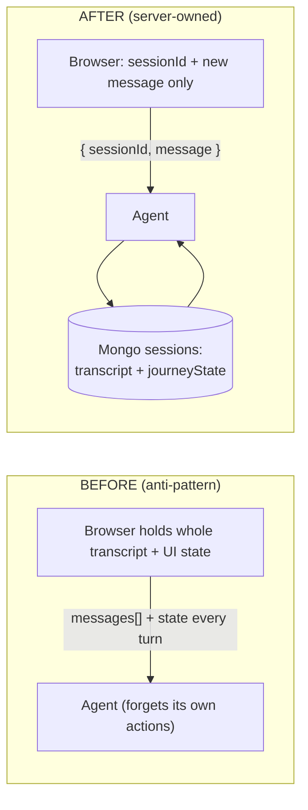
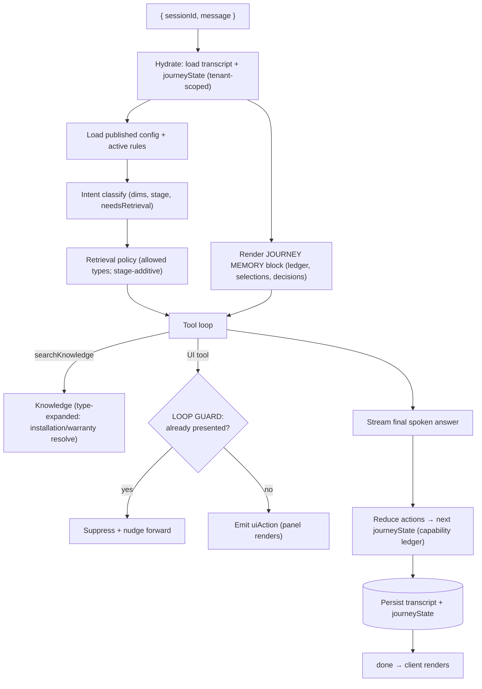
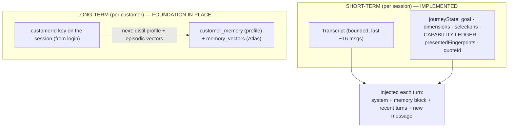
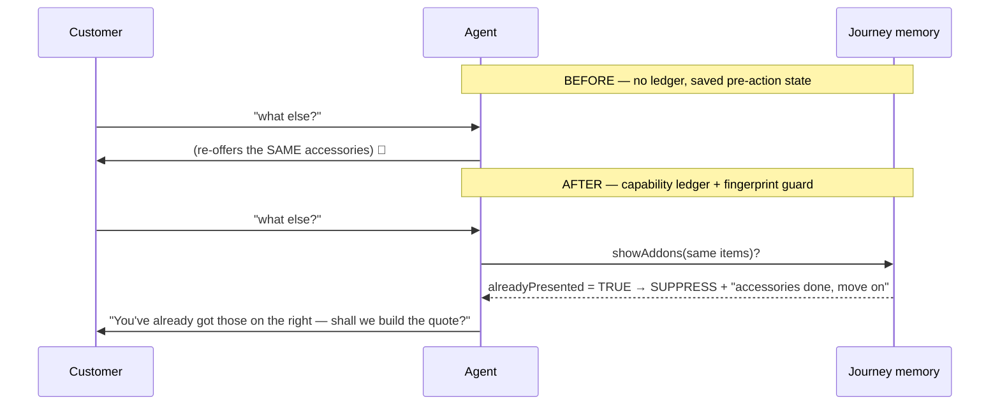
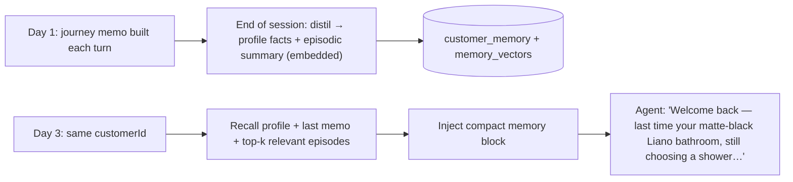

# JourneyAX — Server-Owned Memory & Conversation Flows

**Date:** 17 July 2026
**Implements:** the Agent Context/Memory/Quality review, Track A (Phase 1 + Phase 2 core + Phase 3 quick win).
**Principle:** the client sends only `{ sessionId, message, (customerId when signed in) }`. The **server owns** the transcript, the typed journey state, and all rendering.

---

## 1. Client-minimal contract (the rule)

- Storefront send is now literally `{ message, sessionId }` (`ChatPanel.tsx`). No `messages[]`, no `state`.
- The agent reconstructs everything from `journeyx.sessions` (`SessionStore` + `journey-memory.ts`).

---

## 2. One turn — the gatekeeper pipeline (single visible agent)

Gatekeepers, in order: **hydrate → intent → retrieval policy → capability toolset → loop guard (idempotency) → grounding → reducer/persist.**

---

## 3. Memory layers (short-term now; long-term ready)

- **Short-term** = the enriched `sessions` doc (transcript + `journeyState`). Bounded, so context stays small (context-editing).
- **Long-term** = `customerId` is now persisted on the session; the distil→profile→episodic-vector loop (Layers 2–3) reuses the existing Atlas Vector index. This is the "returning after 2 days / I'm a kitchen builder" hook — foundation laid, distillation is the next slice.

---

## 4. The accessory loop — before vs after

Verified in isolation: `alreadyPresented` returns TRUE for a repeat presentation, FALSE for new items; the ledger marks `accessories: completed`; the memory block tells the model so.

---

## 5. Returning customer (long-term memory target)

---

## 6. What was fixed (Track A)

| Area | Change | Verified |
|---|---|---|
| **Client-minimal** | Storefront sends only `{ sessionId, message }` | ✅ code + typecheck |
| **Server-owned transcript** | `SessionStore` persists `messages[]` + `journeyState`, tenant-scoped | ✅ Mongo round-trip |
| **Capability ledger + reducer** | `journey-memory.ts` folds each turn's actions into typed state | ✅ unit test |
| **Loop guard (idempotency)** | fingerprint suppresses duplicate presentations in both paths | ✅ unit test |
| **Guides/warranty retrieval** | `expandTypeFilter`: `installation/faq` now resolve to the `technical/policy` chunks where they live | ✅ was 0 results → now returns the guide + warranty pages |
| **Document links** | product search now returns `metadata.documents` | ✅ field wired |
| **Stage-additive retrieval** | buying flow may now fetch installation + warranty before quoting | ✅ router |
| **Temperature** | configured `ai.temperature` now applied (non-reasoning models) | ✅ code |

## 7. Not yet done (larger, tracked)
- **SKU↔document relationship** (Defect 3): many product-text chunks don't carry their PDF links; a normalized relation / GraphRAG join surfaces every product's own guides. (Phase 2 deep.)
- **Long-term distillation** (Layers 2–3): the profile + episodic-vector writer.
- **Persona/prompt-conflict cleanup** (Phase 3 full): remove "always end with a question", collapse overlapping prompt layers, add a style profile + examples.
- **Rolling summary** for very long sessions.

## 8. ⚠️ Verification blocker
Live end-to-end conversation verification is currently blocked by **OpenAI `429 — quota exceeded`** on the configured key. The pipeline runs correctly up to the generation call (all traces emit); memory logic + persistence are verified independently. Top up / switch the OpenAI key (or point a project at Ollama) to run the full walked session + eval suite.
