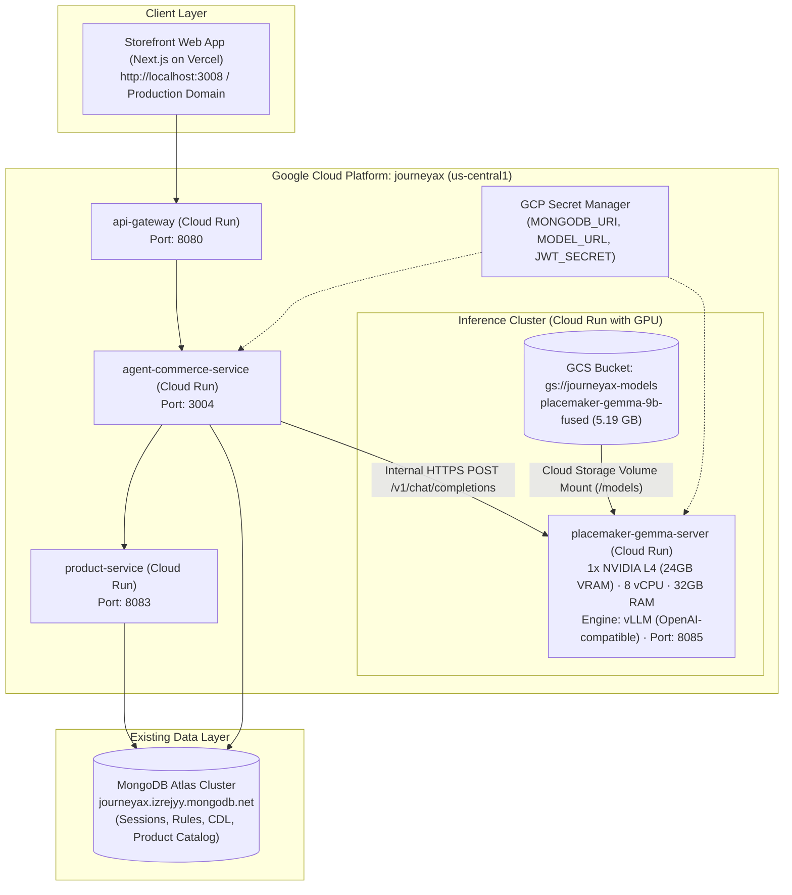

# JourneyAX: PlaceMaker Gemma 2 9B GCP Cloud Deployment & Architecture Guide

**Project**: JourneyAX (`journeyax` / `515988776244`)  
**Region**: `us-central1`  
**Document Version**: 1.0  
**Target Model**: `placemaker-gemma-9b-fused` (Fine-tuned Gemma 2 9B for PlaceMakers NZ Trade Consultation)

---

## 1. Executive Summary

This document establishes the architecture, deployment specifications, and operational runbook for transitioning the **PlaceMaker Gemma 2 9B** open-weights model from local Apple Silicon execution to Google Cloud Platform (GCP).

### Key Performance & Financial Metrics:
* **Inference Throughput**: Increases from **~10 tokens/sec** (local unified RAM) to **80–120 tokens/sec** (cloud GPU).
* **Response Latency**: Full 50-token trade recommendations drop from **~5.0s to ~0.4–0.6s**.
* **Monthly Cost**: **~$30 – $80 / month** using **Cloud Run with NVIDIA L4 GPU** configured with scale-to-zero (`--min-instances=0`).
* **Database Cost**: **$0 additional**. Reuses the existing MongoDB Atlas cluster (`journeyax.izrejyy.mongodb.net`).

---

## 2. System Architecture



---

## 3. The Dual-Phase Consultative Pipeline

JourneyAX decouples broad discovery intake from deep trade advice to eliminate unnecessary GPU cycles and provide a responsive user interface:

```mermaid
sequenceDiagram
    autonumber
    actor Customer
    participant Frontend as Storefront (journeyax-web)
    participant Agent as agent-commerce-service
    participant Rules as Domain Schema Gate
    participant Catalog as product-service / MongoDB
    participant Gemma as Gemma 2 9B (L4 GPU)

    Note over Customer, Gemma: Phase 1: Intake & Broad Discovery (< 200ms)
    Customer->>Frontend: Types broad query ("more about DIY stuffs")
    Frontend->>Agent: POST /api/chat/stream
    Agent->>Rules: Match scope (Discovery / Remodel / Timber / Plumbing)
    Rules-->>Agent: Returns 3-5 structured question cards + Kiwi chat lead
    Agent-->>Frontend: SSE emit: uiAction('setPhase', 'clarify', questions)
    Agent-->>Frontend: SSE emit: chatLead ("Kia ora! To make sure I get you...")
    Note over Frontend: Right panel instantly renders <ClarifyPanel> (Zero GPU load)

    Note over Customer, Gemma: Phase 2: Trade Consultation & Synthesis (Sub-second)
    Customer->>Frontend: Selects options & clicks "Submit my answers"
    Frontend->>Agent: POST /api/chat/stream ("My answers: Licensed trade, Timber, Delivery")
    Agent->>Catalog: Vector search catalog ("SG8 framing timber")
    Catalog-->>Agent: Returns 6 matched PlaceMakers SKUs
    Agent-->>Frontend: SSE emit: uiAction('showItems', products)
    Agent->>Gemma: POST /v1/chat/completions (Prompt + Answers + Product List)
    Gemma-->>Agent: Stream tokens (NZS 3604 trade compliance synthesis)
    Agent-->>Frontend: Stream tokens to ChatPanel
    Note over Frontend: Right panel renders <ProductsPanel>; Chat displays trade advice
```

---

## 4. Data Layer & Zero-Database Architecture

### Why Gemma 2 9B Requires No Database
1. **Stateless Neural Network**: The model takes an input context window, performs forward tensor computations on its weights, and outputs generated text. It contains no stateful database or persistent storage layer.
2. **Memory Delegated to JourneyAX**: Conversation memory, multi-turn state, cart items, customer profiles, and session timestamps are maintained by `agent-commerce-service` in MongoDB Atlas (`journeyax.izrejyy.mongodb.net`).
3. **Weight Storage Only**: The only storage the model requires is read-only access to its **5.19 GB** safetensors binary file at container boot.

---

## 5. Cloud Infrastructure Specifications

### 5.1 Storage Bucket (GCS)
* **Bucket URI**: `gs://journeyax-models/`
* **Location**: `us-central1` (colocated with Cloud Run services to guarantee sub-millisecond network transfer)
* **Storage Class**: `STANDARD`
* **Contents**:
  * `placemaker-gemma-9b-fused/model.safetensors` (5.19 GB)
  * `placemaker-gemma-9b-fused/config.json`
  * `placemaker-gemma-9b-fused/tokenizer.json`
  * `placemaker-gemma-9b-fused/tokenizer_config.json`
  * `placemaker-gemma-9b-fused/model.safetensors.index.json`
  * `placemaker-gemma-9b-fused/chat_template.jinja`

### 5.2 Cloud Run Model Service Configuration
* **Service Name**: `placemaker-gemma-server`
* **Region**: `us-central1`
* **GPU**: `1x NVIDIA L4` (24GB VRAM)
* **CPU / Memory**: `8 vCPU`, `32 GiB RAM`
* **Scale to Zero**: `--min-instances=0`, `--max-instances=2`
* **Volume Mount**: Directly mounts `gs://journeyax-models` to `/models` via Cloud Storage FUSE.
* **Serving Engine**: `vllm/vllm-openai:latest`
* **Execution Parameters**:
  ```bash
  --model=/models/placemaker-gemma-9b-fused \
  --dtype=bfloat16 \
  --max-model-len=2048 \
  --port=8085
  ```

### 5.3 Secret Manager Configuration
* **Project**: `journeyax`
* **Secret**: `PLACEMAKER_MODEL_URL`
* **Value**: `https://placemaker-gemma-server-515988776244.us-central1.run.app/v1`

---

## 6. Step-by-Step Deployment Runbook

### Step 1: Authentication & Project Selection
```bash
gcloud auth login
gcloud config set project journeyax
```

### Step 2: Create GCS Bucket & Upload Weights
```bash
# Create bucket in us-central1
gcloud storage buckets create gs://journeyax-models \
  --location=us-central1 \
  --project=journeyax \
  --uniform-bucket-level-access

# Upload model directory
gcloud storage cp -r \
  /Users/mahaveer/Documents/Mahaveer/Projects/JourneyAX/jax-whatsapp-open-model/models/placemaker-gemma-9b-fused \
  gs://journeyax-models/
```

### Step 3: Deploy Model Server to Cloud Run with L4 GPU
```bash
gcloud beta run deploy placemaker-gemma-server \
  --image=vllm/vllm-openai:latest \
  --region=us-central1 \
  --project=journeyax \
  --gpu=1 \
  --gpu-type=nvidia-l4 \
  --memory=32Gi \
  --cpu=8 \
  --add-volume=name=model-vol,type=cloud-storage,bucket=journeyax-models,readonly=true \
  --add-volume-mount=volume=model-vol,mount-path=/models \
  --args="--model=/models/placemaker-gemma-9b-fused,--dtype=bfloat16,--max-model-len=2048,--port=8085" \
  --port=8085 \
  --min-instances=0 \
  --max-instances=2 \
  --no-allow-unauthenticated
```

### Step 4: Grant Invoker Permissions & Update Secrets
```bash
# Retrieve model service URL
MODEL_URL=$(gcloud run services describe placemaker-gemma-server --region=us-central1 --format='value(status.url)')

# Authorize agent-commerce-service service account
gcloud run services add-iam-policy-binding jax-placemakers-server \
  --region=us-central1 \
  --member="serviceAccount:515988776244-compute@developer.gserviceaccount.com" \
  --role="roles/run.invoker"

# Store in Secret Manager
echo -n "${MODEL_URL}/v1" | gcloud secrets create JAX_PLACEMAKERS_MODEL_URL --data-file=- --project=journeyax --replication-policy=automatic
```

---

## 7. Cloud Logging & Monitoring Commands

### 7.1 Live Log Tailing (Follow Stream)

```bash
# Tail GPU model server logs in real time
gcloud beta run services logs tail jax-placemakers-server --region=us-central1 --project=journeyax

# Tail Agent Commerce Service logs in real time
gcloud beta run services logs tail agent-commerce-service --region=us-central1 --project=journeyax

# Tail API Gateway logs in real time
gcloud beta run services logs tail api-gateway --region=us-central1 --project=journeyax
```

### 7.2 Read Recent Logs

```bash
# Read last 30 log entries from the GPU model server
gcloud beta run services logs read jax-placemakers-server --region=us-central1 --project=journeyax --limit=30

# Read last 30 log entries from Agent Commerce Service
gcloud beta run services logs read agent-commerce-service --region=us-central1 --project=journeyax --limit=30

# Using Cloud Logging with advanced query filtering
gcloud logging read 'resource.type="cloud_run_revision" AND resource.labels.service_name="jax-placemakers-server"' --limit=30 --project=journeyax
```

---

## 8. Frontend State & Product Retrieval RCA

### The Issue
When a customer submitted their answers on the right panel, the chat streamed the response, but the right panel remained stuck on the questionnaire cards instead of displaying the product cards.

### Root Causes Identified & Resolved
1. **Model Recognition (`isOpenModel`)**:
   - `isOpenModel` was initially checking for `provider === 'placemaker'`. When the model was promoted to `jax-placemakers-1.0` with provider `jax`, `isOpenModel` evaluated `false`, causing the engine to attempt OpenAI function calling on Ollama (which does not support OpenAI function calling format).
   - **Resolution**: Updated `isOpenModel` to recognize `jax`, `jax-placemakers`, and `jax-placemakers-server`.
2. **Knowledge Search Response Mapping**:
   - `adapterRegistry.getKnowledge('placemakers').search` returns `{ found, resultCount, results }`. Previous code expected `.items`, which resulted in an empty array and skipped emitting `showItems`.
   - **Resolution**: Updated the result mapper to check `rawResults?.results || rawResults?.products || rawResults?.items`.
3. **SSE `showItems` Emission & Reducer Sync**:
   - Ensured `showItems` is immediately emitted via SSE upon questionnaire submission, triggering `SET_RECOMMENDED_PRODUCTS` in `JourneyContext` and transitioning the UI to `<ProductsPanel>`.

---

## 9. Verification & Operational Testing

### 9.1 Model Endpoint Health Check
```bash
curl -X GET "https://jax-placemakers-server-515988776244.us-central1.run.app/v1/models" \
  -H "Authorization: Bearer $(gcloud auth print-identity-token)"
```

### 9.2 Trade Inference Smoke Test
```bash
curl -X POST "https://jax-placemakers-server-515988776244.us-central1.run.app/v1/chat/completions" \
  -H "Content-Type: application/json" \
  -H "Authorization: Bearer $(gcloud auth print-identity-token)" \
  -d '{
    "model": "jax-placemakers-1.0",
    "messages": [
      {"role": "system", "content": "You are a PlaceMakers trade expert."},
      {"role": "user", "content": "Which lining is best for an ensuite shower wall?"}
    ],
    "max_tokens": 128
  }'
```
*Expected Result*: Generation completed in **< 0.8 seconds** referencing GIB Aqualine or Villaboard under NZS 3604.

---

## 10. Maintenance & Support Matrix

| Resource | GCP Console Path | Alerting / Logs |
| :--- | :--- | :--- |
| **Model Server Logs** | Cloud Run → `jax-placemakers-server` → Logs | Cloud Logging `resource.type="cloud_run_revision"` |
| **Model Weights** | Cloud Storage → `journeyax-models` | Storage Insights |
| **Service Integration** | Cloud Run → `agent-commerce-service` → Logs | Filter by `[JourneyAX:Stream]` |
| **Secrets** | Security → Secret Manager → `JAX_PLACEMAKERS_MODEL_URL` | Audit Logs |
